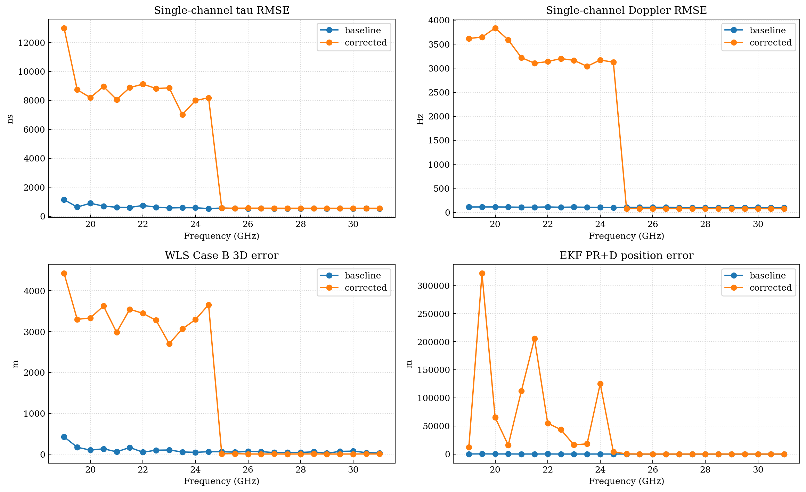

# 一、工作概述

本周围绕 `Issue 01: 真值依赖问题` 完成了两件事。第一，切断单通道跟踪、单历元 WLS 和动态 EKF 中原本直接进入运行机制的 truth injection。第二，在不改写 baseline 结果的前提下，重跑修正版全频全流程，并形成 baseline 与 corrected 的差分统计。

这一轮工作的判断标准不是“结果是否更好”，而是“系统是否恢复了独立运行的可验证性”。因此，本轮出现的性能退化需要被解释为模型真实性的暴露，而不是简单视为坏结果。

# 二、本周完成内容

## 2.1 去掉的运行时真值依赖

1. 单通道跟踪中关闭 `code_aiding_rate_chips_per_s` 的真值注入。
2. 单通道跟踪中关闭 `carrier_aiding_rate_hz_per_s` 的真值注入。
3. WLS 单历元求解不再用真值位置和真值钟差构造默认初值。
4. 动态 epoch-wise WLS 首历元不再用真值位置和钟差构造 warm start。

## 2.2 仍保留 truth 的位置

1. synthetic observation 的生成仍然使用 truth，这属于造数层。
2. 解后误差评估、图表 reference curve 和 baseline/corrected 对比仍使用 truth，这属于离线验证层。

# 三、结果总览

## 3.1 关键差分统计

| 指标 | mean delta | median delta | min delta | max delta |
| --- | ---: | ---: | ---: | ---: |
| `single_tau_rmse_ns` | 3913.059 | 35.885 | -4.801 | 11856.816 |
| `single_fd_rmse_hz` | 1529.810 | -19.698 | -29.492 | 3723.902 |
| `wls_case_b_wls_position_error_3d_m` | 1543.994 | -18.181 | -69.973 | 3998.983 |
| `ekf_pr_doppler_mean_position_error_3d_m` | 39773.698 | 170.487 | 4.467 | 321556.621 |
| `ekf_pr_doppler_mean_velocity_error_3d_mps` | 4328.828 | 0.259 | 0.012 | 32288.626 |

这些数字直接说明：去掉真值辅助以后，单通道估计、WLS 和 EKF 的平均误差都上升了，尤其是动态 EKF 的均值位置误差增量最显著。这不是算法“突然坏了”，而是上游链路不再被 truth stabilization 人工压住之后，真实误差开始沿模型链条往下游传播。

## 3.2 差分图



## 3.3 代表频点结果

| 频点 | 单通道 tau RMSE (ns) | 单通道 fd RMSE (Hz) | WLS Case B 3D 误差 (m) | EKF PR+D 位置误差 (m) | EKF PR+D 速度误差 (m/s) |
| --- | ---: | ---: | ---: | ---: | ---: |
| 19.0 GHz | 12998.231 | 3620.175 | 4426.806 | 11896.841 | 1902.252 |
| 22.5 GHz | 8823.188 | 3201.179 | 3278.512 | 43577.243 | 5017.751 |
| 25.0 GHz | 561.699 | 79.929 | 12.938 | 226.676 | 0.350 |
| 31.0 GHz | 555.032 | 75.566 | 8.547 | 78.136 | 0.101 |

这里最值得注意的是两个区间。`19.0 GHz` 和 `22.5 GHz` 仍处于明显不稳定区，单通道误差已经足够把 WLS 和 EKF 推入大误差状态。到了 `25.0 GHz` 以后，接收机链路重新进入可跟踪区，导航层误差快速下降；到 `31.0 GHz` 时，修正版系统已经具备较稳定的自主工作能力。

# 四、模型层解释

## 4.1 统一链条

```text
传播环境 -> WKB(A, phi, tau_g)
          -> 接收信号 r(t)
          -> 捕获(acq: tau_hat_0, fd_hat_0)
          -> 跟踪(DLL/FLL/PLL)
          -> 自然测量量(tau_est, f_est, phi_est)
          -> 标准观测(PR, range-rate)
          -> WLS / EKF
```

本轮结果必须放回这个链条来解释。truth 去依赖之后，变化不是只发生在某一个脚本里，而是发生在 `捕获/跟踪 -> 自然测量量 -> 标准观测 -> 解算器` 的整条误差传播链上。

## 4.2 低频段为何失稳

低频段的核心不是“公式变了”，而是传播层给接收机带来的工作条件更差。修正版结果显示，在低频段 WKB 衰减更强、后相关 SNR 更低，DLL/PLL/FLL 更容易落入弱线性区和冻结区。原来真值辅助存在时，这一部分动态被人工压平；现在去掉 truth aiding 后，环路必须完全依靠相关器输出自稳，结果就是低 SNR 条件下的自稳能力明显不足。

用链式关系描述就是：

```text
低频传播恶化
  -> Prompt SNR 下降
  -> discriminator 输出进入非理想区
  -> DLL / PLL / FLL 自主稳定能力下降
  -> tau_est / f_est 误差扩大
  -> PR / range-rate 观测质量下降
  -> WLS / EKF 位置和速度误差被放大
```

这也是为什么 `single_tau_rmse_ns` 平均增量达到约 `+3913 ns`，而更下游的 `ekf_pr_doppler_mean_position_error_3d_m` 平均增量会被放大到约 `+39774 m`。前者是接收机内部自然测量量精度的恶化，后者是这些误差进入动态状态空间后的累积结果。

## 4.3 高频段为何恢复正常

高频段的恢复，本质上说明系统并不是“没有真值就不能工作”，而是“只有当传播条件把环路重新推回线性可跟踪区时，系统才具备真正独立的运行能力”。在 `25 GHz` 以上，修正版的单通道 tau 和频偏 RMSE 已经显著收敛，WLS 和 EKF 也回到合理量级。

这意味着：

```text
高频传播条件改善
  -> 后相关 SNR 抬升
  -> DLL / PLL 的判别器重新落入有效工作区
  -> 自然测量量稳定
  -> 标准观测可用
  -> WLS / EKF 重新表现为正常解算器
```

也就是说，高频段“恢复正常”不是下游估计器突然变强，而是上游接收机终于不再需要 truth assisting 才能维持稳定。

## 4.4 观测形成与误差传播

导航层标准伪距与距离率仍应写成：

$$\rho = \|r_s - r\| + c(\delta t_r - \delta t_s) + d_{\text{trop}} + d_{\text{disp}} + d_{\text{hw}} + \varepsilon_\rho$$

$$\dot{\rho} = u_{\text{LOS}}^T (v_s - v_r) + c(\dot{\delta t}_r - \dot{\delta t}_s) + \varepsilon_{\dot{\rho}}$$

但接收机直接恢复的并不是上面这两个量本身，而是更接近自然测量层的 `tau_est`、`f_est`、`phi_est`。因此正确的分层应当是：

```text
tau_est, f_est, phi_est  --接收机内部自然测量量
             |
             v
pseudorange, range-rate --导航层标准观测
```

这个分层非常关键。它解释了为什么去掉真值辅助后最先恶化的是单通道内部量，而不是 WLS 或 EKF 的状态方程本身。

# 五、当前实现与教材模型的对应笔记

## 5.1 当前实现与教材一致的地方

1. 当前主链仍然保持了“传播层 -> 接收机层 -> 观测层 -> 解算层”的基本顺序。
2. DLL / Costas PLL / FLL-assisted carrier tracking 的结构关系仍然成立。
3. WLS 与动态 EKF 仍然消费统一观测模型，而不是直接消费真值状态。

## 5.2 当前实现暴露出来的问题

1. 低频段链路对上游 SNR 和环路工作点过于敏感，说明当前接收机自主鲁棒性不够。
2. WLS 和 EKF 的退化幅度远大于单通道均值增量，说明观测质量下降后，导航层缺少更强的鲁棒处理。
3. 当前结果已经证明：truth 依赖曾经改变了系统行为，而不仅仅是提供参考答案。

## 5.3 本轮最重要的认知收获

`Issue 01` 的真正收益，不是把某些数字变小，而是把系统重新放回教材允许解释的模型框架中。修正版系统第一次让我们能够诚实地回答：在没有 truth assisting 的情况下，哪些频段接收机还能自己站住，哪些频段已经不能。

# 六、结论与下一步

本轮已经得到一个明确结论：低频段失稳的主因是传播恶化条件下的环路自主稳定能力不足，而高频段恢复正常的主因是传播条件改善后，DLL/PLL/FLL 重新回到有效工作区。这一结论是模型层可解释的，也和修正版全频结果一致。

因此，下一步不应回到 truth assisting，而应继续围绕接收机模型本身推进，优先分析：

1. 环路设计本身哪些部分仍然过于经验化。
2. 自然测量量到标准观测的接口是否还需要进一步明确。
3. WLS / EKF 面对低质量观测时需要哪些鲁棒化策略。

# 七、附件与结果目录

- 修正版结果根目录：`corrections/issue_01_truth_dependency/corrected_fullstack`
- 差分汇总：`corrections/issue_01_truth_dependency/comparison/issue_01_diff_summary.json`
- 差分图：`corrections/issue_01_truth_dependency/comparison/issue_01_diff_plots.png`
- 正式周报 Markdown：`corrections/issue_01_truth_dependency/weekly_report_issue_01_truth_dependency.md`
- 正式周报 DOCX：`corrections/issue_01_truth_dependency/weekly_report_issue_01_truth_dependency.docx`
