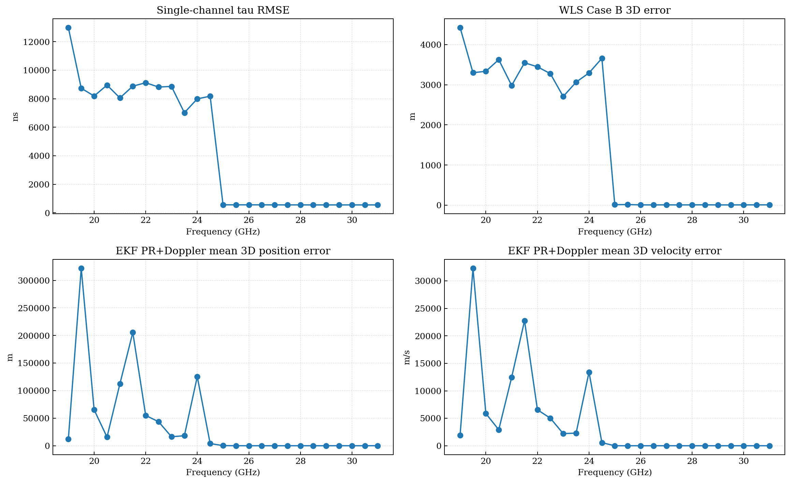

# Issue 02: 链路内部变换合法性审查

## 目的

这一组笔记不回答“代码能不能跑”，而回答更基础的问题：

1. 这一层接收的对象到底是什么。
2. 这一层内部为什么可以这样变换。
3. 这一层产出的对象为什么有资格进入下一层。

本轮以教材为金标准，重点先把信号层和接收机层立住，再把前端输出一路接到观测形成与导航解算层，检查整条链路是否存在语义越层、启发式替代正式定义、或运行机制依赖真值的问题。

## 阅读顺序

1. [notes/00_review_method.md](notes/00_review_method.md)
2. [notes/01_signal_layer.md](notes/01_signal_layer.md)
3. [notes/02_receiver_layer.md](notes/02_receiver_layer.md)
4. [notes/03_observable_formation.md](notes/03_observable_formation.md)
5. [notes/04_navigation_layer.md](notes/04_navigation_layer.md)
6. [references/issue_01_reference_index.md](references/issue_01_reference_index.md)
7. [references/representative_frequency_metrics.md](references/representative_frequency_metrics.md)

## 审查总链

```text
transmitted signal object
  -> propagation imprint (A, phi, tau_g)
  -> received complex block r(t)
  -> acquisition (tau_hat_0, fd_hat_0)
  -> tracking loops (DLL / FLL / PLL)
  -> natural measurements (tau_est, phi_est, f_est)
  -> standard observables (PR, carrier phase, range-rate)
  -> navigation estimators (WLS / EKF)
```

## 本轮结论入口

- `01_signal_layer.md` 重点回答：当前系统送入接收机的对象是不是“合法的信号对象”，还是已经混入了接收机语义。
- `02_receiver_layer.md` 重点回答：相关、捕获、DLL/PLL/FLL、内部状态更新到底属于什么机制，哪些是教材正式结构，哪些只是工程控制律。
- `03_observable_formation.md` 重点回答：`tau_est_s`、`carrier_phase_total_rad`、`carrier_freq_hz` 为什么还不是标准伪距/载波相位/距离率。
- `04_navigation_layer.md` 重点回答：WLS 和 EKF 的方程本身是否成立，以及它们当前所消费的对象是否已经满足合法观测语义。

## 与 Issue 01 的关系

`Issue 01` 已经切断运行时真值依赖，并给出了 baseline 与 corrected 的差分结果。本轮不新增实验，只把这些结果当作“合法性审查的经验支撑材料”。

最重要的经验事实是：

- 低频段去掉真值辅助后，单通道 `tau` / `fd` 误差迅速放大。
- 这些误差随后沿观测层进入 WLS / EKF。
- 高频段在不依赖真值稳定的情况下重新进入可跟踪区，说明链路在该区间具备更强的独立性。

## 支撑图表




## 使用边界

- 本目录是审查包，不是新实现。
- 本目录不改写现有接收机、WLS 或 EKF 行为。
- 本目录的判断标准是“对象定义是否清楚、变换是否有教材依据、下游资格是否成立”，不是“结果看起来像不像对的”。
