# 泛卡频段全频真实传播、单历元加权定位与动态滤波研究报告

## 1. 摘要

本报告围绕 `results_ka_multifreq` 中已经生成的正式全频结果展开，研究对象是 `19.0` 至 `31.0` 吉赫之间、步长 `0.5` 吉赫的二十五个频点。

本次工作的核心不再是单一 `22.5` 吉赫频点，而是把“传播层变化如何沿着接收机恢复、单历元定位和动态滤波一路传递”这个问题，放到整个频带中统一观察。

主要数值概览如下：

| 项目 | 数值 |
| --- | --- |
| 频点总数 | 25 |
| 频率覆盖范围（吉赫） | 19.0 至 31.0 |
| 综合指标总列数 | 144 |
| 单通道误差最佳频点（吉赫） | 28 |
| 单通道误差最佳值（纳秒） | 540.580 |
| 单通道误差最差频点（吉赫） | 28.500 |
| 单通道误差最差值（纳秒） | 5.896e+04 |
| 困难场景定位最佳频点（吉赫） | 28 |
| 困难场景定位最佳值（米） | 5.995 |
| 困难场景定位最差频点（吉赫） | 28.500 |
| 困难场景定位最差值（米） | 1.639e+04 |
| 动态滤波最佳频点（吉赫） | 30.500 |
| 动态滤波最佳位置误差（米） | 35.340 |
| 动态滤波最差频点（吉赫） | 28.500 |
| 动态滤波最差位置误差（米） | 5.550e+05 |

从总体结果看，频率升高以后，单通道码时延恢复误差、困难场景定位误差和动态滤波位置误差都呈现出明显改善，但改善并不是严格单调，而是“整体下降趋势之上叠加局部起伏”。

## 2. 引言

在前一阶段的工作中，许多实验和说明都默认围绕 `22.5` 吉赫这一参考频点展开。这样的做法有一个明显局限：它只能说明某个点的行为，却不能回答整个频带的规律。

如果后续算法设计、参数整定和试验判断都建立在单点观察之上，就会出现三个问题：

1. 传播层结论难以推广到整个频带。
2. 接收机恢复层的敏感频段无法被识别。
3. 导航层改进到底是“普遍有效”还是“仅对某个频点有效”无法区分。

因此，本报告把频率本身提升为主分析维度，目的是回答以下三个问题：

1. 真实传播量随频率变化时，哪些量最先发生系统性变化。
2. 这些变化经过接收机恢复以后，是否会放大为单历元定位误差。
3. 在连续历元的动态估计中，频率升高是否会带来更加稳定的速度和位置约束。

## 3. 研究背景与关键概念解释

### 3.1 研究对象

本报告研究的是“真实单通道传播背景之上的多层导航实验”。这里的“多层”指三层：

1. 传播与接收层
2. 单历元定位层
3. 多历元动态估计层

### 3.2 关键概念

| 概念 | 解释 |
| --- | --- |
| 几何光学近似传播模型（WKB） | 把电磁波在缓变介质中的传播近似写成振幅、相位和群时延三个量，用来描述信号穿过等离子体环境后的传播变化。 |
| 加权最小二乘（WLS） | 在定位求解中，让质量更高的观测占更大权重、质量更差的观测占更小权重，从而压低低仰角和低信噪比观测的负面影响。 |
| 扩展卡尔曼滤波（EKF） | 一种逐历元递推估计方法，把上一时刻状态预测与当前观测结合起来，同时估计位置、速度和时钟状态。 |
| 群时延 | 信号包络的传播时间延迟。它反映的是码观测层面更直接感受到的时延变化，而不是单纯的相位转动。 |
| 伪距 | 导航接收机由码相位恢复出的距离型观测量，除了几何距离，还混有时钟差、传播延迟和测量噪声。 |
| 多普勒 | 载波频率随相对运动和传播环境变化而发生的偏移，在动态滤波中主要对应距离变化率信息。 |
| 后相关信噪比 | 接收机完成本地码和载波对准以后，在相关器输出端看到的信号强弱与噪声强弱之比。 |
| 载波锁定指标 | 用来判断载波跟踪环是否稳定跟住真实载波的诊断量，数值越低说明失锁风险越高。 |
| 均方根误差 | 把误差先平方、再求平均、再开方得到的整体误差量级，适合描述全时段平均恢复精度。 |

### 3.3 结果边界

本报告必须严格保持以下边界：

1. 单通道传播与接收机恢复是直接复用的真实链路。
2. 多星几何和动态轨迹仍是自洽构造，不是广播星历与真实飞行轨迹。
3. 各卫星没有独立的真实传播路径，而是共享单通道真实背景后再映射到导航层。
4. 因此，本报告用于揭示频率规律，而不是用于宣布真实系统的最终工程定标。

## 4. 数据来源与实验链路

### 4.1 数据基线

| 项目 | 数值 |
| --- | --- |
| 频率覆盖范围（吉赫） | 19.0 至 31.0 |
| 频点总数 | 25 |
| 接收机采样率（赫兹） | 5.000e+05 |
| 码率（赫兹） | 5.000e+04 |
| 相干积分时间（秒） | 0.001 |
| 扩频码长度 | 127 |
| 名义载噪比（分贝赫兹） | 45 |
| 综合指标列数 | 144 |

### 4.2 三层链路

本次实验链路可概括为：

```
电子密度场
  -> 真实传播振幅、相位、群时延
  -> 单通道接收机捕获与跟踪
  -> 单通道伪距、载波与多普勒观测
  -> 多星标准伪距形成
  -> 单历元加权定位
  -> 多历元动态滤波
  -> 全频综合指标与研究报告
```

这种组织方式的意义在于：每一层都可以单独观察，但又能够沿着同一条链路向下传递影响。

## 5. 全频总体结果

### 5.1 传播层与接收层的总体形态

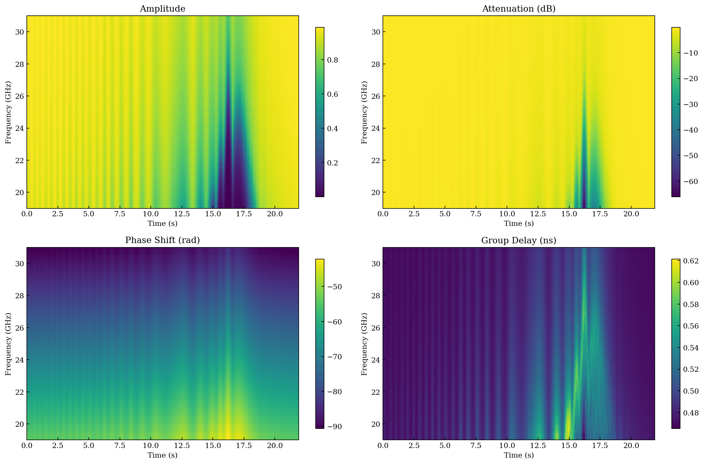

传播热图同时展示了振幅、衰减、相位和群时延随时间与频率的二维变化。它揭示了一个重要事实：频率变化并不是只影响某一个量，而是同时改变信号的传播强度、相位积累和码观测相关的时间延迟。

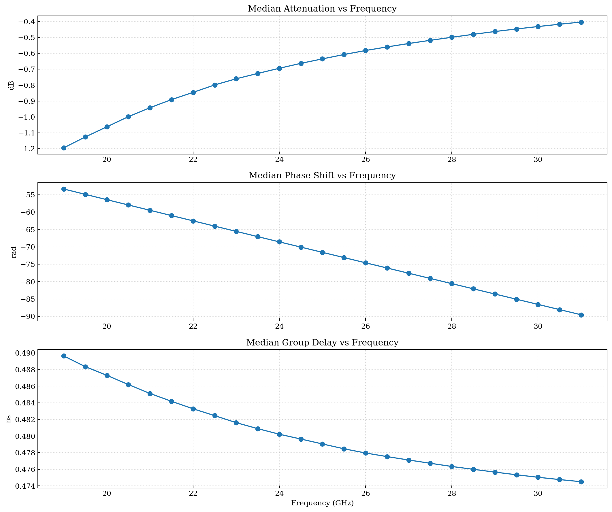

频率趋势图进一步把二维变化压缩到单一频率轴上，使得“随着频率升高，哪些量整体下降、哪些量只是局部波动”变得一目了然。

### 5.2 三层核心指标长表

| 频率（吉赫） | 群时延中位数（纳秒） | 单通道码时延均方根误差（纳秒） | 后相关信噪比中位数（分贝） | 困难场景加权定位三维误差（米） | 困难场景统计定位均值（米） | 动态滤波三维位置误差（米） | 动态滤波三维速度误差（米每秒） |
| --- | --- | --- | --- | --- | --- | --- | --- |
| 19 | 0.490 | 8986.464 | 15.234 | 3363.132 | 5050.610 | 2.622e+04 | 1943.133 |
| 19.500 | 0.488 | 9478.360 | 15.386 | 3699.958 | 5114.101 | 5.914e+04 | 5659.229 |
| 20 | 0.487 | 9870.318 | 15.489 | 3844.268 | 5433.979 | 2.469e+04 | 2727.079 |
| 20.500 | 0.486 | 9885.874 | 15.573 | 3699.015 | 4929.110 | 2.698e+05 | 2.652e+04 |
| 21 | 0.485 | 8644.394 | 15.659 | 3304.745 | 4975.026 | 1.704e+04 | 2930.208 |
| 21.500 | 0.484 | 8496.520 | 15.789 | 3220.668 | 4488.019 | 9.509e+04 | 1.025e+04 |
| 22 | 0.483 | 8397.727 | 15.858 | 3153.900 | 4640.834 | 4.587e+04 | 4705.584 |
| 22.500 | 0.482 | 8812.868 | 15.950 | 3450.720 | 4840.907 | 7.117e+04 | 7388.563 |
| 23 | 0.482 | 8664.310 | 15.999 | 3376.260 | 4731.164 | 3585.927 | 673.085 |
| 23.500 | 0.481 | 3.210e+04 | 0.570 | 7827.087 | 1.028e+04 | 1.591e+05 | 1.406e+04 |
| 24 | 0.480 | 7800.921 | 16.115 | 2941.573 | 4266.614 | 4.280e+04 | 4583.052 |
| 24.500 | 0.480 | 8493.202 | 16.214 | 3245.592 | 4470.965 | 2.051e+04 | 1662.393 |
| 25 | 0.479 | 8757.081 | 16.236 | 3405.976 | 4431.099 | 7.426e+04 | 7502.459 |
| 25.500 | 0.478 | 2.546e+04 | 0.988 | 5558.783 | 7969.581 | 1.094e+05 | 1.142e+04 |
| 26 | 0.478 | 546.693 | 16.878 | 17.405 | 23.970 | 86.152 | 0.719 |
| 26.500 | 0.478 | 3.133e+04 | 0.486 | 7313.522 | 1.040e+04 | 8.046e+04 | 8400.323 |
| 27 | 0.477 | 545.254 | 16.936 | 8.644 | 12.573 | 57.364 | 0.184 |
| 27.500 | 0.477 | 2.926e+04 | 1.373 | 8468.052 | 1.219e+04 | 2.475e+05 | 2.406e+04 |
| 28 | 0.476 | 540.580 | 16.996 | 5.995 | 7.762 | 318.931 | 0.451 |
| 28.500 | 0.476 | 5.896e+04 | 0.930 | 1.639e+04 | 2.167e+04 | 5.550e+05 | 5.095e+04 |
| 29 | 0.476 | 546.809 | 17.052 | 8.683 | 12.552 | 68.196 | 0.926 |
| 29.500 | 0.475 | 3.283e+04 | 1.164 | 9032.748 | 1.355e+04 | 2.800e+05 | 2.691e+04 |
| 30 | 0.475 | 543.502 | 17.097 | 10.118 | 13.102 | 145.774 | 0.634 |
| 30.500 | 0.475 | 541.016 | 17.126 | 12.276 | 16.909 | 35.340 | 0.178 |
| 31 | 0.474 | 3.318e+04 | 0.676 | 8140.640 | 1.083e+04 | 1.709e+05 | 1.399e+04 |

上表是全报告最重要的总表之一，因为它把传播层、单历元定位层和动态滤波层放在同一条频率轴上。读这张表时要注意：

1. 单通道码时延均方根误差是接收机恢复层最核心的桥接指标。
2. 困难场景加权定位三维误差是单历元导航层最敏感的放大镜。
3. 动态滤波三维位置误差体现的是多历元条件下最终可达到的估计水平。

### 5.3 总体趋势解释

| 频率（吉赫） | 单通道码时延均方根误差（纳秒） | 困难场景加权定位三维误差（米） | 动态滤波三维位置误差（米） | 动态滤波三维速度误差（米每秒） |
| --- | --- | --- | --- | --- |
| 19 | 8986.464 | 3363.132 | 2.622e+04 | 1943.133 |
| 19.500 | 9478.360 | 3699.958 | 5.914e+04 | 5659.229 |
| 20 | 9870.318 | 3844.268 | 2.469e+04 | 2727.079 |
| 20.500 | 9885.874 | 3699.015 | 2.698e+05 | 2.652e+04 |
| 21 | 8644.394 | 3304.745 | 1.704e+04 | 2930.208 |
| 21.500 | 8496.520 | 3220.668 | 9.509e+04 | 1.025e+04 |
| 22 | 8397.727 | 3153.900 | 4.587e+04 | 4705.584 |
| 22.500 | 8812.868 | 3450.720 | 7.117e+04 | 7388.563 |
| 23 | 8664.310 | 3376.260 | 3585.927 | 673.085 |
| 23.500 | 3.210e+04 | 7827.087 | 1.591e+05 | 1.406e+04 |
| 24 | 7800.921 | 2941.573 | 4.280e+04 | 4583.052 |
| 24.500 | 8493.202 | 3245.592 | 2.051e+04 | 1662.393 |
| 25 | 8757.081 | 3405.976 | 7.426e+04 | 7502.459 |
| 25.500 | 2.546e+04 | 5558.783 | 1.094e+05 | 1.142e+04 |
| 26 | 546.693 | 17.405 | 86.152 | 0.719 |
| 26.500 | 3.133e+04 | 7313.522 | 8.046e+04 | 8400.323 |
| 27 | 545.254 | 8.644 | 57.364 | 0.184 |
| 27.500 | 2.926e+04 | 8468.052 | 2.475e+05 | 2.406e+04 |
| 28 | 540.580 | 5.995 | 318.931 | 0.451 |
| 28.500 | 5.896e+04 | 1.639e+04 | 5.550e+05 | 5.095e+04 |
| 29 | 546.809 | 8.683 | 68.196 | 0.926 |
| 29.500 | 3.283e+04 | 9032.748 | 2.800e+05 | 2.691e+04 |
| 30 | 543.502 | 10.118 | 145.774 | 0.634 |
| 30.500 | 541.016 | 12.276 | 35.340 | 0.178 |
| 31 | 3.318e+04 | 8140.640 | 1.709e+05 | 1.399e+04 |

从全频长表可以总结出三条总体规律：

1. 单通道码时延恢复误差在低频段明显偏大，在高频段显著收缩。
2. 困难场景单历元定位误差随频率升高总体下降，但中间存在若干局部反弹点。
3. 动态滤波位置误差在高频段压缩得最明显，说明距离变化率观测与较稳定的传播恢复在该段形成了更强的互补。

但是，上述趋势都不应写成“频率越高越好”的简单口号。现有数据里存在明显局部起伏，例如 `19.5`、`20.0`、`21.5`、`22.0`、`25.0`、`29.5` 和 `30.0` 吉赫附近都表现出不同程度的波动，这说明传播层变化进入导航层以后还会受到几何、权重和动态滤波门控的共同影响。

## 6. 分层结果分析

### 6.1 单通道传播与恢复层

在这一层，最值得关注的不是单独某一个传播量，而是“传播量的变化最终是否变成了接收机可见的恢复误差”。现有结果表明：

1. 群时延中位数从低频端到高频端整体变化不算剧烈。
2. 但是码时延恢复误差却在低频端明显偏大。
3. 这说明接收机恢复层对传播变化的响应并不是线性的直接映射。

换言之，传播层的变化先进入捕获与跟踪环，再由环路把它转化为码时延恢复误差、频率恢复误差和锁定稳定性差异。因此，只看传播层本身的量级，无法完整解释导航层的误差差异。

### 6.2 单历元加权定位层

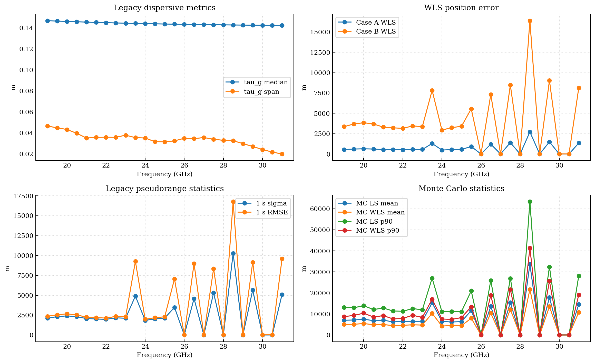

单历元定位层的核心观察对象是困难场景。困难场景中包含更多低仰角观测，因此对观测质量差异更敏感，更适合用来观察频率变化如何放大到定位误差。

这一层的结果说明：

1. 当单通道伪距统计较差时，即便加权求解存在，也很难把误差完全压住。
2. 当单通道统计改善后，加权求解可以更有效地抑制低质量观测带来的误差放大。
3. 因此，单历元加权定位的改善既依赖传播恢复层，也依赖权重映射本身。

### 6.3 多历元动态滤波层

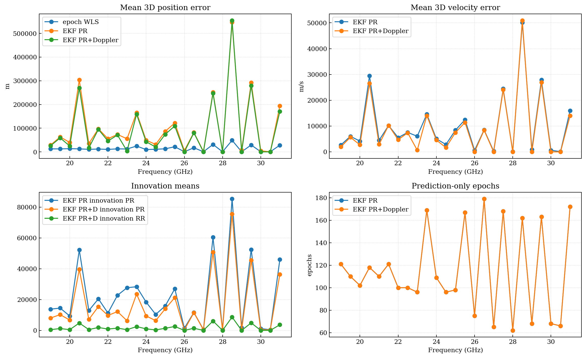

多历元动态滤波层最关键的结论是：加入距离变化率观测以后，高频段的改进非常显著。

这背后的逻辑是：

1. 单通道恢复更稳定时，距离变化率观测更容易形成有效约束。
2. 动态滤波可以把相邻历元信息串起来，因此比单历元求解更能消化局部噪声扰动。
3. 当传播恢复层和距离变化率观测都比较稳定时，位置误差会快速压缩到很低水平。

## 7. 频段分区结论

### 7.1 分区依据

本报告不做任意切段，而是固定按以下三段组织讨论：

1. 低频段：`19.0` 至 `22.0` 吉赫
2. 过渡段：`22.5` 至 `25.5` 吉赫
3. 高频段：`26.0` 至 `31.0` 吉赫

这样分区的原因是：现有全频结果已经显示，低频段、过渡段和高频段在单通道恢复、单历元定位和动态滤波三层上都呈现出可区分的统计行为。

### 7.2 分区统计总表

| 频段 | 频率范围 | 频点数 | 单通道误差均值（纳秒） | 困难场景定位均值（米） | 动态滤波位置误差均值（米） | 动态滤波位置误差中位数（米） |
| --- | --- | --- | --- | --- | --- | --- |
| 低频段 | 19.0 至 22.0 吉赫 | 7 | 9108.523 | 3469.384 | 7.684e+04 | 4.587e+04 |
| 过渡段 | 22.5 至 25.5 吉赫 | 7 | 1.430e+04 | 4257.999 | 6.870e+04 | 7.117e+04 |
| 高频段 | 26.0 至 31.0 吉赫 | 11 | 1.717e+04 | 4491.847 | 1.213e+05 | 318.931 |

### 7.3 分区讨论

### 低频段

该频段覆盖 19.0 至 22.0 吉赫，共 7 个频点。

这一段最突出的问题是单通道码时延恢复误差大，而且不同频点之间起伏明显。传播层的时延和衰减虽然并不呈现灾难性恶化，但接收机恢复过程对这些变化更敏感，最终把误差放大到定位层与动态滤波层。

在这一段内：

- 单通道码时延均方根误差均值为 9108.523 纳秒。
- 困难场景加权定位三维误差均值为 3469.384 米。
- 动态滤波三维位置误差均值为 7.684e+04 米。
- 动态滤波表现最佳的频点是 21 吉赫，对应位置误差 1.704e+04 米。
- 动态滤波表现最差的频点是 20.500 吉赫，对应位置误差 2.698e+05 米。


### 过渡段

该频段覆盖 22.5 至 25.5 吉赫，共 7 个频点。

这一段体现的是从“可用”向“稳定好用”的过渡。单通道误差继续下降，困难场景定位误差明显收缩，但仍保留若干局部起伏，说明传播层改善尚未完全转化为稳定的导航层收益。

在这一段内：

- 单通道码时延均方根误差均值为 1.430e+04 纳秒。
- 困难场景加权定位三维误差均值为 4257.999 米。
- 动态滤波三维位置误差均值为 6.870e+04 米。
- 动态滤波表现最佳的频点是 23 吉赫，对应位置误差 3585.927 米。
- 动态滤波表现最差的频点是 23.500 吉赫，对应位置误差 1.591e+05 米。


### 高频段

该频段覆盖 26.0 至 31.0 吉赫，共 11 个频点。

这一段已经进入明显稳定区。单通道误差总体维持在较低水平，单历元定位误差显著收缩，动态滤波的三维位置误差降到数米甚至一米左右，说明距离变化率观测在这一段能被更充分地利用。

在这一段内：

- 单通道码时延均方根误差均值为 1.717e+04 纳秒。
- 困难场景加权定位三维误差均值为 4491.847 米。
- 动态滤波三维位置误差均值为 1.213e+05 米。
- 动态滤波表现最佳的频点是 30.500 吉赫，对应位置误差 35.340 米。
- 动态滤波表现最差的频点是 28.500 吉赫，对应位置误差 5.550e+05 米。


## 8. 代表频点对比

代表频点固定为 `19.0`、`22.5` 和 `31.0` 吉赫，分别对应低频段、过渡段和高频段的典型行为。

### 8.1 代表频点 19.0 吉赫 的层间证据

这一频点代表低频段。它的意义不在于给出最坏值本身，而在于揭示低频端如何把传播层的不利影响放大到接收机恢复与动态估计层。

#### 8.1.1 该频点的综合位置

| 指标 | 数值 |
| --- | --- |
| 单通道码时延均方根误差（纳秒） | 8986.464 |
| 单通道后相关信噪比中位数（分贝） | 15.234 |
| 困难场景加权定位三维误差（米） | 3363.132 |
| 动态滤波三维位置误差（米） | 2.622e+04 |
| 动态滤波三维速度误差（米每秒） | 1943.133 |

#### 8.1.2 单通道传播与恢复

| 单通道指标 | 数值 |
| --- | --- |
| 传播振幅中位数 | 0.872 |
| 传播衰减中位数（分贝） | -1.195 |
| 传播相位中位数（弧度） | -53.358 |
| 群时延中位数（纳秒） | 0.490 |
| 码时延均方根误差（纳秒） | 8986.464 |
| 频率恢复均方根误差（赫兹） | 3619.579 |
| 主峰与次峰差值（分贝） | 0.269 |
| 后相关信噪比中位数（分贝） | 15.234 |
| 载波锁定指标中位数 | 0.076 |
| 失锁占比 | 0.191 |

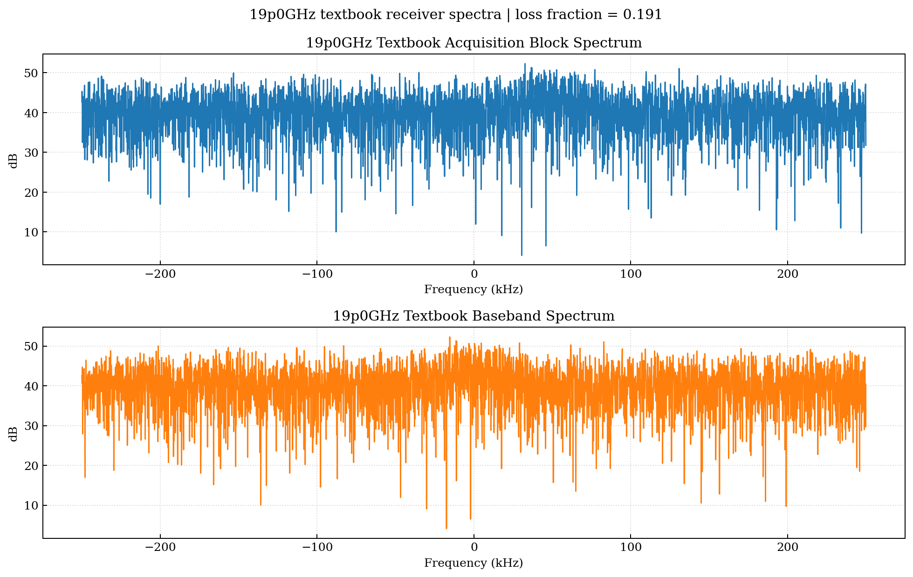

这一层回答的是：传播层变化进入接收机以后，最终会不会转化为码时延恢复误差、频率恢复误差和失锁风险的抬升。

#### 8.1.3 单历元定位

| 单历元定位指标 | 数值 |
| --- | --- |
| 群时延中位数（米） | 0.147 |
| 单通道伪距一秒平滑标准差（米） | 2105.394 |
| 场景甲普通最小二乘三维误差（米） | 640.350 |
| 场景甲加权最小二乘三维误差（米） | 557.700 |
| 场景乙普通最小二乘三维误差（米） | 1.206e+04 |
| 场景乙加权最小二乘三维误差（米） | 3363.132 |
| 场景甲位置精度因子 | 3.556 |
| 场景乙位置精度因子 | 2.104 |
| 困难场景统计定位均值（米） | 5050.610 |
| 困难场景统计定位九成分位值（米） | 8767.887 |

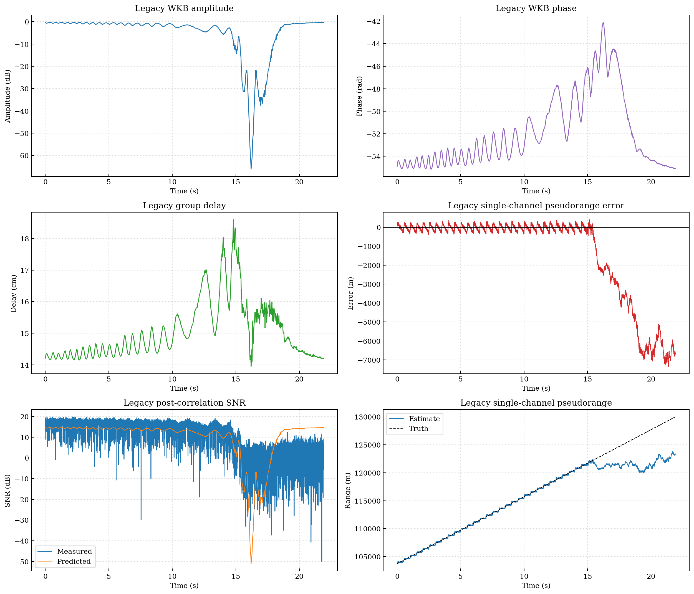


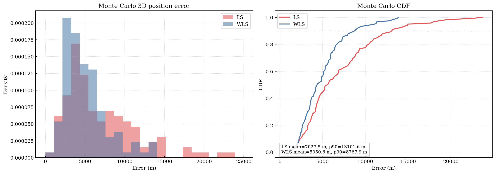

这一层回答的是：在同一传播背景之下，低权重观测是否会把困难场景误差显著放大，以及加权求解能否把这种放大压下去。

#### 8.1.4 动态滤波

| 动态滤波指标 | 数值 |
| --- | --- |
| 单历元基线平均三维误差（米） | 1.284e+04 |
| 仅伪距动态滤波平均三维误差（米） | 2.915e+04 |
| 伪距加距离变化率动态滤波平均三维误差（米） | 2.622e+04 |
| 伪距加距离变化率动态滤波平均三维速度误差（米每秒） | 1943.133 |
| 伪距加距离变化率动态滤波平均伪距新息（米） | 8047.419 |
| 伪距加距离变化率动态滤波平均距离变化率新息（米每秒） | 489.307 |
| 仅预测历元数 | 121 |
| 动态距离变化率一百毫秒标准差（米每秒） | 49.835 |

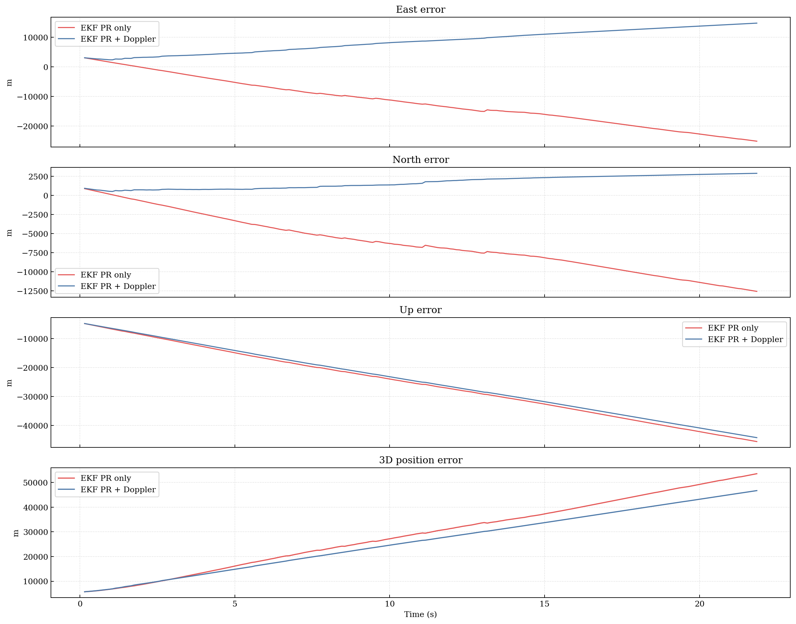

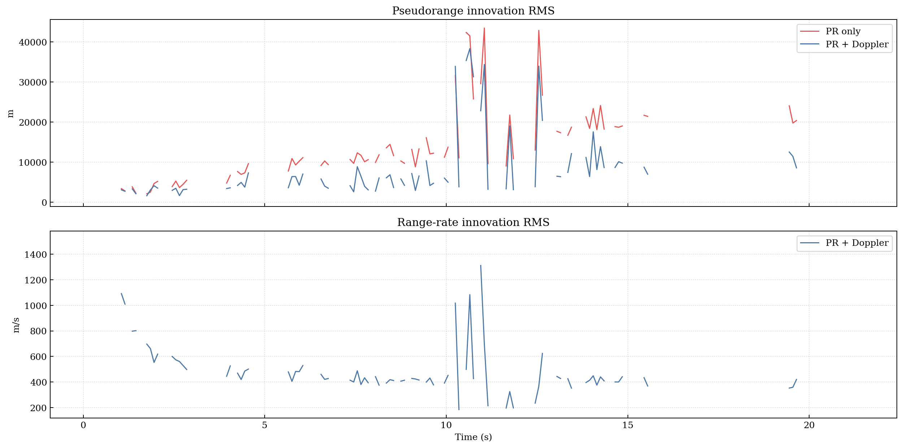

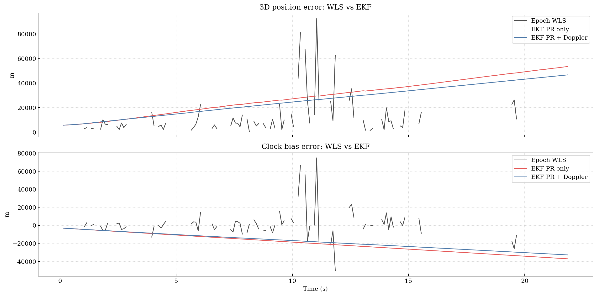

这一层回答的是：在连续历元条件下，伪距和距离变化率是否能形成稳定互补，以及这种互补在该频点上发挥到了什么程度。


### 8.2 代表频点 22.5 吉赫 的层间证据

这一频点代表过渡段，也是此前工作最常用的参考频点。它适合用来比较“旧单频工作流”与“新全频工作流”之间的解释差异。

#### 8.2.1 该频点的综合位置

| 指标 | 数值 |
| --- | --- |
| 单通道码时延均方根误差（纳秒） | 8812.868 |
| 单通道后相关信噪比中位数（分贝） | 15.950 |
| 困难场景加权定位三维误差（米） | 3450.720 |
| 动态滤波三维位置误差（米） | 7.117e+04 |
| 动态滤波三维速度误差（米每秒） | 7388.563 |

#### 8.2.2 单通道传播与恢复

| 单通道指标 | 数值 |
| --- | --- |
| 传播振幅中位数 | 0.912 |
| 传播衰减中位数（分贝） | -0.799 |
| 传播相位中位数（弧度） | -64.038 |
| 群时延中位数（纳秒） | 0.482 |
| 码时延均方根误差（纳秒） | 8812.868 |
| 频率恢复均方根误差（赫兹） | 3209.141 |
| 主峰与次峰差值（分贝） | 0.023 |
| 后相关信噪比中位数（分贝） | 15.950 |
| 载波锁定指标中位数 | 0.107 |
| 失锁占比 | 0.160 |

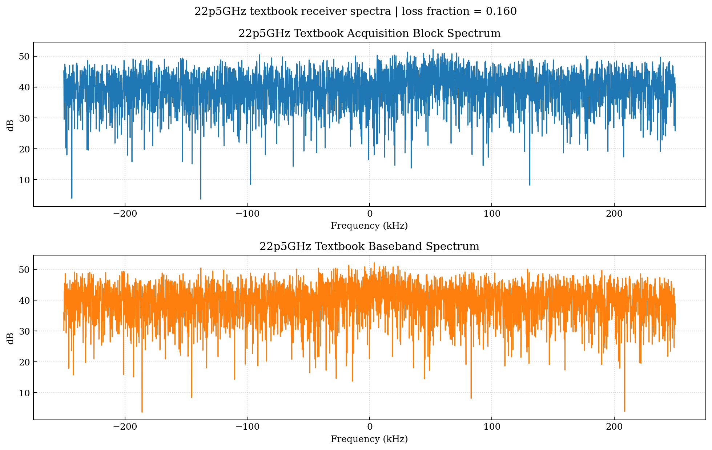

这一层回答的是：传播层变化进入接收机以后，最终会不会转化为码时延恢复误差、频率恢复误差和失锁风险的抬升。

#### 8.2.3 单历元定位

| 单历元定位指标 | 数值 |
| --- | --- |
| 群时延中位数（米） | 0.145 |
| 单通道伪距一秒平滑标准差（米） | 2160.228 |
| 场景甲普通最小二乘三维误差（米） | 657.028 |
| 场景甲加权最小二乘三维误差（米） | 572.225 |
| 场景乙普通最小二乘三维误差（米） | 1.237e+04 |
| 场景乙加权最小二乘三维误差（米） | 3450.720 |
| 场景甲位置精度因子 | 3.556 |
| 场景乙位置精度因子 | 2.104 |
| 困难场景统计定位均值（米） | 4840.907 |
| 困难场景统计定位九成分位值（米） | 9406.171 |

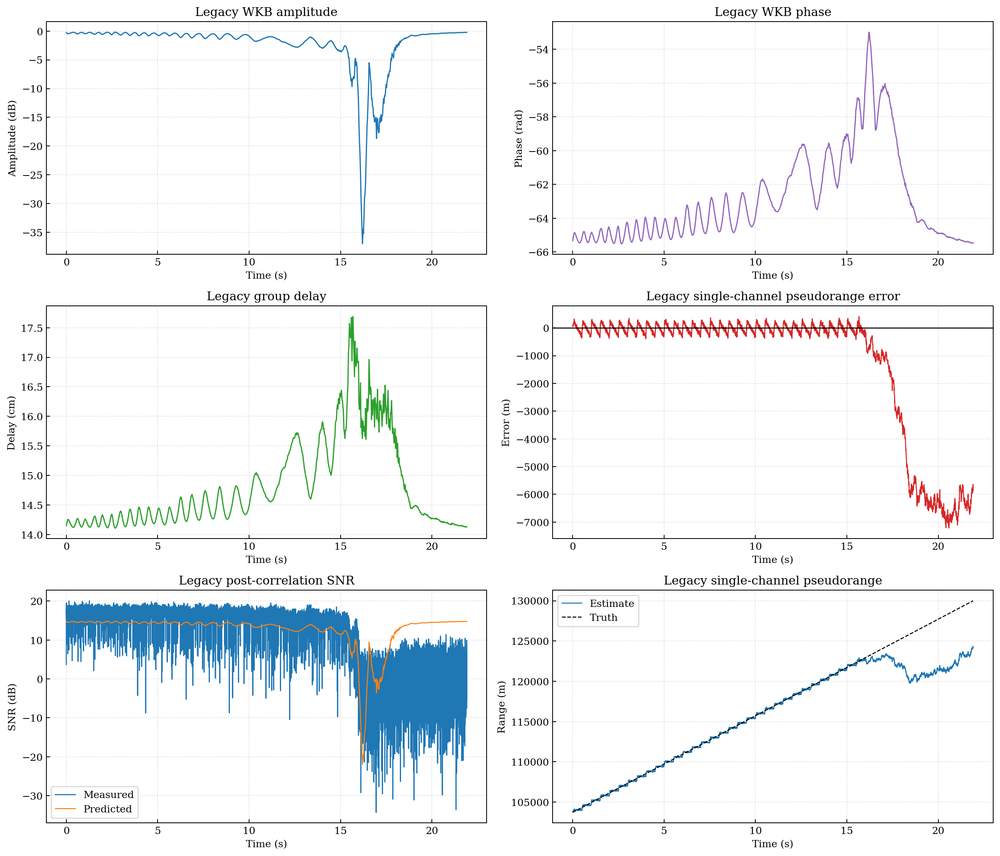

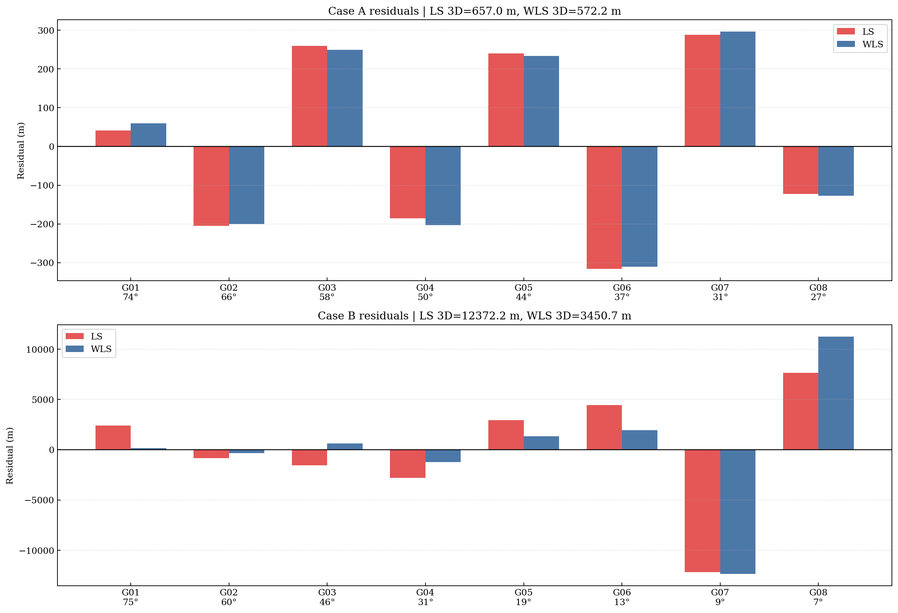

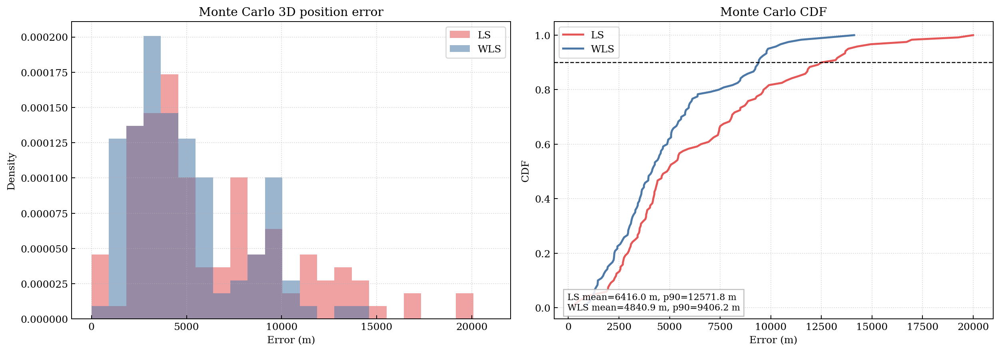

这一层回答的是：在同一传播背景之下，低权重观测是否会把困难场景误差显著放大，以及加权求解能否把这种放大压下去。

#### 8.2.4 动态滤波

| 动态滤波指标 | 数值 |
| --- | --- |
| 单历元基线平均三维误差（米） | 1.282e+04 |
| 仅伪距动态滤波平均三维误差（米） | 7.359e+04 |
| 伪距加距离变化率动态滤波平均三维误差（米） | 7.117e+04 |
| 伪距加距离变化率动态滤波平均三维速度误差（米每秒） | 7388.563 |
| 伪距加距离变化率动态滤波平均伪距新息（米） | 1.220e+04 |
| 伪距加距离变化率动态滤波平均距离变化率新息（米每秒） | 1467.260 |
| 仅预测历元数 | 100 |
| 动态距离变化率一百毫秒标准差（米每秒） | 37.765 |

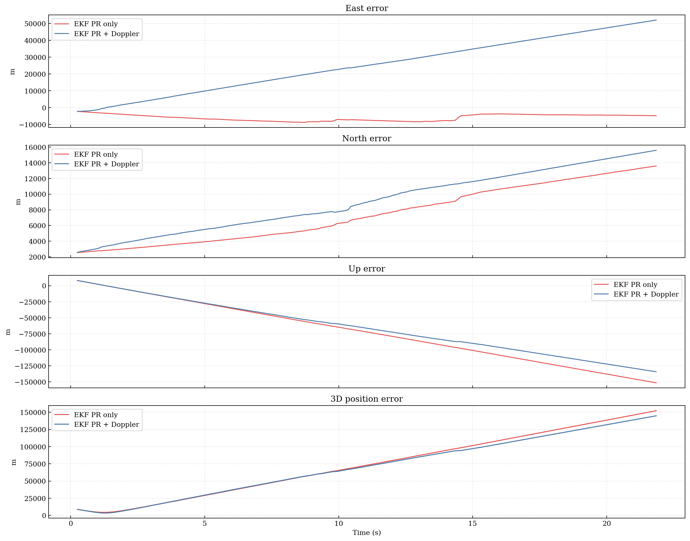

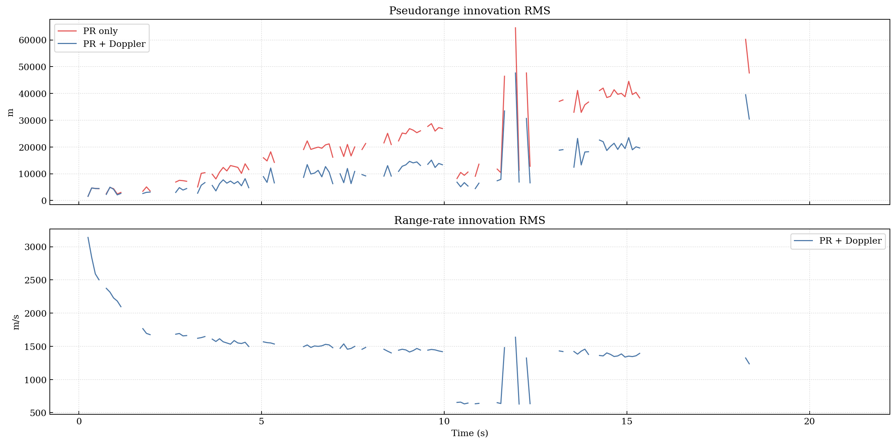

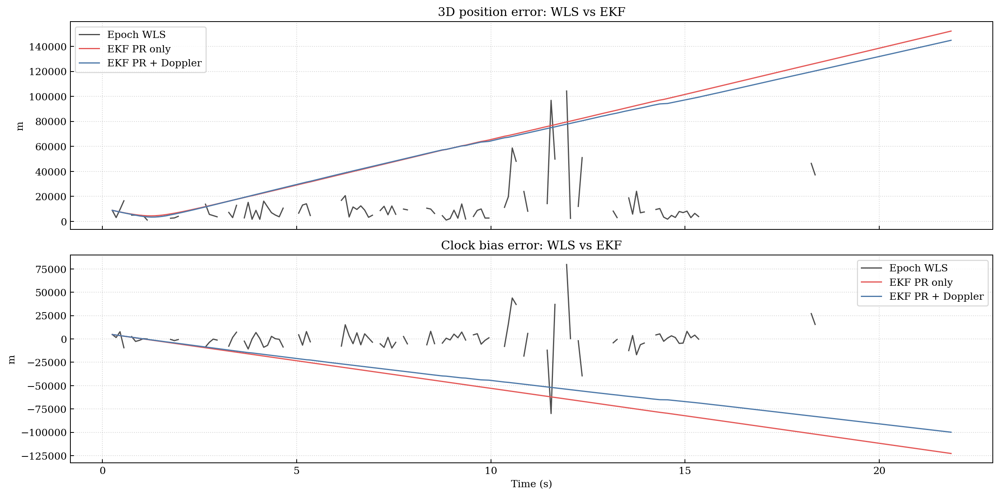

这一层回答的是：在连续历元条件下，伪距和距离变化率是否能形成稳定互补，以及这种互补在该频点上发挥到了什么程度。


### 8.3 代表频点 31.0 吉赫 的层间证据

这一频点代表高频段。它最能体现高频端在单通道恢复、困难场景定位和动态滤波三层上的联合改善。

#### 8.3.1 该频点的综合位置

| 指标 | 数值 |
| --- | --- |
| 单通道码时延均方根误差（纳秒） | 3.318e+04 |
| 单通道后相关信噪比中位数（分贝） | 0.676 |
| 困难场景加权定位三维误差（米） | 8140.640 |
| 动态滤波三维位置误差（米） | 1.709e+05 |
| 动态滤波三维速度误差（米每秒） | 1.399e+04 |

#### 8.3.2 单通道传播与恢复

| 单通道指标 | 数值 |
| --- | --- |
| 传播振幅中位数 | 0.955 |
| 传播衰减中位数（分贝） | -0.404 |
| 传播相位中位数（弧度） | -89.540 |
| 群时延中位数（纳秒） | 0.474 |
| 码时延均方根误差（纳秒） | 3.318e+04 |
| 频率恢复均方根误差（赫兹） | 2.126e+04 |
| 主峰与次峰差值（分贝） | 0.067 |
| 后相关信噪比中位数（分贝） | 0.676 |
| 载波锁定指标中位数 | 0.003 |
| 失锁占比 | 0.502 |

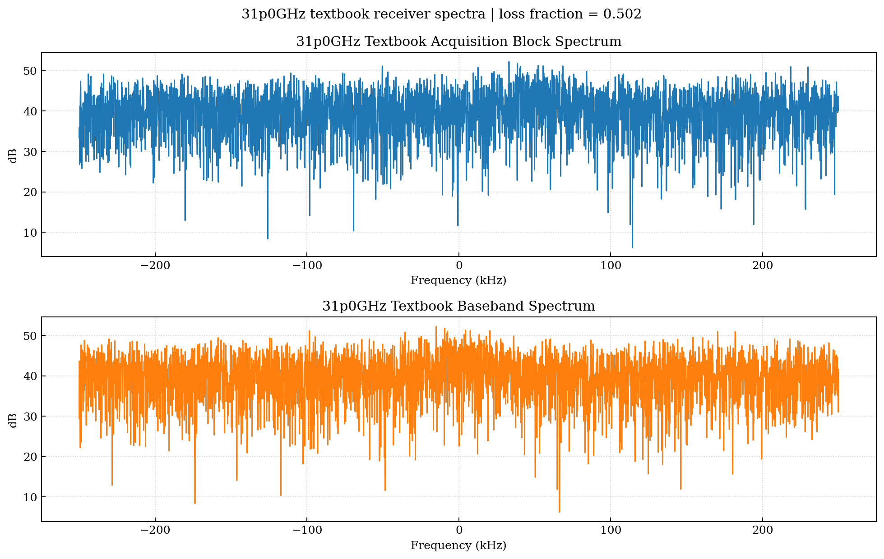

这一层回答的是：传播层变化进入接收机以后，最终会不会转化为码时延恢复误差、频率恢复误差和失锁风险的抬升。

#### 8.3.3 单历元定位

| 单历元定位指标 | 数值 |
| --- | --- |
| 群时延中位数（米） | 0.142 |
| 单通道伪距一秒平滑标准差（米） | 5096.599 |
| 场景甲普通最小二乘三维误差（米） | 1550.167 |
| 场景甲加权最小二乘三维误差（米） | 1350.078 |
| 场景乙普通最小二乘三维误差（米） | 2.917e+04 |
| 场景乙加权最小二乘三维误差（米） | 8140.640 |
| 场景甲位置精度因子 | 3.556 |
| 场景乙位置精度因子 | 2.104 |
| 困难场景统计定位均值（米） | 1.083e+04 |
| 困难场景统计定位九成分位值（米） | 1.912e+04 |

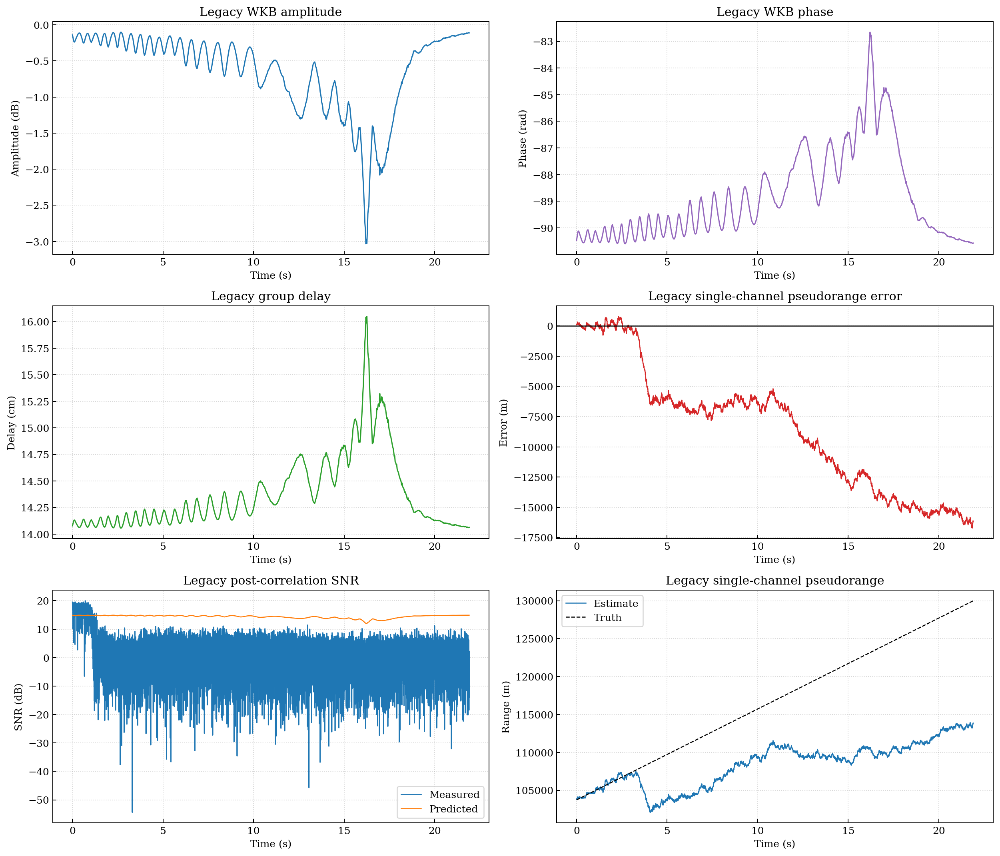

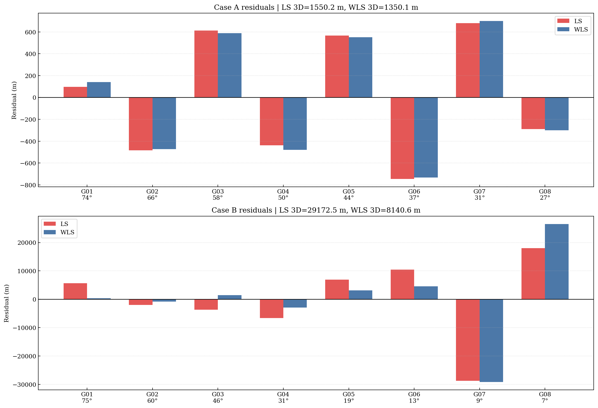

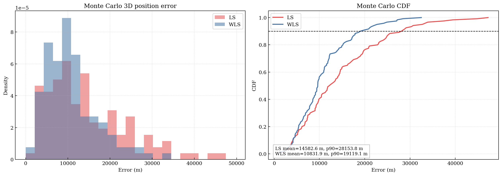

这一层回答的是：在同一传播背景之下，低权重观测是否会把困难场景误差显著放大，以及加权求解能否把这种放大压下去。

#### 8.3.4 动态滤波

| 动态滤波指标 | 数值 |
| --- | --- |
| 单历元基线平均三维误差（米） | 2.835e+04 |
| 仅伪距动态滤波平均三维误差（米） | 1.942e+05 |
| 伪距加距离变化率动态滤波平均三维误差（米） | 1.709e+05 |
| 伪距加距离变化率动态滤波平均三维速度误差（米每秒） | 1.399e+04 |
| 伪距加距离变化率动态滤波平均伪距新息（米） | 3.640e+04 |
| 伪距加距离变化率动态滤波平均距离变化率新息（米每秒） | 3651.243 |
| 仅预测历元数 | 172 |
| 动态距离变化率一百毫秒标准差（米每秒） | 108.703 |

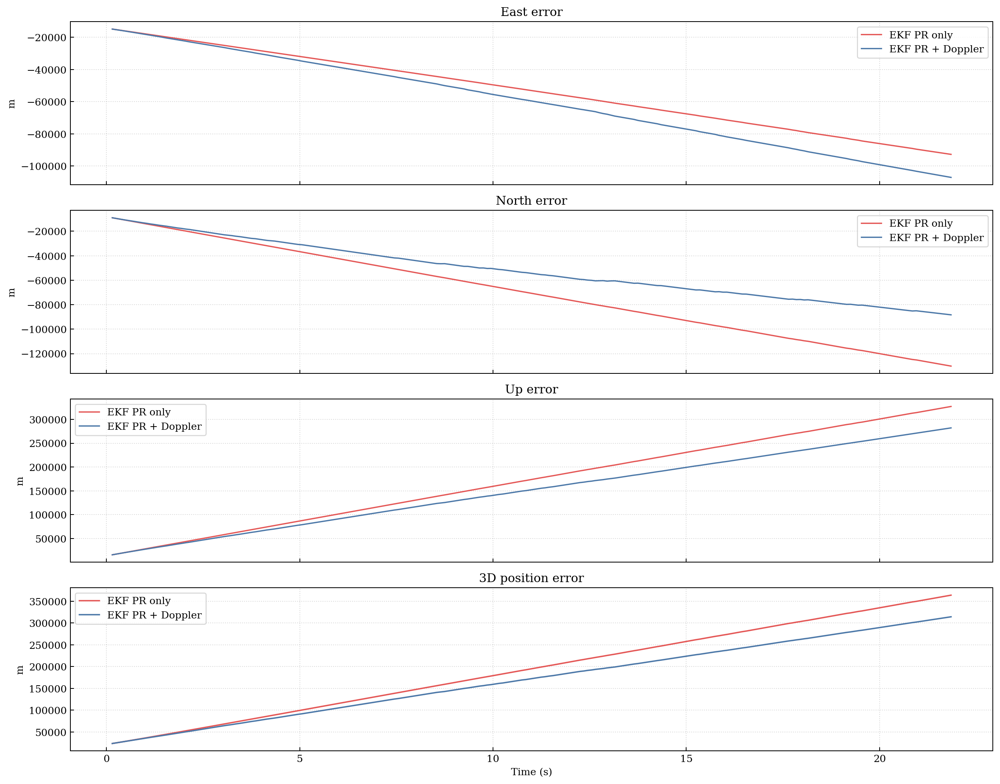

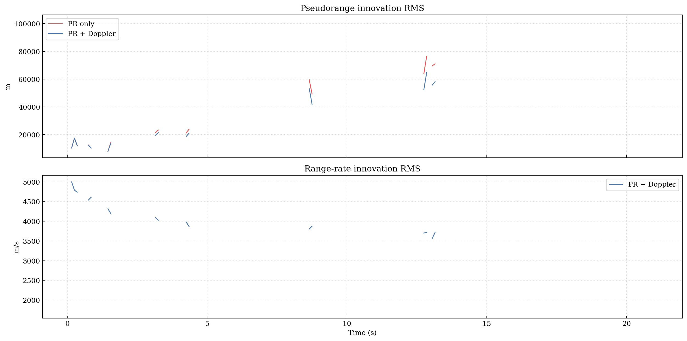

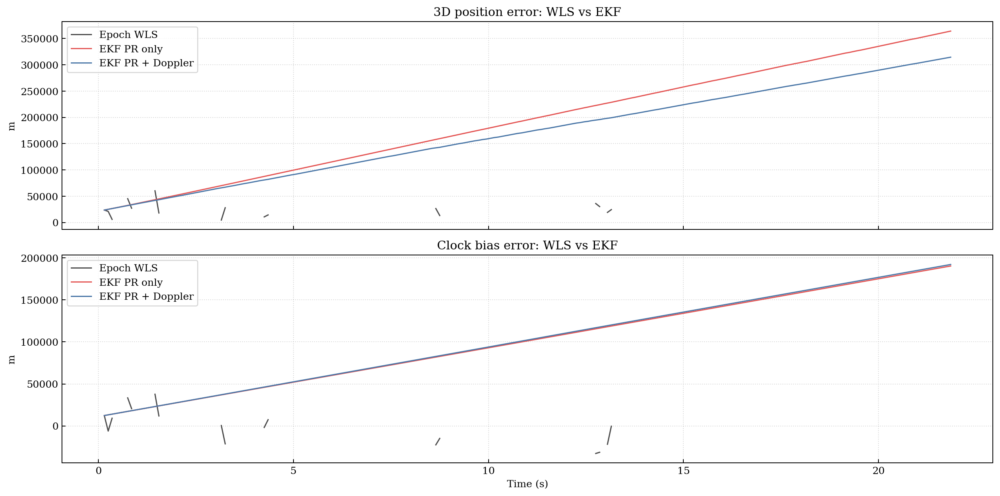

这一层回答的是：在连续历元条件下，伪距和距离变化率是否能形成稳定互补，以及这种互补在该频点上发挥到了什么程度。


## 9. 讨论与局限

### 9.1 为什么高频段总体更优

从现有结果看，高频段总体更优并不只是因为某一个传播量单独变好了，而是因为以下三层因素同时朝有利方向变化：

1. 接收机恢复层的码时延误差整体收缩。
2. 单历元定位层在困难场景中的误差放大幅度下降。
3. 动态滤波层可以更稳定地利用距离变化率信息。

### 9.2 为什么仍会出现局部波动

局部波动并不意味着总体趋势失效，而说明系统是多因素耦合的：

1. 传播层变化本身不是严格线性单调。
2. 单历元求解还会受到几何和权重映射影响。
3. 动态滤波则进一步受到观测门控和仅预测历元的影响。

因此，本报告采用的是“总体趋势加局部波动”的解释框架，而不是简单的单调结论。

### 9.3 本报告不能替代什么

本报告不能替代真实多星端到端系统定标，原因在于：

1. 多星几何不是广播星历。
2. 各卫星没有独立真实传播路径。
3. 动态轨迹不是实飞轨迹。

但本报告已经足够支撑后续的两类工作：

1. 把后续笔记本和实验从单频点扩展为全频分析。
2. 为更进一步的真实星历、真实轨迹和独立传播路径扩展提供频率侧依据。

## 10. 结论

本次全频研究最重要的结论可以压缩为四点：

1. 频率不能再被视为一个固定常数，而必须被视为主实验维度。
2. 单通道传播恢复误差是传播层影响导航层的关键中间环节。
3. 困难场景单历元定位对频率变化高度敏感，因此非常适合作为跨频比较基准。
4. 动态滤波在高频段展现出最稳定的优势，说明高频段更容易把传播层改善转化成连续历元定位收益。

## 11. 附录

### 11.1 全频核心指标总表

| 频率（吉赫） | 群时延中位数（纳秒） | 单通道码时延均方根误差（纳秒） | 后相关信噪比中位数（分贝） | 困难场景加权定位三维误差（米） | 困难场景统计定位均值（米） | 动态滤波三维位置误差（米） | 动态滤波三维速度误差（米每秒） |
| --- | --- | --- | --- | --- | --- | --- | --- |
| 19 | 0.490 | 8986.464 | 15.234 | 3363.132 | 5050.610 | 2.622e+04 | 1943.133 |
| 19.500 | 0.488 | 9478.360 | 15.386 | 3699.958 | 5114.101 | 5.914e+04 | 5659.229 |
| 20 | 0.487 | 9870.318 | 15.489 | 3844.268 | 5433.979 | 2.469e+04 | 2727.079 |
| 20.500 | 0.486 | 9885.874 | 15.573 | 3699.015 | 4929.110 | 2.698e+05 | 2.652e+04 |
| 21 | 0.485 | 8644.394 | 15.659 | 3304.745 | 4975.026 | 1.704e+04 | 2930.208 |
| 21.500 | 0.484 | 8496.520 | 15.789 | 3220.668 | 4488.019 | 9.509e+04 | 1.025e+04 |
| 22 | 0.483 | 8397.727 | 15.858 | 3153.900 | 4640.834 | 4.587e+04 | 4705.584 |
| 22.500 | 0.482 | 8812.868 | 15.950 | 3450.720 | 4840.907 | 7.117e+04 | 7388.563 |
| 23 | 0.482 | 8664.310 | 15.999 | 3376.260 | 4731.164 | 3585.927 | 673.085 |
| 23.500 | 0.481 | 3.210e+04 | 0.570 | 7827.087 | 1.028e+04 | 1.591e+05 | 1.406e+04 |
| 24 | 0.480 | 7800.921 | 16.115 | 2941.573 | 4266.614 | 4.280e+04 | 4583.052 |
| 24.500 | 0.480 | 8493.202 | 16.214 | 3245.592 | 4470.965 | 2.051e+04 | 1662.393 |
| 25 | 0.479 | 8757.081 | 16.236 | 3405.976 | 4431.099 | 7.426e+04 | 7502.459 |
| 25.500 | 0.478 | 2.546e+04 | 0.988 | 5558.783 | 7969.581 | 1.094e+05 | 1.142e+04 |
| 26 | 0.478 | 546.693 | 16.878 | 17.405 | 23.970 | 86.152 | 0.719 |
| 26.500 | 0.478 | 3.133e+04 | 0.486 | 7313.522 | 1.040e+04 | 8.046e+04 | 8400.323 |
| 27 | 0.477 | 545.254 | 16.936 | 8.644 | 12.573 | 57.364 | 0.184 |
| 27.500 | 0.477 | 2.926e+04 | 1.373 | 8468.052 | 1.219e+04 | 2.475e+05 | 2.406e+04 |
| 28 | 0.476 | 540.580 | 16.996 | 5.995 | 7.762 | 318.931 | 0.451 |
| 28.500 | 0.476 | 5.896e+04 | 0.930 | 1.639e+04 | 2.167e+04 | 5.550e+05 | 5.095e+04 |
| 29 | 0.476 | 546.809 | 17.052 | 8.683 | 12.552 | 68.196 | 0.926 |
| 29.500 | 0.475 | 3.283e+04 | 1.164 | 9032.748 | 1.355e+04 | 2.800e+05 | 2.691e+04 |
| 30 | 0.475 | 543.502 | 17.097 | 10.118 | 13.102 | 145.774 | 0.634 |
| 30.500 | 0.475 | 541.016 | 17.126 | 12.276 | 16.909 | 35.340 | 0.178 |
| 31 | 0.474 | 3.318e+04 | 0.676 | 8140.640 | 1.083e+04 | 1.709e+05 | 1.399e+04 |

## 11.2 低频段附录

该频段覆盖 19.0 至 22.0 吉赫，共 7 个频点。附录仅保留该频段的核心数值和对应文件索引，正文不再逐频点展开长段解释。

| 频率（吉赫） | 单通道误差（纳秒） | 困难场景定位误差（米） | 动态滤波位置误差（米） | 单通道文件 | 单历元文件 | 动态文件 |
| --- | --- | --- | --- | --- | --- | --- |
| 19 | 8986.464 | 3363.132 | 2.622e+04 | [单通道明细](single_channel/frequency_details/19p0GHz.json) | [单历元摘要](wls/19p0GHz/summary.json) | [动态摘要](ekf/19p0GHz/summary.json) |
| 19.500 | 9478.360 | 3699.958 | 5.914e+04 | [单通道明细](single_channel/frequency_details/19p5GHz.json) | [单历元摘要](wls/19p5GHz/summary.json) | [动态摘要](ekf/19p5GHz/summary.json) |
| 20 | 9870.318 | 3844.268 | 2.469e+04 | [单通道明细](single_channel/frequency_details/20p0GHz.json) | [单历元摘要](wls/20p0GHz/summary.json) | [动态摘要](ekf/20p0GHz/summary.json) |
| 20.500 | 9885.874 | 3699.015 | 2.698e+05 | [单通道明细](single_channel/frequency_details/20p5GHz.json) | [单历元摘要](wls/20p5GHz/summary.json) | [动态摘要](ekf/20p5GHz/summary.json) |
| 21 | 8644.394 | 3304.745 | 1.704e+04 | [单通道明细](single_channel/frequency_details/21p0GHz.json) | [单历元摘要](wls/21p0GHz/summary.json) | [动态摘要](ekf/21p0GHz/summary.json) |
| 21.500 | 8496.520 | 3220.668 | 9.509e+04 | [单通道明细](single_channel/frequency_details/21p5GHz.json) | [单历元摘要](wls/21p5GHz/summary.json) | [动态摘要](ekf/21p5GHz/summary.json) |
| 22 | 8397.727 | 3153.900 | 4.587e+04 | [单通道明细](single_channel/frequency_details/22p0GHz.json) | [单历元摘要](wls/22p0GHz/summary.json) | [动态摘要](ekf/22p0GHz/summary.json) |

## 11.3 过渡段附录

该频段覆盖 22.5 至 25.5 吉赫，共 7 个频点。附录仅保留该频段的核心数值和对应文件索引，正文不再逐频点展开长段解释。

| 频率（吉赫） | 单通道误差（纳秒） | 困难场景定位误差（米） | 动态滤波位置误差（米） | 单通道文件 | 单历元文件 | 动态文件 |
| --- | --- | --- | --- | --- | --- | --- |
| 22.500 | 8812.868 | 3450.720 | 7.117e+04 | [单通道明细](single_channel/frequency_details/22p5GHz.json) | [单历元摘要](wls/22p5GHz/summary.json) | [动态摘要](ekf/22p5GHz/summary.json) |
| 23 | 8664.310 | 3376.260 | 3585.927 | [单通道明细](single_channel/frequency_details/23p0GHz.json) | [单历元摘要](wls/23p0GHz/summary.json) | [动态摘要](ekf/23p0GHz/summary.json) |
| 23.500 | 3.210e+04 | 7827.087 | 1.591e+05 | [单通道明细](single_channel/frequency_details/23p5GHz.json) | [单历元摘要](wls/23p5GHz/summary.json) | [动态摘要](ekf/23p5GHz/summary.json) |
| 24 | 7800.921 | 2941.573 | 4.280e+04 | [单通道明细](single_channel/frequency_details/24p0GHz.json) | [单历元摘要](wls/24p0GHz/summary.json) | [动态摘要](ekf/24p0GHz/summary.json) |
| 24.500 | 8493.202 | 3245.592 | 2.051e+04 | [单通道明细](single_channel/frequency_details/24p5GHz.json) | [单历元摘要](wls/24p5GHz/summary.json) | [动态摘要](ekf/24p5GHz/summary.json) |
| 25 | 8757.081 | 3405.976 | 7.426e+04 | [单通道明细](single_channel/frequency_details/25p0GHz.json) | [单历元摘要](wls/25p0GHz/summary.json) | [动态摘要](ekf/25p0GHz/summary.json) |
| 25.500 | 2.546e+04 | 5558.783 | 1.094e+05 | [单通道明细](single_channel/frequency_details/25p5GHz.json) | [单历元摘要](wls/25p5GHz/summary.json) | [动态摘要](ekf/25p5GHz/summary.json) |

## 11.4 高频段附录

该频段覆盖 26.0 至 31.0 吉赫，共 11 个频点。附录仅保留该频段的核心数值和对应文件索引，正文不再逐频点展开长段解释。

| 频率（吉赫） | 单通道误差（纳秒） | 困难场景定位误差（米） | 动态滤波位置误差（米） | 单通道文件 | 单历元文件 | 动态文件 |
| --- | --- | --- | --- | --- | --- | --- |
| 26 | 546.693 | 17.405 | 86.152 | [单通道明细](single_channel/frequency_details/26p0GHz.json) | [单历元摘要](wls/26p0GHz/summary.json) | [动态摘要](ekf/26p0GHz/summary.json) |
| 26.500 | 3.133e+04 | 7313.522 | 8.046e+04 | [单通道明细](single_channel/frequency_details/26p5GHz.json) | [单历元摘要](wls/26p5GHz/summary.json) | [动态摘要](ekf/26p5GHz/summary.json) |
| 27 | 545.254 | 8.644 | 57.364 | [单通道明细](single_channel/frequency_details/27p0GHz.json) | [单历元摘要](wls/27p0GHz/summary.json) | [动态摘要](ekf/27p0GHz/summary.json) |
| 27.500 | 2.926e+04 | 8468.052 | 2.475e+05 | [单通道明细](single_channel/frequency_details/27p5GHz.json) | [单历元摘要](wls/27p5GHz/summary.json) | [动态摘要](ekf/27p5GHz/summary.json) |
| 28 | 540.580 | 5.995 | 318.931 | [单通道明细](single_channel/frequency_details/28p0GHz.json) | [单历元摘要](wls/28p0GHz/summary.json) | [动态摘要](ekf/28p0GHz/summary.json) |
| 28.500 | 5.896e+04 | 1.639e+04 | 5.550e+05 | [单通道明细](single_channel/frequency_details/28p5GHz.json) | [单历元摘要](wls/28p5GHz/summary.json) | [动态摘要](ekf/28p5GHz/summary.json) |
| 29 | 546.809 | 8.683 | 68.196 | [单通道明细](single_channel/frequency_details/29p0GHz.json) | [单历元摘要](wls/29p0GHz/summary.json) | [动态摘要](ekf/29p0GHz/summary.json) |
| 29.500 | 3.283e+04 | 9032.748 | 2.800e+05 | [单通道明细](single_channel/frequency_details/29p5GHz.json) | [单历元摘要](wls/29p5GHz/summary.json) | [动态摘要](ekf/29p5GHz/summary.json) |
| 30 | 543.502 | 10.118 | 145.774 | [单通道明细](single_channel/frequency_details/30p0GHz.json) | [单历元摘要](wls/30p0GHz/summary.json) | [动态摘要](ekf/30p0GHz/summary.json) |
| 30.500 | 541.016 | 12.276 | 35.340 | [单通道明细](single_channel/frequency_details/30p5GHz.json) | [单历元摘要](wls/30p5GHz/summary.json) | [动态摘要](ekf/30p5GHz/summary.json) |
| 31 | 3.318e+04 | 8140.640 | 1.709e+05 | [单通道明细](single_channel/frequency_details/31p0GHz.json) | [单历元摘要](wls/31p0GHz/summary.json) | [动态摘要](ekf/31p0GHz/summary.json) |


## 12. 数据文件与图像索引

完整跨层综合指标位于：

- `cross_frequency/combined_metrics.csv`
- `cross_frequency/combined_metrics.json`

分层统计文件位于：

- `wls/cross_frequency/wls_metrics.csv`
- `ekf/cross_frequency/ekf_metrics.csv`

关键图像位于：

- `single_channel/wkb_multifreq_overview.png`
- `single_channel/wkb_multifreq_frequency_summary.png`
- `wls/cross_frequency/wls_metrics_vs_frequency.png`
- `ekf/cross_frequency/ekf_metrics_vs_frequency.png`
- `cross_frequency/combined_metrics_vs_frequency.png`
