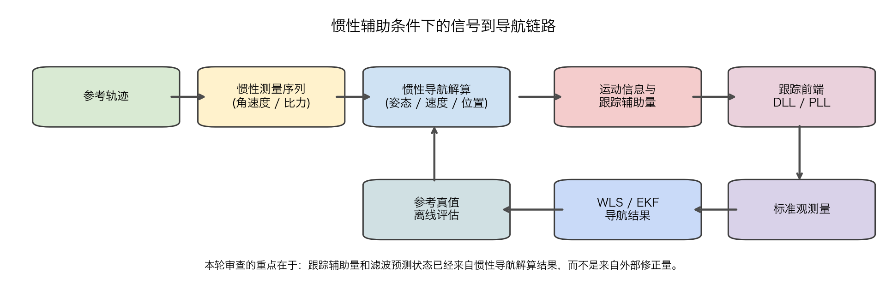
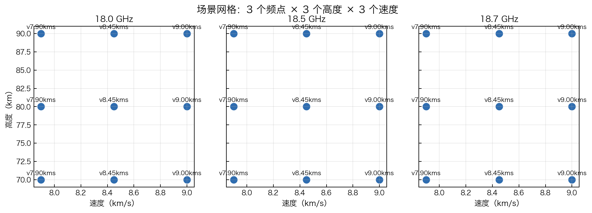
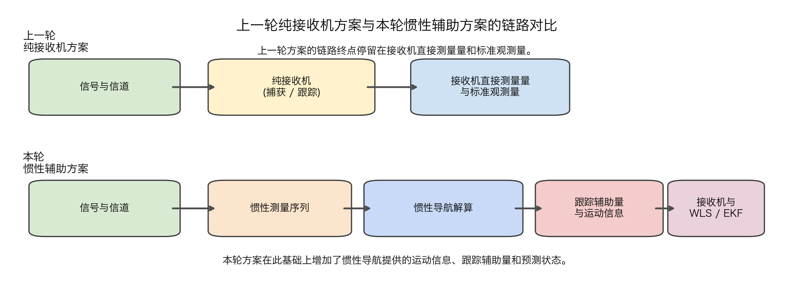
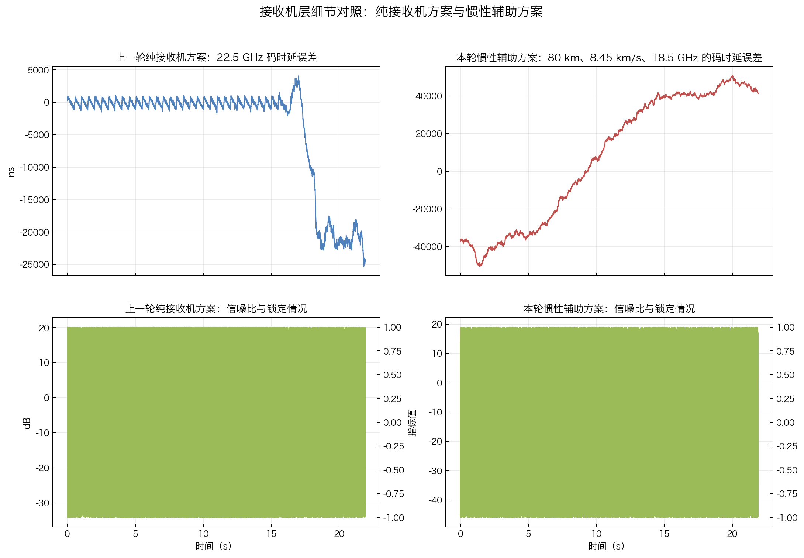
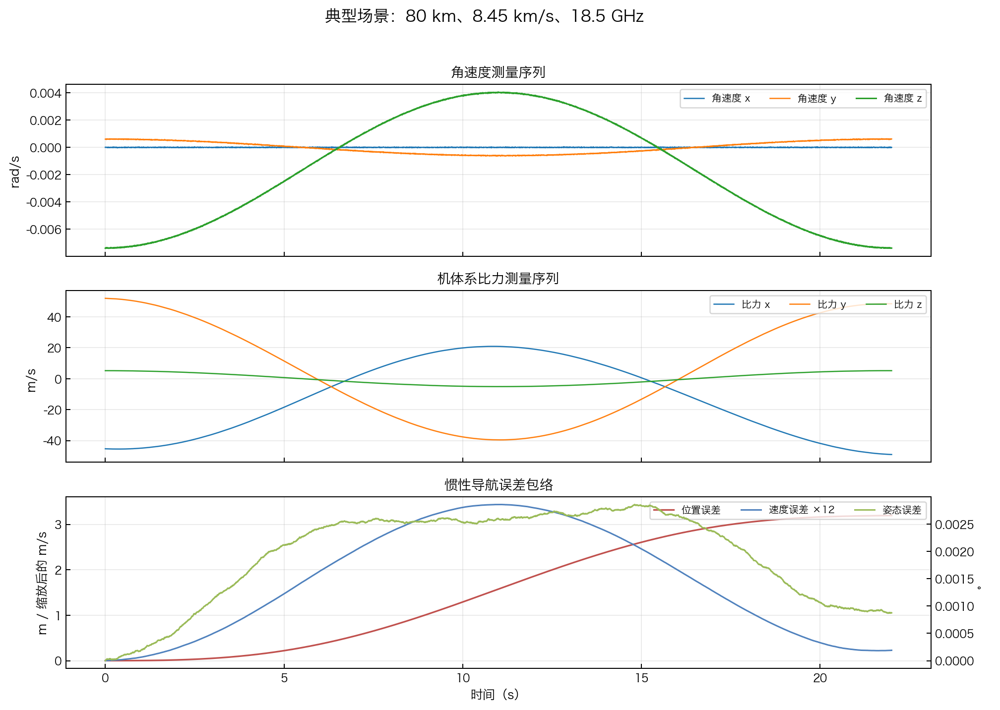
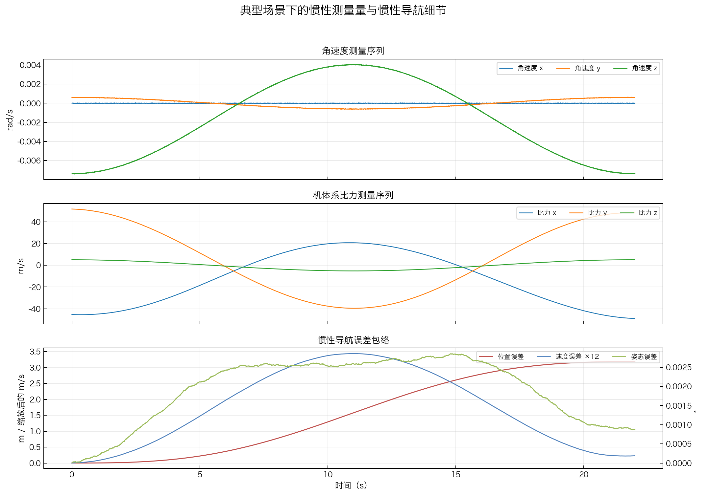
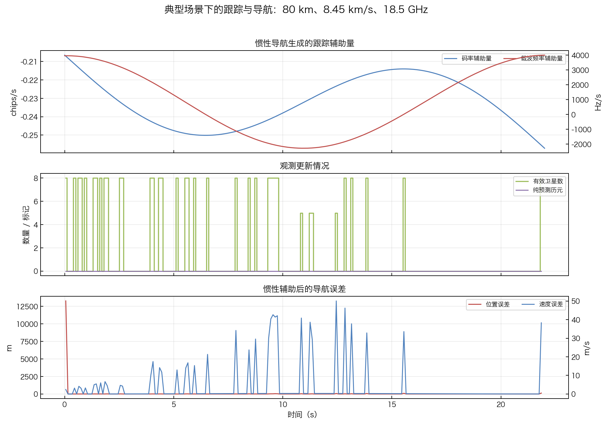
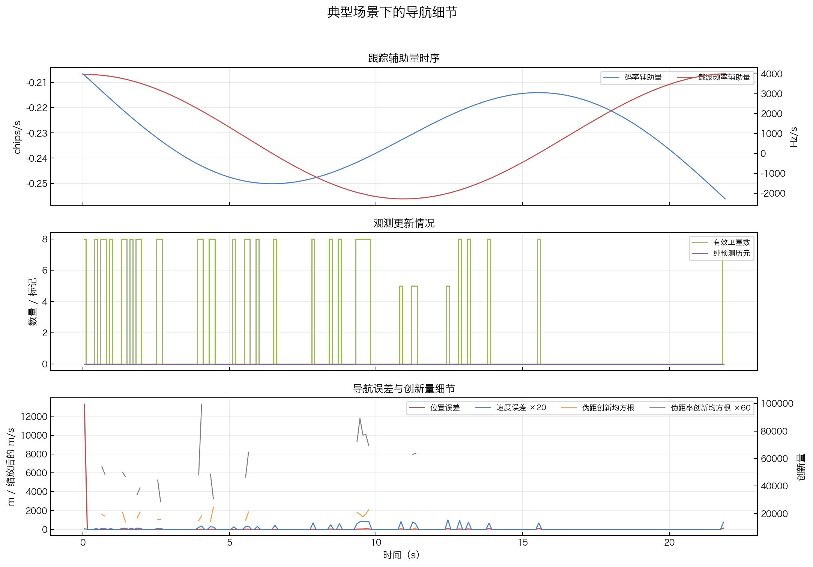
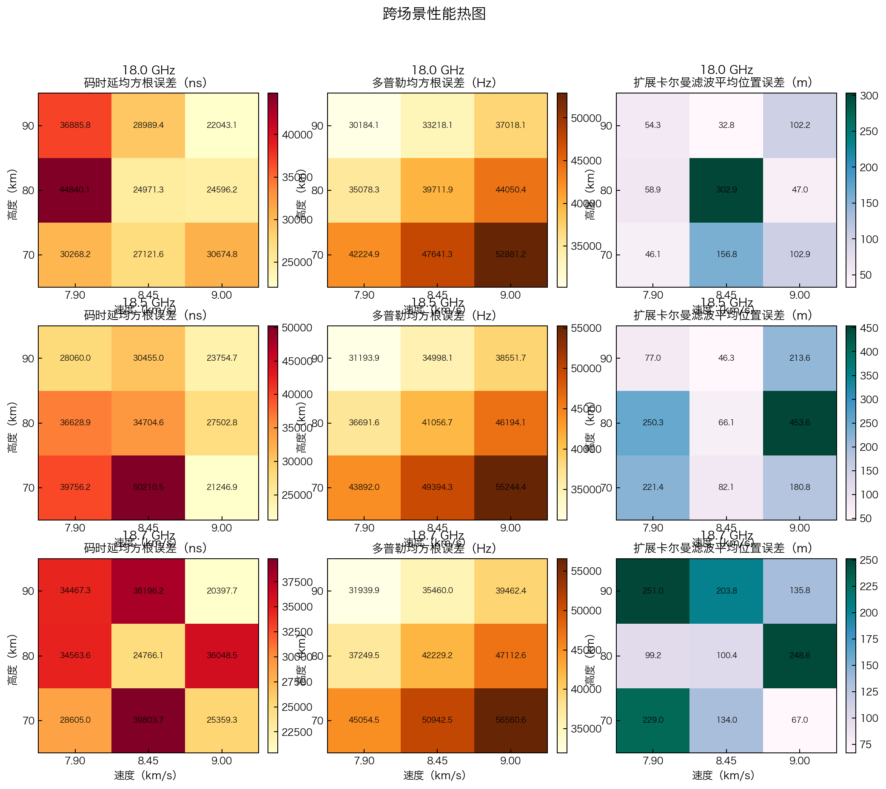
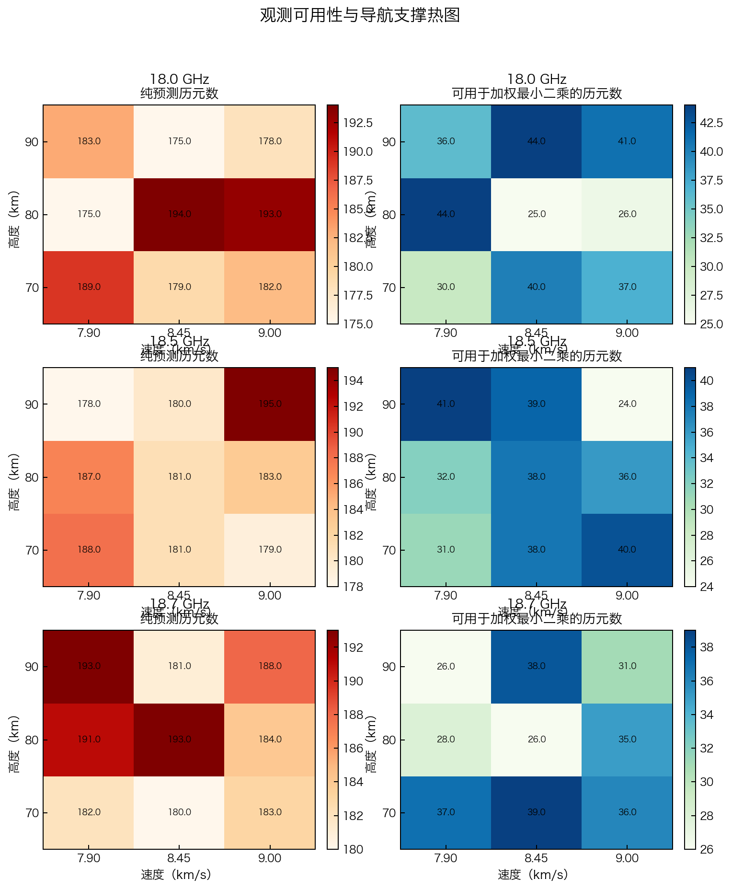

# 惯性测量单元辅助的前端跟踪与动态导航审查报告

生成时间：2026-04-23 10:40

## 一、执行摘要

本轮工作将原先依赖外部修正量的动态支撑方式，改为由惯性测量单元（IMU）和惯性导航解算（INS）直接提供支持，并在 `18.0 / 18.5 / 18.7 GHz`、`70 / 80 / 90 km`、`7.9 / 8.45 / 9.0 km/s` 组成的 `27` 个场景上完成了全量验证。

审查结论如下：**未发现需要整体返工的严重逻辑问题。** 目前的实现已经完成了“用惯性导航解算替代外部修正量”的主要目标。延迟锁定环（DLL）和锁相环（PLL）所需的跟踪辅助量，以及扩展卡尔曼滤波（EKF）中的预测状态，均由惯性导航解算结果提供，不再直接依赖参考真值或额外修正项。现阶段更突出的限制不是惯性链路本身，而是高动态条件下可用于更新的观测历元偏少，纯预测历元数仍然偏高。

## 二、背景与本轮目标

上一轮工作已经把整体流程梳理为四个层次：信号生成、接收机直接测量量、标准观测量，以及加权最小二乘（WLS）与扩展卡尔曼滤波。那一阶段虽然完成了接收机与观测层的整理，但动态支撑部分仍保留外部修正量，因此整条链路的物理含义还不够完整。

本轮工作的目标可以概括为四点：

1. 用惯性测量数据和简化捷联惯性导航替代外部修正量。
2. 由惯性导航解算结果生成跟踪环所需的辅助量。
3. 由同一套惯性状态提供加权最小二乘初值和扩展卡尔曼滤波预测状态。
4. 在高动态、跨频点、跨高度、跨速度的场景网格上验证这条链路是否稳定成立。

本轮采用的惯性测量单元参数取值偏向高端工程水平，但仍保持现实可实现性：

| 参数 | 取值 |
| --- | --- |
| 采样率（Hz） | 200 |
| 陀螺零偏（°/h） | 0.005 |
| 陀螺角随机游走（°/√h） | 0.003 |
| 加速度计零偏（mg） | 0.030 |
| 加速度计速度随机游走（m/s/√h） | 0.020 |
| 陀螺满量程（°/s） | 500 |
| 加速度计满量程（g） | 20 |

本轮场景分布如下图所示：

## 三、与上一轮纯接收机方案的对比

为了说明本轮改动的实际意义，需要先给出上一轮纯接收机方案的参照结果。上一轮工作已经把流程收敛到“接收机直接测量量形成标准观测量”的框架内，但尚未把惯性信息接入跟踪和动态导航，因此它适合作为本轮的基线。

这里还需要说明一个前提：上一轮的单通道频点扫描覆盖 `19.0~31.0 GHz`，本轮的场景则固定在 `18.0 / 18.5 / 18.7 GHz`。因此，这里的比较不是严格的一一同频对比，而是用来说明“链路职责发生了什么变化，以及这种变化带来了什么现象”。

两轮方案的职责差别如下：

| 比较项 | 上一轮纯接收机方案 | 本轮惯性辅助方案 |
| --- | --- | --- |
| 链路终点 | 接收机直接测量量与标准观测量 | 在标准观测量基础上继续完成惯性辅助和状态预测 |
| 动态信息来源 | 不引入惯性信息耦合 | 由惯性导航解算统一生成运动信息、跟踪辅助量和预测状态 |
| 主要关注点 | 码时延和多普勒恢复、锁定质量、观测形成边界 | 惯性信息是否真正接管动态支撑，以及观测是否持续可用 |
| 当前主要瓶颈 | 接收机恢复层的解释和稳定性 | 纯预测历元偏多，有效观测更新偏少 |

为便于理解，下面选取上一轮 `22.5 GHz` 的纯接收机结果，以及本轮 `80 km、8.45 km/s、18.5 GHz` 这一典型场景进行对照：

| 对象 | 代表频点或场景 | 码时延均方根误差（ns） | 多普勒均方根误差（Hz） | 锁定或可用性指标 | 说明 |
| --- | --- | --- | --- | --- | --- |
| 上一轮纯接收机方案 | 22.5 GHz | 8812.9 | 3209.1 | 主峰与次峰差 0.02 dB，失锁比例 0.160 | 用于说明未引入惯性信息时，接收机恢复层的表现与边界 |
| 本轮惯性辅助方案的典型场景 | 80 km、8.45 km/s、18.5 GHz | 34704.6 | 41056.7 | 辅助量覆盖比例 1.00，纯预测历元 181 | 用于说明引入惯性信息后，主要问题转为观测可用性和更新密度 |

这组对照说明了两个事实。第一，上一轮工作的重点是把纯接收机恢复过程和标准观测形成过程讲清楚。第二，本轮在此基础上引入了惯性信息，因此关注重点已经从“是否存在外部修正量”转移到“在高动态条件下观测是否还能持续更新”。

上一轮纯接收机方案的主报告和单通道汇总文件位于：

- `archive/research/corrections/issue_03_textbook_full_correction/weekly_report_issue_03_textbook_full_context.md`
- `archive/research/corrections/issue_03_textbook_full_correction/corrected_fullstack/single_channel/summary.json`

## 四、改进思路与实现原理

### 4.1 总体思路

本轮改动的重点，不是简单增加一组惯性参数，而是把动态部分重写为一条完整、闭合的物理链路：

`参考轨迹 -> IMU 测量序列 -> 惯性导航解算 -> 运动信息与跟踪辅助量 -> 跟踪前端 -> 标准观测量 -> 加权最小二乘与扩展卡尔曼滤波`

这条链路成立的前提有三点：

1. 角速度测量必须真实进入姿态传播。
2. 比力测量必须先经过姿态变换，再参与速度和位置积分。
3. 跟踪辅助量与滤波预测状态必须来自惯性导航解算结果，而不是直接使用参考真值。

### 4.2 简化捷联惯性导航的基本关系

本轮采用的是简化捷联惯性导航，而不是完整的惯性误差状态滤波。核心关系可以概括为三步：

$$
C_{bn,k+1} = C_{bn,k} \exp([\omega_b \Delta t]_\times)
$$

$$
a_n = C_{bn} f_b
$$

$$
v_{k+1} = v_k + a_n \Delta t, \qquad
p_{k+1} = p_k + v_k \Delta t + \tfrac{1}{2} a_n \Delta t^2
$$

在跟踪辅助侧，惯性导航的位置和速度继续投影到视线方向上，从而得到距离变化率，并进一步生成码率辅助量和载波频率辅助量：

$$
\dot{\rho} = u^T v_r, \qquad
f_D = -\frac{f_c}{c} \dot{\rho}
$$

因此，本轮新增的不是另一套外部修正项，而是把同一套惯性导航状态同时用于四件事：

1. 生成运动信息。
2. 生成跟踪辅助量。
3. 提供加权最小二乘初值。
4. 提供扩展卡尔曼滤波预测状态。

## 五、最终审查结论

### 5.1 严重问题复核

围绕“是否存在必须推翻当前实现的严重问题”，本轮重点复核了四项内容：

1. 惯性辅助链路中是否仍有参考真值直接写入。
2. 角速度测量是否真实参与姿态传播。
3. 机体系比力是否经过姿态变换后再积分。
4. 综合统计结果是否与单场景输出一致。

复核结果如下：

| 审查项 | 结论 |
| --- | --- |
| 惯性辅助链路是否直接使用参考真值 | 27 个场景均确认未直接使用参考真值，惯性辅助量全部来自惯性导航状态 |
| 惯性导航误差量级是否异常 | 平均位置误差范围为 1.456~1.682 m，未见数值发散 |
| 姿态传播是否存在明显失真 | 平均姿态误差范围为 0.001243~0.001934°，陀螺建模与姿态传播保持一致 |
| 综合统计文件是否完整 | 27 个场景目录、27 份摘要文件以及 1 组综合统计文件均已生成 |

综合判断是：当前实现没有暴露出必须整体返工的问题，可以直接作为正式汇报版本使用。

### 5.2 当前的主要限制

如果只看惯性导航本身，本轮结果是稳定的：

- 惯性导航平均位置误差均值为 `1.572 m`
- 惯性导航平均姿态误差均值为 `0.001611°`

但如果同时看跟踪和导航结果，限制因素仍然集中在观测可用性上：

- 码时延均方根误差均值为 `31293.2 ns`，最大达到 `50210.5 ns`
- 多普勒均方根误差均值为 `41675.4 Hz`，最大达到 `56560.6 Hz`
- 可用于加权最小二乘的历元数均值为 `34.7`，最少仅 `24`
- 纯预测历元数均值为 `184.3`，约占 `219` 个历元中的 `84.1%`

这说明系统已经具备由惯性信息支撑动态过程的能力，但高动态条件下可用于更新的观测历元仍然不足，这也是下一步需要优先处理的问题。

## 六、典型场景与中间量

为便于说明中间量的变化情况，下面选取 `80 km、8.45 km/s、18.5 GHz` 这一典型场景作为示例。

### 6.1 惯性测量量与惯性导航误差

这张图可以说明三点：

1. 惯性测量序列中确实存在连续的角速度和比力数据，而不是只有参数配置。
2. 惯性导航的位置、速度和姿态误差始终保持在较小范围内，没有出现发散。
3. 在当前高动态场景下，惯性导航本身并不是主要误差来源。

下图进一步把惯性测量量和惯性导航误差拆开显示，便于单独观察各项变化：

### 6.2 跟踪辅助量与导航时序

这一组结果最关键的信息有两点：

1. 惯性导航持续生成码率辅助量和载波频率辅助量，并将其送入跟踪环。
2. 纯预测历元仍然较多，说明扩展卡尔曼滤波虽然能够依靠惯性信息维持运行，但观测更新仍然偏稀疏。

下图把有效卫星数、创新量和导航误差放到同一视角下，用于说明观测更新不足对导航结果的影响：

典型场景和两端场景的结果摘要如下：

| 场景 | 码时延均方根误差（ns） | 多普勒均方根误差（Hz） | 惯性导航平均位置误差（m） | 扩展卡尔曼滤波平均位置误差（m） | 纯预测历元数 |
| --- | --- | --- | --- | --- | --- |
| 70 km、7.90 km/s、18.0 GHz | 30268.2 | 42224.9 | 1.477 | 46.1 | 189 |
| 80 km、8.45 km/s、18.5 GHz | 34704.6 | 41056.7 | 1.582 | 66.1 | 181 |
| 90 km、9.00 km/s、18.7 GHz | 20397.7 | 39462.4 | 1.676 | 135.8 | 188 |

## 七、27 个场景的综合结果

### 7.1 综合统计

| 指标 | 最小值 | 均值 | 最大值 |
| --- | --- | --- | --- |
| 码时延均方根误差（ns） | 20397.7 | 31293.2 | 50210.5 |
| 多普勒均方根误差（Hz） | 30184.1 | 41675.4 | 56560.6 |
| 惯性导航平均位置误差（m） | 1.456 | 1.572 | 1.682 |
| 惯性导航平均姿态误差（°） | 0.001243 | 0.001611 | 0.001934 |
| 扩展卡尔曼滤波平均位置误差（m） | 32.8 | 146.8 | 453.6 |
| 纯预测历元数 | 175 | 184.3 | 195 |

### 7.2 跨场景性能分布

从这组热图可以看出两个整体趋势：

1. 惯性导航相关误差整体比较稳定，但码时延误差、多普勒误差和导航位置误差会随着场景条件明显变化。
2. 频率、高度和速度共同决定动态压力，其中高速度与部分中高频点组合更容易使跟踪前端进入困难区间。

### 7.3 观测可用性分布

这张图对应本轮最重要的判断：真正限制结果上限的，不是惯性导航本身，而是很多场景中的观测更新历元明显偏少。这也是为什么：

- 加权最小二乘的平均误差仍然较大。
- 扩展卡尔曼滤波虽然明显优于加权最小二乘，但仍有不少时间处于纯预测状态。

### 7.4 误差最大的场景

按照扩展卡尔曼滤波平均位置误差排序，误差最大的 5 个场景如下：

| 场景 | 码时延均方根误差（ns） | 多普勒均方根误差（Hz） | 扩展卡尔曼滤波平均位置误差（m） | 纯预测历元数 |
| --- | --- | --- | --- | --- |
| 80 km、9.00 km/s、18.5 GHz | 27502.8 | 46194.1 | 453.6 | 183 |
| 80 km、8.45 km/s、18.0 GHz | 24971.3 | 39711.9 | 302.9 | 194 |
| 90 km、7.90 km/s、18.7 GHz | 34467.3 | 31939.9 | 251.0 | 193 |
| 80 km、7.90 km/s、18.5 GHz | 36628.9 | 36691.6 | 250.3 | 187 |
| 80 km、9.00 km/s、18.7 GHz | 36048.5 | 47112.6 | 248.6 | 184 |

其中需要单独指出的极值如下：

- 码时延均方根误差最大场景：`70 km、8.45 km/s、18.5 GHz`，`50210.5 ns`
- 多普勒均方根误差最大场景：`70 km、9.00 km/s、18.7 GHz`，`56560.6 Hz`
- 扩展卡尔曼滤波平均位置误差最大场景：`80 km、9.00 km/s、18.5 GHz`，`453.6 m`
- 纯预测历元数最大场景：`90 km、9.00 km/s、18.5 GHz`，`195`

## 八、结果解释与汇报建议

本轮工作的结论可以归纳为一条清晰的主线：过去需要依赖外部修正量来支撑的动态部分，现在已经可以由惯性信息直接承担；惯性导航本身误差较小，说明这种替换在原理上和实现上都是成立的；而当前系统的精度上限，主要受制于高动态条件下观测更新不足。

因此，在正式汇报时，更合适的表述应当是：

> 本轮工作已经完成了从“外部修正量支撑”到“惯性信息支撑”的替换，并在 27 个高动态场景上验证了这条链路的稳定性。当前系统的主要约束，已经从动态先验是否合法，转移到高动态条件下观测是否能够持续更新。

## 九、后续建议

基于本轮结果，后续工作建议集中在三点：

1. 当前版本可以直接作为正式汇报稿件使用，不建议在汇报前继续大幅修改主算法。
2. 下一阶段如继续推进，应优先提升跟踪前端的鲁棒性和有效观测历元数，而不是重新引入外部修正量。
3. 如果后续需要进一步提高性能，可单独评估更紧密的跟踪方案或更完整的惯性误差状态建模，但不建议放入本轮收尾工作中。

## 十、交付内容

- 主报告：`weekly_report_issue_04_imu_aided.md`
- 文档版（.docx）：`weekly_report_issue_04_imu_aided.docx`
- 综合数据：`corrected_fullstack/cross_scenario/combined_metrics.csv`
- 图表目录：`figures`
- 专题分析笔记本：`notebooks/imu_aided_receiver_dynamics_review.ipynb`
- 专题图表目录：`figures/notebook`
