# Ka 21.0 GHz 真实 WKB 单通道背景下的多历元动态多星导航 EKF 实验报告

## 1. 摘要

[../notebooks/ka_multifreq_receiver_common.py](../notebooks/ka_multifreq_receiver_common.py) 提供真实单通道共享链路：
真实电子密度场、真实 WKB、Ka 21.0 GHz PN/BPSK 信号、捕获、DLL / PLL 跟踪，以及单通道
`pseudorange / carrier phase / Doppler` 输出。  
[../notebooks/exp_multisat_wls_pvt_report.py](../notebooks/exp_multisat_wls_pvt_report.py) 在此基础上增加了多星几何、
标准伪距方程和单历元 LS/WLS PVT。  
[../notebooks/exp_dynamic_multisat_ekf_report.py](../notebooks/exp_dynamic_multisat_ekf_report.py) 则进一步把系统推进到
“多历元位置-速度-钟差-钟漂动态估计”。

本报告中的动态多星结果不代表真实多星端到端 Ka 动态导航系统的性能定标。真实单通道传播与接收机链路已经接入；
动态接收机真值、多星时变几何、多历元观测形成和 EKF 仍是新增的导航层构造。

主要数字如下：

| 项目 | 数值 |
|---|---|
| tau_g 中位数 (m) | 0.145 |
| tau_g 跨度 (m) | 0.035 |
| legacy PR 100 ms sigma (m) | 150.501 |
| legacy PR 1 s sigma (m) | 38.181 |
| 导航历元数 | 219 |
| 平均有效卫星数 | 6.247 |
| Epoch WLS 平均 3D 误差 (m) | 587.134 |
| EKF PR only 平均 3D 误差 (m) | 1149.789 |
| EKF PR + Doppler 平均 3D 误差 (m) | 56.657 |
| EKF PR + Doppler 平均 3D 速度误差 (m/s) | 0.088 |
| PR + Doppler prediction-only epochs | 48 |
| 退化窗口起点 (s) | 10.078 |
| 退化窗口终点 (s) | 12.694 |

## 2. 旧脚本已有内容

共享单通道模块 [../notebooks/ka_multifreq_receiver_common.py](../notebooks/ka_multifreq_receiver_common.py) 的主链路如下：

1. 从 CSV 构造电子密度场。
2. 计算真实 WKB，得到 `A(t)`、`phi(t)`、`tau_g(t)`。
3. 用真实传播量生成 Ka 21.0 GHz PN/BPSK 信号。
4. 完成捕获。
5. 完成 DLL / PLL 跟踪。
6. 输出单通道 `pseudorange / carrier phase / Doppler`。

单历元多星脚本 [../notebooks/exp_multisat_wls_pvt_report.py](../notebooks/exp_multisat_wls_pvt_report.py) 在此基础上补上了：

1. 多星几何
2. 标准伪距形成
3. 单历元 LS/WLS
4. DOP
5. Monte Carlo

动态脚本没有重写这些内容，而是在它们的基础上增加：

1. 多历元接收机真值轨迹
2. 多历元多星时间变化几何
3. 多历元标准 `pseudorange / range-rate`
4. epoch-wise WLS 串联基线
5. 动态 EKF

## 3. 新脚本增加的动态步骤

动态脚本主链路如下：

```text
电子密度场 CSV
  -> 旧脚本 build_fields_from_csv
  -> 旧脚本 compute_real_wkb_series
  -> 旧脚本 build_signal_config_from_wkb_time
  -> 旧脚本 resample_wkb_to_receiver_time
  -> 旧脚本 KaBpskReceiver.run
  -> legacy 单通道背景: A(t), phi(t), tau_g(t), pseudorange, Doppler, SNR, lock
  -> 动态接收机真值轨迹
  -> 动态多星几何
  -> 多历元标准观测形成
  -> epoch-wise WLS baseline
  -> EKF
  -> 图片、CSV、JSON、Markdown
```

流程中的量可分成四层：

1. 真实单通道链路量：`A(t)`、`phi(t)`、`tau_g(t)`、legacy `pseudorange`、legacy Doppler、SNR、lock。
2. 动态几何量：receiver truth、satellite position/velocity、LOS、几何距离、几何距离率。
3. 标准观测量：进入统一观测方程的多历元 `pseudorange_m / range_rate_mps`。
4. 动态导航结果：WLS 基线、EKF 状态、协方差、innovation、位置/速度/时钟误差。

## 4. 复用的旧脚本函数

动态脚本直接复用了以下旧函数：

1. `build_fields_from_csv`
2. `compute_real_wkb_series`
3. `build_signal_config_from_wkb_time`
4. `resample_wkb_to_receiver_time`
5. `KaBpskReceiver.run`
6. `solve_pvt_iterative`

代码摘录如下：

```python
field_result = LEGACY_DEBUG.build_fields_from_csv(...)
wkb_result = LEGACY_DEBUG.compute_real_wkb_series(...)
cfg_sig = LEGACY_DEBUG.build_signal_config_from_wkb_time(...)
plasma_rx = LEGACY_DEBUG.resample_wkb_to_receiver_time(...)
receiver_outputs = LEGACY_DEBUG.KaBpskReceiver(receiver_context).run()
trk_result = receiver_outputs.trk_result
```

旧脚本负责真实传播和单通道接收机；动态脚本只补充旧脚本尚未覆盖的多历元导航层。

## 5. 动态状态空间模型

动态滤波状态定义为：

```text
x = [rx, ry, rz, vx, vy, vz, cb, cd]^T
```

其中：

- `r` 为接收机 ECEF 位置，单位 m
- `v` 为接收机 ECEF 速度，单位 m/s
- `cb` 为接收机钟差，单位 m
- `cd` 为接收机钟漂，单位 m/s

状态方程采用首版常速度模型：

```text
r(k+1)  = r(k) + v(k) * dt
v(k+1)  = v(k) + w_v
cb(k+1) = cb(k) + cd(k) * dt
cd(k+1) = cd(k) + w_c
```

这里的设计取舍是：

1. 接收机真值轨迹是连续常速度 ECEF 轨迹，因此常速度滤波模型与真值模型在一阶上自洽。
2. 首版重点是把系统从单历元推进到动态估计，而不是一开始就把复杂动力学引入主线。
3. `cb/cd` 分离能让 pseudorange 和 Doppler 分别约束钟差与钟漂。

代码摘录如下：

```python
def state_transition_matrix(dt_s: float) -> np.ndarray:
    f_matrix = np.eye(8, dtype=float)
    f_matrix[0:3, 3:6] = dt_s * np.eye(3, dtype=float)
    f_matrix[6, 7] = dt_s
    return f_matrix

def process_noise_matrix(dt_s: float, accel_sigma_mps2: float, clock_drift_sigma_mps2: float) -> np.ndarray:
    ...
```

`F` 的块结构负责位置由速度推进、钟差由钟漂推进。  
`Q` 的平移部分按白加速度离散化，时钟部分按钟漂随机游走离散化。  
这意味着滤波器不是把速度和钟漂当成严格常数，而是允许它们在统计意义上缓慢变化。

若把 `F` 写成块矩阵，则可以写成：

```text
F =
[ I3  dt*I3   0   0 ]
[  0    I3    0   0 ]
[  0     0    1  dt ]
[  0     0    0   1 ]
```

对应的 `Q` 在平移子空间和时钟子空间都采用同一类二阶积分白噪声离散化：

```text
Q_block =
sigma^2 * [
  dt^4/4   dt^3/2
  dt^3/2   dt^2
]
```

三维位置/速度部分把该 `Q_block` 分别放到 `x/y/z` 三个轴上；钟差/钟漂部分再放一份到 `cb/cd` 上。  
这样做的物理含义是：速度并非刚性常数，而是由白加速度驱动的随机过程；钟漂也不是严格常数，而是允许在较慢时间尺度上随机变化。

### 5.1 滤波器关键配置

| 参数 | 数值 | 含义 |
|---|---|---|
| process_accel_sigma_mps2 | 0.450 | 平移白加速度过程噪声 |
| process_clock_drift_sigma_mps2 | 0.200 | 钟漂随机游走过程噪声 |
| init_position_sigma_m | 250.000 | 初始位置标准差 |
| init_velocity_sigma_mps | 35.000 | 初始速度标准差 |
| init_clock_bias_sigma_m | 80.000 | 初始钟差标准差 |
| init_clock_drift_sigma_mps | 8.000 | 初始钟漂标准差 |
| divergence_position_sigma_threshold_m | 5000.000 | 位置 sigma 发散门限 |
| divergence_innovation_pr_threshold_m | 300.000 | PR innovation 告警门限 |
| divergence_innovation_rr_threshold_mps | 120.000 | RR innovation 告警门限 |

## 6. 观测模型

动态脚本使用两类主观测：

1. `pseudorange`
2. `range-rate`（由 legacy Doppler 转换而来）

伪距方程：

```text
rho = ||rs-r|| + cb - c*dts + tropo + dispersive + hardware + noise
```

距离率方程：

```text
rhodot = u_LOS^T (vs-vr) + cd - c*ddts + noise
```

其中：

- `||rs-r||` 是几何距离
- `u_LOS^T (vs-vr)` 是 LOS 方向相对速度
- `cb/cd` 是接收机钟差和钟漂
- `dts/ddts` 是卫星钟差和钟漂
- `tropo / dispersive / hardware` 是非几何项
- `noise` 来自 legacy 单通道跟踪误差统计和质量指标映射

脚本内部统一用距离率单位 `m/s`，并使用：

```text
range_rate_mps = -(c / fc) * doppler_hz
```

因此，legacy Doppler 不再只是链路内部频偏量，而是进入标准导航观测方程的距离率观测。

代码摘录如下：

```python
pseudorange_m = (
    geometric_range_m
    + truth.clock_bias_m
    - C_LIGHT * sat_clock_bias_s
    + tropo_delay_m
    + dispersive_delay_m
    + sat_template.hardware_bias_m
    + legacy_metrics.pr_shared_error_m[epoch_idx]
    + independent_pr_noise_m
)

range_rate_mps = (
    geometric_range_rate_mps
    + truth.clock_drift_mps
    - sat_clock_drift_mps
    + legacy_metrics.rr_shared_error_mps[epoch_idx]
    + independent_rr_noise_mps
)
```

这里需要强调：动态脚本并没有把 DLL 内部 `c * tau_est` 直接当成导航伪距本体，而是把几何、
时钟和非几何项统一写入标准伪距方程，再把 legacy 误差统计映射为噪声和权重。

## 7. 动态几何与时间轴

时间轴分三层：

1. 接收机内部采样率：`500 kHz`
2. 跟踪输出率：`1 ms`，约 `1000 Hz`
3. 导航解算率：`10.0 Hz`

接收机真值轨迹采用自洽常速度 ECEF 轨迹，不是真实 RAM-C 六自由度轨迹。  
卫星几何不是广播星历外推，而是先在接收机本地坐标系中参数化 `azimuth / elevation / range` 的时变轨迹，
再逐 epoch 映射到 ECEF，并用有限差分构造卫星速度。这种写法的目的不是模拟真实 GNSS 轨道动力学，
而是确保在当前 21.8 s 的短时间窗内，几何变化能够被清楚地表达和诊断。

时间轴和场景配置摘要如下：

| 项目 | 数值 |
|---|---|
| 接收机内部采样率 (Hz) | 500000.000 |
| 跟踪输出率 (Hz) | 1000.000 |
| 导航解算率 (Hz) | 10.000 |
| 导航时间步长 (s) | 0.100 |
| 导航历元数 | 219 |
| 总时长 (s) | 21.800 |
| 退化窗口长度 (s) | 2.616 |
| 卫星数 | 8 |
| 退化注入卫星 | G06, G07, G08 |

几何变化跨度摘要如下：

| 量 | 最小值 | 中位数 | 最大值 |
|---|---|---|---|
| Azimuth span (deg) | 0.607 | 0.734 | 1.085 |
| Elevation span (deg) | 0.394 | 0.583 | 0.783 |
| Range span (km) | 23.796 | 27.501 | 37.403 |
| Range-rate span (m/s) | 9359.625 | 9363.178 | 9364.578 |

### 7.1 动态天空图

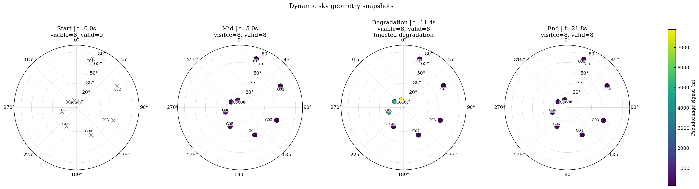

图 1 展示起始、中段、退化段和结束时刻的天空图。可以直接看到：

1. 多星几何不是静态不变的，而且在短时间窗内已经达到可见的子度级到度级变化。
2. 各星的 sigma 和 validity 会随几何和质量门限共同变化。
3. 退化窗口中的观测质量变化可以在图上直接看到。

### 7.2 3D 几何快照

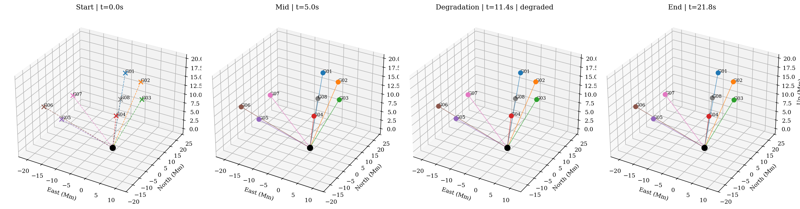

图 2 给出对应时刻的接收机中心 ENU 3D 几何。黑点为接收机原点，彩色点为卫星，连线为 LOS。  
这里故意不用绝对 ECEF 坐标，而改用接收机中心局部坐标，是因为在 20~25 Mm 量级的绝对坐标上，
短时间窗内的几何变化很容易在视觉上被淹没；改成 ENU 后，同一段时变几何就能直观看出方向和高度的变化。

### 7.3 几何时间演化

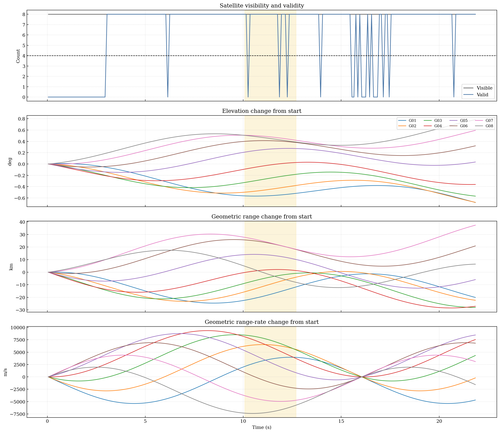

图 3 不再画几条几乎重合的绝对量直线，而是给出相对起点的几何变化：
可见/有效卫星数、逐星 elevation change、range change、range-rate change。  
图中阴影区域为人为退化窗口，便于把几何变化和质量变化分开看。

## 8. 旧脚本生成的单通道背景

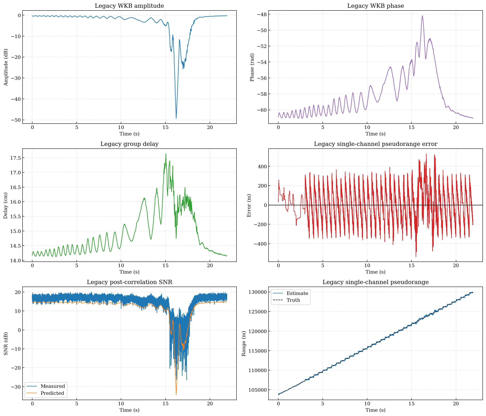

图 4 给出 legacy 单通道背景，包括：

1. 真实 WKB 幅度 `A(t)`
2. 真实 WKB 相位 `phi(t)`
3. 真实群时延 `tau_g(t)`
4. legacy 单通道伪距误差
5. legacy 后相关 SNR
6. legacy 单通道伪距 truth vs estimate

legacy 背景的关键量级如下：

| 指标 | 数值 |
|---|---|
| tau_g 中位数 (m) | 0.145 |
| tau_g 跨度 (m) | 0.035 |
| legacy PR 100 ms sigma (m) | 150.501 |
| legacy PR 1 s sigma (m) | 38.181 |
| legacy PR 1 s RMSE (m) | 37.368 |
| legacy PR 平均偏置 (m) | -2.219 |
| dynamic RR 100 ms sigma (m/s) | 0.084 |

这部分说明两件事：

1. 动态多星导航层不是凭空造数据，而是确实耦合了真实单通道 WKB / 接收机背景。
2. legacy 单通道误差本身并不小，因此动态 EKF 的结果必须谨慎解释。
3. 从 `100 ms` 到 `1 s` 平滑后 sigma 明显下降，说明共享背景里既有快变误差也有低频慢变分量。
4. 动态观测层继承了这类时间相关误差，因此 EKF 的收益一部分来自时序约束，而不仅仅是“多加几颗卫星”。

## 9. 从 legacy 背景到多历元多星观测

动态脚本没有直接把单通道 `c * tau_est` 复制给所有卫星，而是做了下面几步：

1. 为每个 epoch、每颗卫星生成几何距离和几何距离率。
2. 把 legacy `tau_g` 按仰角映射到色散项。
3. 把 legacy 单通道 PR / RR 误差统计映射到多星多历元 sigma。
4. 把 legacy SNR、lock、sustained-loss 映射到 downweight / invalid 逻辑。
5. 在退化窗口内对指定卫星额外施加低 SNR / 低 lock / 大 sigma。

图 5 和图 6 展示这一层：

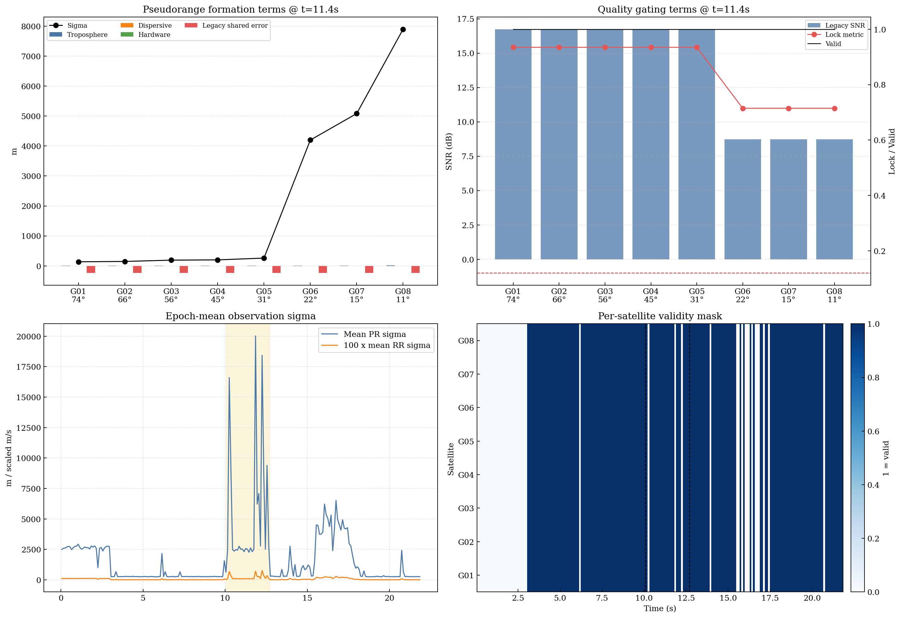

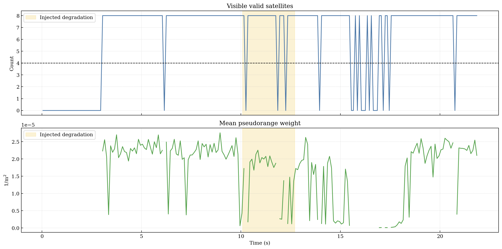

图 5 侧重代表性 epoch 下的观测组成与质量门限。图 6 侧重全时段的有效卫星数和权重变化。  
二者一起说明“观测为什么在某些时段更弱”。

### 9.1 质量门限与权重映射

本实验的 gating / weighting 配置如下：

| 参数 | 数值 | 含义 |
|---|---|---|
| min_elevation_deg | 8.000 | 低于此仰角直接判 invalid |
| min_post_corr_snr_db | -1.000 | 低于此后相关 SNR 判 invalid |
| min_carrier_lock_metric | 0.120 | 低于此锁定指标判 invalid |
| low_elevation_sigma_boost_factor | 1.800 | 低仰角 sigma 放大 |
| snr_sigma_boost_factor | 0.550 | 低 SNR sigma 放大斜率 |
| lock_sigma_boost_factor | 2.200 | 低锁定指标 sigma 放大斜率 |
| degradation_sigma_factor | 6.500 | 退化窗口内额外 sigma 放大 |
| drop_on_sustained_loss | No | 是否在 sustained-loss 时直接丢弃 |

观测形成的工程逻辑可以概括为：

1. 几何先给出 `range / range-rate / elevation`。
2. legacy 单通道背景给出共享的 `PR / RR error`、`SNR`、`lock`、`loss flag`。
3. 仰角越低，`tropo` 和 `dispersive` 越大，同时 sigma 也会放大。
4. `SNR` 和 `lock` 既能直接触发 invalid，也能通过 sigma 放大形成软降权。
5. 退化窗口并不是修改 EKF，而是在观测形成层注入更差的 `SNR / lock / sigma`，因此报告可以明确区分“输入变差”与“滤波器失效”。

### 9.2 代表性 epoch 逐星观测组成摘要

代表性 epoch 取退化段中的代表时刻 `t = 11.450 s`。逐星组成如下：

| Sat | Az (deg) | El (deg) | Geom range (Mm) | Geom rr (m/s) | Tropo (m) | Dispersive (m) | Hardware (m) | Legacy PR err (m) | Legacy SNR (dB) | Legacy lock | PR sigma (m) | Valid |
|---|---|---|---|---|---|---|---|---|---|---|---|---|
| G01 | 18.240 | 73.583 | 20.375 | 4249.535 | 2.606 | 0.156 | 0.800 | -237.984 | 16.737 | 0.935 | 136.000 | Yes |
| G02 | 61.357 | 65.735 | 20.617 | 4587.611 | 2.742 | 0.167 | -0.600 | -237.984 | 16.737 | 0.935 | 147.502 | Yes |
| G03 | 109.204 | 55.914 | 21.038 | 3062.415 | 3.017 | 0.188 | 1.100 | -237.984 | 16.737 | 0.935 | 191.636 | Yes |
| G04 | 151.676 | 45.080 | 21.662 | 521.829 | 3.527 | 0.229 | -0.900 | -237.984 | 16.737 | 0.935 | 200.411 | Yes |
| G05 | 208.358 | 31.264 | 22.705 | -1625.697 | 4.804 | 0.337 | 0.400 | -237.984 | 16.737 | 0.935 | 259.996 | Yes |
| G06 | 252.987 | 22.315 | 23.515 | -3105.899 | 6.545 | 0.498 | -0.700 | -237.984 | 8.737 | 0.715 | 4200.103 | Yes |
| G07 | 302.435 | 15.315 | 24.208 | -3822.305 | 9.342 | 0.784 | 1.600 | -237.984 | 8.737 | 0.715 | 5083.964 | Yes |
| G08 | 342.032 | 11.269 | 24.602 | -5033.547 | 12.483 | 1.143 | -1.300 | -237.984 | 8.737 | 0.715 | 7898.977 | Yes |

表中可以直接看到：

1. 仰角下降时，`tropo / dispersive / sigma` 会一起变化。
2. legacy SNR 与 lock 会影响 `valid` 和 sigma。
3. 退化段被注入的卫星会出现更高 sigma 或直接失效。

## 10. epoch-wise WLS 串联基线

动态脚本保留了 epoch-wise WLS 串联结果，作用有两个：

1. 作为动态 EKF 的初始化来源
2. 作为“每个 epoch 独立解算”的对比基线

WLS 仍然只解位置和钟差，不解速度和钟漂。  
因此，它能提供静态位置/钟差基线，但不能替代真正的动态滤波。

WLS 摘要如下：

| 项目 | 数值 |
|---|---|
| 有效 WLS epoch 数 | 171 |
| 无效 WLS epoch 数 | 48 |
| 平均 3D 位置误差 (m) | 587.134 |
| 平均 |钟差误差| (m) | 418.308 |
| 平均残差 RMS (m) | 393.037 |

## 11. EKF 初始化与工程策略

EKF 初始状态来自 WLS：

1. 首个有效 WLS epoch 提供位置和钟差初值
2. 前若干个有效 WLS epoch 线性拟合提供速度和钟漂初值

这一步的意义在于避免把速度和钟漂完全靠任意常数拍脑袋初始化。  
即使 PR-only 模式观测不足以强约束速度，它也至少从 WLS 序列获得了一个自洽初始斜率。

工程上还加入了以下处理：

1. 有效卫星数不足 4 时进入 prediction-only
2. 创新协方差奇异时进入 prediction-only
3. 协方差非有限或位置 sigma 过大时标记 divergence warning
4. innovation 过大时记录 warning，但不直接中止实验

代码摘录如下：

```python
h_matrix, z_vector, h_vector, r_matrix, residual_types, num_valid_sats = build_measurement_stack(...)
innovation_vector = z_vector - h_vector
s_matrix = h_matrix @ p_pred @ h_matrix.T + r_matrix
k_matrix = p_pred @ h_matrix.T @ np.linalg.inv(s_matrix)
x_post = x_pred + k_matrix @ innovation_vector
```

初始化与保护逻辑的核心工程含义是：

1. 首版先把“能稳定跑起来、能给出可解释误差曲线”的动态滤波链路打通。
2. 观测不足时宁可 prediction-only，也不强行做数值不稳定的更新。
3. divergence 检查优先作为诊断量输出，而不是把所有异常直接吞掉。
4. 这样生成的 `dynamic_state_history.csv` 能直接支持后续继续加更复杂动力学或 phase 状态。

## 12. 实验设计

本动态脚本固定包含三组对比：

### 12.1 实验 A：epoch-wise WLS vs EKF

目标：比较“每个 epoch 独立解算”与“动态滤波”的差别。

### 12.2 实验 B：PR-only EKF vs PR + Doppler EKF

目标：比较只靠伪距与加入距离率之后的状态可观测性差异，特别是速度和钟漂。

### 12.3 实验 C：正常观测段 vs 注入退化段

目标：检查低 SNR / 低 lock / 高 sigma / 失效逻辑在动态滤波中的表现。

## 13. 实验结果

### 13.1 模式对比总表

| Mode | Mean 3D pos (m) | Mean 3D vel (m/s) | Mean |cb| (m) | Mean |cd| (m/s) | Mean PR innov (m) | Mean RR innov (m/s) | Prediction-only epochs | Diverged epochs |
|---|---|---|---|---|---|---|---|---|
| Epoch WLS | 587.134 | - | 418.308 | - | 393.037 | - | - | - |
| EKF PR only | 1149.789 | 182.745 | 870.872 | 163.011 | 645.505 | - | 48 | 0 |
| EKF PR + Doppler | 56.657 | 0.088 | 44.770 | 0.047 | 515.649 | 1.326 | 48 | 0 |

这张表直接给出三个结论：

1. `EKF PR + Doppler` 的平均 3D 位置误差显著低于 `epoch-wise WLS`。
2. `PR-only` 模式在速度与钟漂上明显更弱。
3. 当前实验中 `PR + Doppler` 是主线可解释结果，`PR-only` 更像一个退化对照组。

### 13.2 正常段 vs 退化段

以下结果基于主线 `EKF PR + Doppler`：

| Segment | Mean valid sats | Mean PR sigma (m) | Mean RR sigma (m/s) | Mean PR innov (m) | Mean RR innov (m/s) | Mean pos err (m) | Mean vel err (m/s) |
|---|---|---|---|---|---|---|---|
| Normal | 6.135 | 1228.626 | 0.539 | 300.987 | 1.427 | 58.694 | 0.092 |
| Degraded | 7.077 | 5422.582 | 2.120 | 1896.949 | 0.674 | 43.889 | 0.058 |

退化段中，有效卫星数下降、sigma 增大、innovation 恶化，这说明退化注入和质量门限确实在动态观测层生效了。

### 13.3 位置误差结果

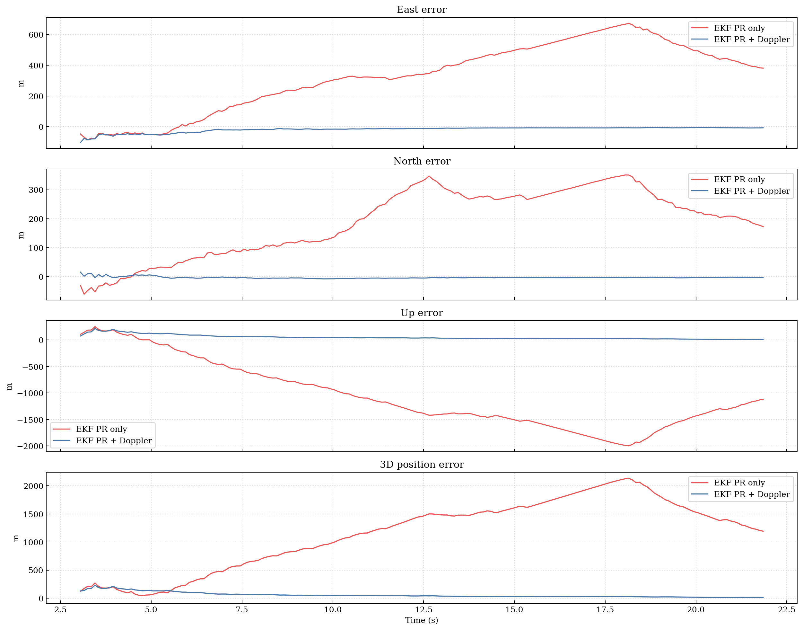

图 7 给出 ENU 和 3D 位置误差。  
从图中可以看出，`EKF PR + Doppler` 明显比 `PR-only` 更稳定，也比单纯拼接的 WLS 曲线更平滑。

### 13.4 速度误差结果

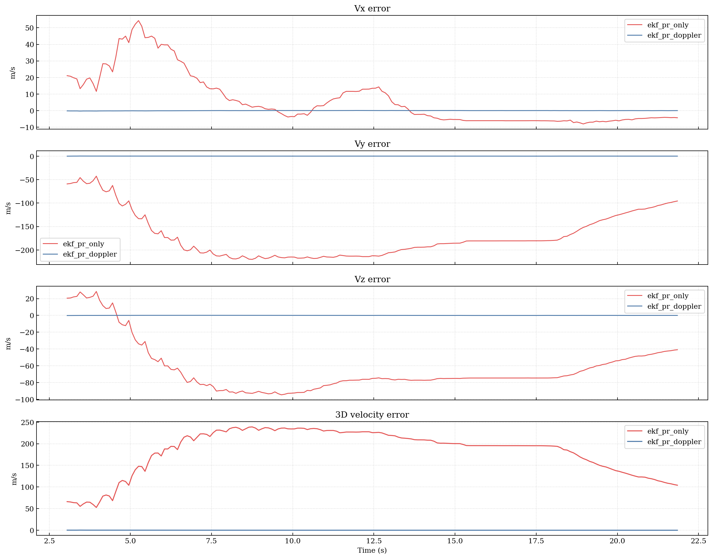

图 8 给出速度误差。  
这一项最能体现 Doppler 的价值：`PR + Doppler` 把速度误差压到了远低于 `PR-only` 的量级。

### 13.5 时钟结果

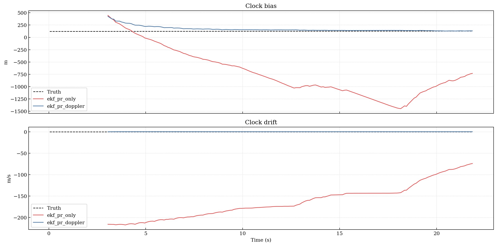

图 9 给出钟差和钟漂。  
加入距离率之后，钟漂状态被明显约束；只用伪距时，钟漂的可观测性更弱。

### 13.6 innovation 结果

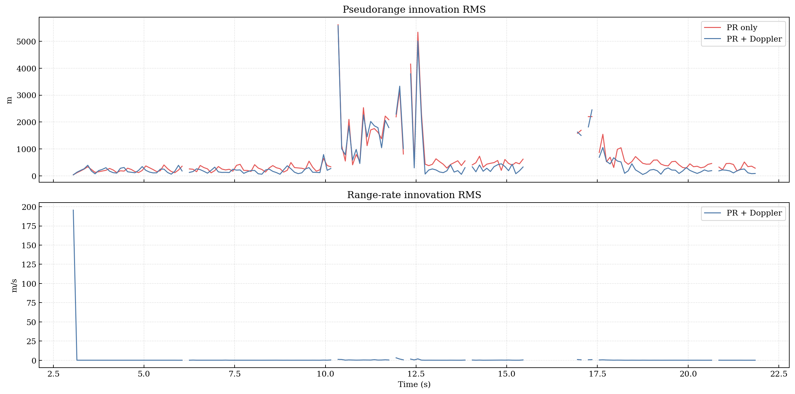

图 10 给出 PR 和 RR innovation。  
这张图的作用是检查滤波是否持续稳定，而不是只看最终误差。

### 13.7 WLS 与 EKF 直接对比

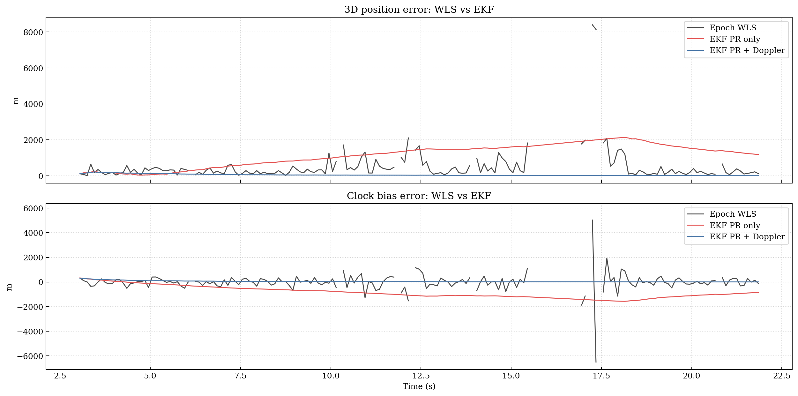

图 11 直接对比 epoch-wise WLS 与 EKF。  
动态滤波的优势不只是更小的平均误差，还包括时间连续性更好。

### 13.8 滤波健康度统计

| Mode | Prediction-only epochs | Diverged epochs | Warning epochs | Mean valid sats |
|---|---|---|---|---|
| ekf_pr_only | 48 | 0 | 160 | 6.247 |
| ekf_pr_doppler | 48 | 0 | 106 | 6.247 |

这张表说明两点：

1. `prediction-only epochs` 不是 bug，而是观测不足或数值保护逻辑触发后的预期行为。
2. 若某模式 warning epoch 明显偏多，通常意味着该模式的可观测性或观测质量更弱，而不是单纯“图上误差大一点”。

## 14. 逐星统计

全程逐星统计如下：

| Sat | Mean El (deg) | Mean range (Mm) | Mean range-rate (m/s) | Mean PR sigma (m) | Valid rate (%) | Degraded-window valid rate (%) | Injected degradation |
|---|---|---|---|---|---|---|---|
| G01 | 73.769 | 20.381 | -919.017 | 663.440 | 78.082 | 88.462 | No |
| G02 | 65.821 | 20.615 | -1022.273 | 690.105 | 78.082 | 88.462 | No |
| G03 | 55.877 | 21.028 | -1283.667 | 738.221 | 78.082 | 88.462 | No |
| G04 | 44.933 | 21.648 | -1240.750 | 833.363 | 78.082 | 88.462 | No |
| G05 | 31.050 | 22.691 | -269.860 | 1024.901 | 78.082 | 88.462 | No |
| G06 | 22.101 | 23.505 | 958.068 | 2398.665 | 78.082 | 88.462 | Yes |
| G07 | 15.164 | 24.205 | 1713.526 | 3143.935 | 78.082 | 88.462 | Yes |
| G08 | 11.225 | 24.608 | 292.744 | 4319.682 | 78.082 | 88.462 | Yes |

这张表用来回答：

1. 哪些星长期处在低仰角
2. 哪些星长期 sigma 更大
3. 哪些星在退化窗口内更容易掉出有效观测集合

## 15. 代码片段

### 15.1 legacy 背景构造

```python
field_result = LEGACY_DEBUG.build_fields_from_csv(...)
wkb_result = LEGACY_DEBUG.compute_real_wkb_series(...)
cfg_sig = LEGACY_DEBUG.build_signal_config_from_wkb_time(...)
plasma_rx = LEGACY_DEBUG.resample_wkb_to_receiver_time(...)
receiver_outputs = LEGACY_DEBUG.KaBpskReceiver(receiver_context).run()
trk_result = receiver_outputs.trk_result
```

### 15.2 动态观测形成

```python
pseudorange_m = (
    geometric_range_m
    + truth.clock_bias_m
    - C_LIGHT * sat_clock_bias_s
    + tropo_delay_m
    + dispersive_delay_m
    + sat_template.hardware_bias_m
    + legacy_metrics.pr_shared_error_m[epoch_idx]
    + independent_pr_noise_m
)

range_rate_mps = (
    geometric_range_rate_mps
    + truth.clock_drift_mps
    - sat_clock_drift_mps
    + legacy_metrics.rr_shared_error_mps[epoch_idx]
    + independent_rr_noise_mps
)
```

### 15.3 状态模型

```python
def state_transition_matrix(dt_s: float) -> np.ndarray:
    f_matrix = np.eye(8, dtype=float)
    f_matrix[0:3, 3:6] = dt_s * np.eye(3, dtype=float)
    f_matrix[6, 7] = dt_s
    return f_matrix

def process_noise_matrix(dt_s: float, accel_sigma_mps2: float, clock_drift_sigma_mps2: float) -> np.ndarray:
    ...
```

### 15.4 EKF 更新

```python
h_matrix, z_vector, h_vector, r_matrix, residual_types, num_valid_sats = build_measurement_stack(...)
innovation_vector = z_vector - h_vector
s_matrix = h_matrix @ p_pred @ h_matrix.T + r_matrix
k_matrix = p_pred @ h_matrix.T @ np.linalg.inv(s_matrix)
x_post = x_pred + k_matrix @ innovation_vector
```

### 15.5 主流程与出图

```python
plot_legacy_channel_overview(...)
plot_sky_geometry_dynamic(...)
plot_geometry_3d_timeslices(...)
plot_geometry_timeseries(...)
plot_observation_formation_overview(...)
plot_trajectory_error(...)
plot_velocity_error(...)
plot_clock_bias_and_drift(...)
plot_innovation_timeseries(...)
plot_visible_satellites_and_weights(...)
plot_filter_vs_epoch_wls(...)
```

## 16. 简化项与适用范围

### 16.1 简化项

1. 多星几何是接收机本地 `az/el/range` 参数化后再映射到 ECEF 的时变构造，不是广播星历。
2. 接收机真值轨迹是连续常速度 ECEF 轨迹，不是 RAM-C 六自由度真值。
3. 各颗卫星没有独立真实传播路径，而是共享同一条 legacy 单通道真实背景再做映射。
4. 对流层、硬件偏差、卫星钟差和卫星钟漂是参数化项。
5. carrier phase 尚未进入主滤波器，不应作整周或 phase-based 动态结论。

### 16.2 结果适用范围

本结果适用于：

**真实单通道 Ka/WKB 背景 + 动态多星几何映射 + 标准 pseudorange/range-rate + 8 状态 EKF**

本结果不适用于：

**真实多星端到端 Ka 动态导航系统性能定标**

### 16.3 下一步建议

1. 引入更接近真实任务的接收机机动轨迹，而不只是假设常速度。
2. 把卫星几何替换为广播星历或更真实的时变轨道。
3. 把 carrier phase 作为扩状态 float ambiguity 实验分支接入。
4. 把各星独立传播路径和独立电离层/等离子体背景接进来，而不是共享单条 legacy 背景。
5. 在 EKF 之上增加 RTS smoothing 或更严格的一致性检验。

## 17. 运行方式与输出物

运行命令：

```bash
.venv/bin/python notebooks/exp_dynamic_multisat_ekf_report.py
```

输出目录：

```text
results_dynamic_multisat_ekf/
```

主报告使用的文件如下：

| 文件 | 用途 |
|---|---|
| legacy_channel_overview.png | legacy 单通道真实背景 |
| sky_geometry_dynamic.png | 动态天空图 |
| geometry_3d_timeslices.png | 接收机中心 ENU 下的动态 3D 几何快照 |
| geometry_timeseries.png | 相对起点的几何变化时序 |
| observation_formation_overview.png | 观测形成中间量 |
| visible_satellites_and_weights.png | 有效卫星数与权重 |
| trajectory_error.png | 位置误差结果 |
| velocity_error.png | 速度误差结果 |
| clock_bias_drift.png | 钟差与钟漂结果 |
| innovation_timeseries.png | innovation 时序 |
| filter_vs_epoch_wls.png | 滤波器与 epoch-wise WLS 对比 |
| dynamic_observations.csv | 逐星逐历元观测表 |
| dynamic_state_history.csv | 逐模式逐历元状态历史 |
| summary.json | 机器可读全局摘要 |
| report_summary.md | 短摘要报告 |
| report_full.md | 完整长报告 |

## 18. 附录

### 18.1 `summary.json`

适合做：

1. 全局数值摘要读取
2. 输出文件路径索引
3. 模式级统计读取

### 18.2 `dynamic_observations.csv`

适合做：

1. 每星每历元观测值检查
2. 几何项 / 非几何项 / sigma / quality flag 复查
3. 代表性 epoch 逐星观测重建

### 18.3 `dynamic_state_history.csv`

适合做：

1. 各模式状态时序复查
2. 协方差对角和 warning 复查
3. 误差和 innovation 二次分析

### 18.4 主要文件字段速查

| 文件 | 关键字段 | 用途 |
|---|---|---|
| dynamic_observations.csv | epoch_idx, sat_id, valid, az_deg, el_deg, pseudorange_m, range_rate_mps, sigma, SNR, lock | 复查观测形成、权重、有效性与退化注入 |
| dynamic_state_history.csv | mode, t_s, state, truth, covariance_diag, innovation_rms, num_valid_sats, warning | 复查状态估计、协方差、innovation 和告警 |
| summary.json | comparison_runs, time_axes, outputs, figure_groups, simplifications | 读取总体指标、输出路径与简化项 |

---

旧脚本完成了真实单通道传播和单通道接收机。  
单历元多星脚本完成了标准伪距和单历元 WLS。  
动态脚本则把系统推进到多历元动态 EKF，并把输入、几何、观测形成和结果层全部串成了一份完整报告。
