# 泛卡频段全频真实传播、单历元加权定位与动态滤波研究报告

## 1. 摘要

本报告围绕 `results_ka_multifreq` 中已经生成的正式全频结果展开，研究对象是 `19.0` 至 `31.0 GHz` 之间、步长 `0.5 GHz` 的二十五个频点。

本次工作的核心不再是单一 `22.5 GHz` 频点，而是把“传播层变化如何沿着接收机恢复、单历元定位和动态滤波一路传递”这个问题，放到整个频带中统一观察。更具体地说，这份报告讨论的不只是跨频结果现象，而是围绕传播模型、标准观测方程和动态状态方程组织的全频分析，因此后文会把这些层之间的数学联系直接写出来，而不再只停留在经验描述上。

主要数值概览如下：

| 项目 | 数值 |
| --- | --- |
| 频点总数 | 25 |
| 频率范围 (GHz) | 19.0 至 31.0 |
| 综合指标总列数 | 144 |
| 单通道误差最佳频点 (GHz) | 31 |
| 单通道误差最佳值（纳秒） | 519.147 |
| 单通道误差最差频点 (GHz) | 19 |
| 单通道误差最差值（纳秒） | 1141.415 |
| 困难场景定位最佳频点 (GHz) | 29 |
| 困难场景定位最佳值（米） | 25.606 |
| 困难场景定位最差频点 (GHz) | 19 |
| 困难场景定位最差值（米） | 427.824 |
| 动态滤波最佳频点 (GHz) | 30 |
| 动态滤波最佳位置误差（米） | 0.855 |
| 动态滤波最差频点 (GHz) | 19.500 |
| 动态滤波最差位置误差（米） | 256.882 |

从总体结果看，频率升高以后，单通道码时延恢复误差、困难场景定位误差和动态滤波位置误差都呈现出明显改善，但改善并不是严格单调，而是“整体下降趋势之上叠加局部起伏”。

## 2. 引言

在前一阶段的工作中，许多实验、图像说明和后续笔记本都默认围绕 `22.5 GHz` 这一参考频点展开。这样的做法在单点验证阶段是有效的，因为它能够让传播链路、接收机恢复和导航解算的接口先稳定下来，但它也天然带着一个局限，那就是它只能解释一个频点的行为，不能回答整个泛卡频段上的规律。只要后续算法设计、参数整定和实验判断仍然建立在单点观察之上，就很容易把“这个频点的表现”误当成“整个频带的共性”，从而在推广到其他频点时出现解释偏差。

这也是本报告要把频率本身提升为主分析维度的原因。这里真正关心的，不是某个频点是否偶然表现较好，而是传播层中的振幅、相位和群时延在频率变化时如何系统性地改变，接收机恢复过程又如何把这些传播变化转化为码时延恢复误差、频率恢复误差和锁定稳定性的差异，最终这些差异再如何沿着单历元定位与多历元动态估计继续向下传递。换句话说，本报告研究的是一条跨层传递链，而不是若干彼此分离的单点数值。

因此，全频研究的意义并不只在于把已有图重新画成跨频曲线，而在于为后续所有依赖 `22.5 GHz` 的笔记本和实验提供新的基线：以后讨论传播恢复、困难场景定位和动态滤波时，频率不能再被视为一个固定常数，而必须被视为影响系统行为的一条主轴。只有这样，后续基于整个泛卡频段的实验扩展才有统一而自洽的解释框架。

## 3. 研究背景与关键概念解释

### 3.1 研究对象

本报告研究的是“真实单通道传播背景之上的多层导航实验”。这里所说的“多层”，并不是把几类图像简单拼接在一起，而是指同一套真实单通道传播背景被连续映射到了三个层面之中。最上面的一层是传播与接收层，在这一层中，电子密度场通过几何光学近似传播模型决定了信号振幅、相位和群时延的变化，接收机再把这些变化转化为可观测的恢复误差和锁定稳定性。中间一层是单历元定位层，在这一层中，单通道统计被继续映射为伪距观测精度，并在多星几何条件下形成单次求解的位置误差。最下面的一层是多历元动态估计层，这一层把伪距和距离变化率放到连续时间序列中联合利用，最终给出更接近真实导航应用场景的动态位置与速度误差。

### 3.2 关键概念

几何光学近似传播模型（WKB）是本报告最上游的传播描述工具。它的作用，是把电磁波在缓变介质中的传播近似写成振幅、相位和群时延三个量，从而描述信号穿过等离子体环境以后，传播强弱、相位积累和码观测相关时间延迟会发生什么变化。若把传播结果写成复传输系数，则可以写成

```text
h_p(t, f) = A(t, f) · exp(j φ(t, f))
ω = 2π f
τ_g(t, f) = - ∂φ(t, f) / ∂ω
```

这里的 `A(t, f)` 是传播振幅，`φ(t, f)` 是传播相位，`τ_g(t, f)` 是群时延。群时延不是额外引入的经验量，而是由相位对角频率求导得到的，因此它本质上描述的是传播相位随频率变化时，码观测会感受到的有效时延扰动。当前工程实现并不是直接对连续函数求导，而是按照相邻频点的中心差分计算群时延，因此在报告所用的数据中，实际采用的是

```text
τ_g(t, f) ≈ - [φ(t, f + Δf) - φ(t, f - Δf)] / (4πΔf)
```

这也是为什么本报告中的群时延分析能够自然接到全频频点网格之上，因为它本来就是通过频率邻点之间的相位差分获得的。

进入接收机以后，传播结果不再只是停留在 `A(t)`、`φ(t)` 和 `τ_g(t)` 这些上游量上，而是通过接收信号模型进入捕获与跟踪环路。当前链路可以概括写成

```text
r(t) = A(t) · c(t - τ_total(t)) · exp(j φ_total(t)) + n(t)
τ_total(t) = τ_geom(t) + τ_g(t)
```

其中 `c(t)` 是发射扩频信号，`τ_geom(t)` 是几何码时延，`τ_g(t)` 是色散传播导致的附加群时延，`φ_total(t)` 则把运动相关相位和传播相位合并到一起。正因为传播层是以这样的方式进入接收机，所以后相关信噪比、载波锁定指标以及码时延和频率恢复误差才会成为传播层影响导航层的第一道可见接口。后相关信噪比反映的是相关器输出端的信号与噪声之比，载波锁定指标描述的是载波跟踪环是否稳定跟住真实载波，均方根误差则用来压缩描述全时段的恢复精度。

导航层中的伪距，是接收机由码相位恢复出的距离型观测量。它并不只是几何距离，还混有时钟差、传播延迟和测量噪声，因此当单通道恢复变差时，伪距质量会直接下降。多普勒则是载波频率因为相对运动和传播环境变化而发生的偏移，在动态滤波层中主要体现为距离变化率信息。单历元加权最小二乘（WLS）的作用，是在一次求解中让质量更高的观测占更大权重、质量更差的观测占更小权重，从而抑制低仰角和低信噪比观测造成的误差放大；扩展卡尔曼滤波（EKF）则是一种逐历元递推估计方法，它把上一时刻状态预测与当前观测结合起来，同时估计位置、速度和时钟状态，因此更适合描述连续时间条件下的动态导航表现。

### 3.3 结果边界

本报告必须严格保持一个边界意识，那就是这里研究的是“真实单通道传播背景之上的跨层导航规律”，而不是“真实多星端到端系统的最终工程定标”。单通道传播与接收机恢复部分是直接复用的真实链路，因此传播层到接收层之间的关系具有直接物理基础；但多星几何和动态轨迹仍然是自洽构造的，不是广播星历和真实飞行轨迹，各卫星也没有各自独立的真实传播路径，而是共享单通道真实背景后再映射到导航层。正因为如此，本报告的价值在于揭示频率规律、说明层间传递关系，并为后续更真实的多星扩展提供依据，而不是在这里直接宣布系统级最终能力。

## 4. 数据来源与实验链路

### 4.1 数据基线

| 项目 | 数值 |
| --- | --- |
| 频率范围 (GHz) | 19.0 至 31.0 |
| 频点总数 | 25 |
| 接收机采样率（赫兹） | 5.000e+05 |
| 码率（赫兹） | 5.000e+04 |
| 相干积分时间（秒） | 0.001 |
| 扩频码长度 | 127 |
| 名义载噪比（分贝赫兹） | 45 |
| 综合指标列数 | 144 |

### 4.2 三层链路

本次实验链路从电子密度场出发，先得到真实传播振幅、相位和群时延，再进入单通道接收机的捕获与跟踪过程，形成单通道伪距、载波与多普勒观测，随后这些观测被映射到多星标准伪距构造之中，继续向下进入单历元加权定位和多历元动态滤波，最终汇总为全频综合指标和本报告所使用的图表。这样组织的意义，不是为了把流程写得更长，而是为了保证每一层都能单独观察，同时又能清楚地解释上一层的变化如何沿着同一条链路继续向下传递。

在单历元导航层，标准伪距观测并不是把单通道内部的 `c · τ_est` 直接原样抬上来，而是统一写进标准观测方程。对第 `i` 颗卫星，可写成

```text
ρ_i = ||r_{s,i} - r|| + c(δt_r - δt_{s,i}) + d_trop,i + d_disp,i + b_hw,i + ε_{ρ,i}
```

这里 `||r_{s,i} - r||` 是几何距离，`δt_r` 和 `δt_{s,i}` 分别是接收机和卫星时钟项，`d_trop,i`、`d_disp,i` 和 `b_hw,i` 分别对应对流层项、色散传播项和硬件偏差，`ε_{ρ,i}` 则吸收了单通道恢复误差在导航层的等效表现。也正因为如此，单通道恢复结果在这里并不是被当作标准伪距本体，而是以误差统计和非几何项的形式进入统一模型。

到了动态层，距离变化率观测与伪距一起进入观测方程。其主线表达可写成

```text
ρdot_i = u_LOS,i^T (v_{s,i} - v_r) + c(δtdot_r - δtdot_{s,i}) + ε_{ρdot,i}
range_rate_mps = -(c / f_c) · doppler_hz
```

其中 `u_LOS,i` 是视线方向单位向量，`v_{s,i}` 和 `v_r` 分别是卫星与接收机速度，`δtdot_r` 与 `δtdot_{s,i}` 是钟漂项。报告后面提到的距离变化率观测，正是按上述换算从单通道多普勒频移映射而来，因此它不是一个额外凭空构造的量，而是链路内部频率观测进入标准导航方程后的形式。

## 5. 全频总体结果

### 5.1 传播层与接收层的总体形态

这一组图先给出一个总判断：传播层的不利影响并不是随机散落在全频范围内，而是在低频端更强、在高频端更收敛，并且这种差异已经足以为后续接收恢复层的分化提供背景。也就是说，第一个问题不是“某个频点好不好”，而是全频范围内是否已经出现了稳定的有利方向；从这两张图看，答案是明确的。

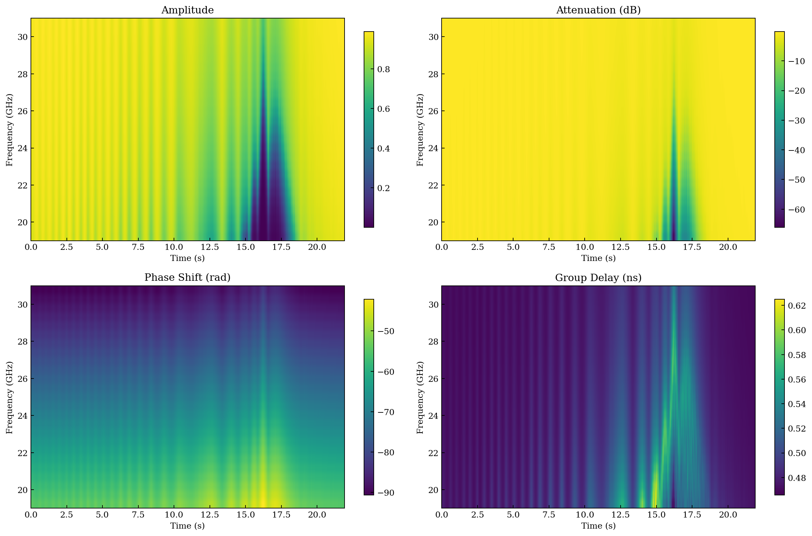

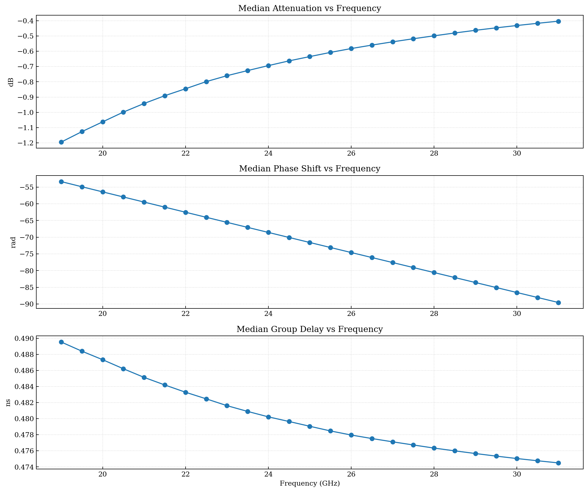

热图负责把“时间和频率是怎样一起作用的”画出来，趋势图则把这种空间形态压缩到单一频率轴上。真正需要读的不是每个子图本身，而是它们共同指向的方向：低频端在十五秒到十七秒附近出现更深的衰落、更明显的相位梯度变化和更宽的群时延扰动带，而这些结构随着频率升高逐渐变浅、变窄、变平顺。趋势图进一步把这种判断定量化，显示衰减中位数持续向零分贝靠近，群时延中位数和相位中位数也保持平滑变化。这样一来，后文在接收恢复、单历元定位和动态滤波层看到的改善，就不再像是孤立现象，而是可以被理解为传播背景已经沿频率轴发生了有利迁移。

### 5.2 三层关键指标图像总览

这张图的作用不是替代表格本身，而是先把跨层结论缩成一页可读的主线。读者在这里需要先抓住一件事：如果频率升高的收益确实能沿链路传递，那么接收恢复量、单历元误差和动态误差应当在同一频率轴上呈现协同收缩，而不是各说各话。

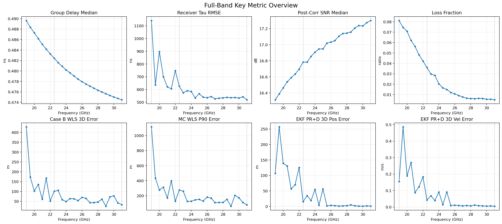

图中的八条指标并不要求逐个细读，它们共同回答的是同一个问题：频率升高以后，误差是否沿层连续收缩。答案是肯定的，而且幅度很大。从 `19.0 GHz` 到 `31.0 GHz`，单通道码时延均方根误差由 `1141.415` 纳秒降到 `519.147` 纳秒，下降 `54.52%`；困难场景加权定位三维误差由 `427.824` 米降到 `33.506` 米，下降 `92.17%`；动态滤波三维位置误差由 `106.860` 米降到 `1.309` 米，下降 `98.78%`；后相关信噪比中位数则从 `16.314` 分贝升到 `17.300` 分贝。也就是说，频率收益没有停留在上游，而是被连续传递到了单历元和动态层。完整逐频数值仍保存在附录 `11.1`，正文在这里优先强调趋势和层间传递关系。

### 5.3 总体趋势解释

如果说上一张图回答的是“收益有没有传下来”，那么这一张图回答的是“这种传递主要发生在哪一段频带”。本节只保留一个主判断：系统的改善不是平均铺开的，而是先在低频到过渡段完成大幅收缩，再在高频段把动态估计稳定性继续拉开。

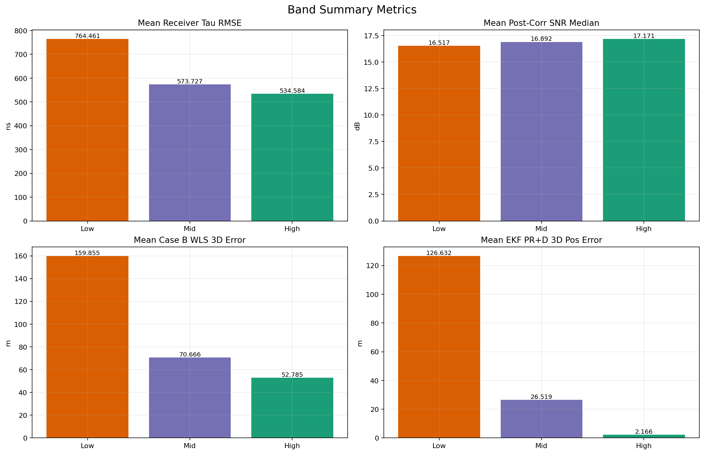

按频段看，低频段与高频段之间已经拉开了清晰差距：单通道码时延均方根误差均值从 `764.461` 纳秒降到 `534.584` 纳秒，困难场景加权定位三维误差均值从 `159.855` 米降到 `52.785` 米，动态滤波三维位置误差均值则从 `126.632` 米压到 `2.166` 米。更关键的是，这种改善分成两个阶段完成。从 `19.0 GHz` 到 `22.5 GHz`，系统先完成一次大幅去劣化；从 `22.5 GHz` 到 `31.0 GHz`，单通道层的继续改善已经没有前一阶段那么剧烈，但动态层仍然能继续大幅受益，这说明高频端的价值不只是让接收机更容易工作，而是让已经改善过的观测条件更稳定地转化为递推估计优势。与此同时，图上仍保留了 `19.5 GHz`、`20.0 GHz`、`21.5 GHz`、`22.0 GHz`、`25.0 GHz`、`29.5 GHz` 和 `30.0 GHz` 一带的局部起伏，因此后文的所有解释都继续遵守“总体改善叠加局部波动”的框架，而不把全频结果写成理想化的单调曲线。

## 6. 分层结果分析

### 6.1 单通道传播与恢复层

在这一层，最值得关注的不是单独某一个传播量，而是“传播量的变化最终是否变成了接收机可见的恢复误差”。从定义上说，群时延满足 `τ_g = -∂φ/∂ω`，因此它刻画的是相位随频率变化的斜率，而不是直接等于接收机要看到的码时延恢复误差。现有结果表明，群时延中位数从低频端到高频端的整体变化并不算剧烈，但码时延恢复误差却在低频端显著偏大，这说明接收机恢复层对传播变化的响应并不是线性的直接映射。传播层的扰动必须先经过 `r(t) = A(t) · c(t-τ_total(t)) · exp(jφ_total(t)) + n(t)` 这一信号形成过程，再进入捕获与跟踪环，最后才被表现为码时延恢复误差、频率恢复误差和锁定稳定性差异，因此只看传播层本身的数值大小，无法完整解释导航层的误差差异。真正重要的，是传播层扰动在环路里被怎样放大、吸收或重新分配，而这一过程正是低频段和高频段表现分化的起点。

### 6.2 单历元加权定位层

这一层先给出结论：单历元定位对频率变化的敏感性明显高于传播层本身，因为上游观测误差一旦进入加权求解，就会在困难场景里被迅速放大或压缩。图中真正值得看的，不是某一条曲线单独怎么走，而是观测统计、困难场景误差和分位数是否同步向更稳定的区间移动。

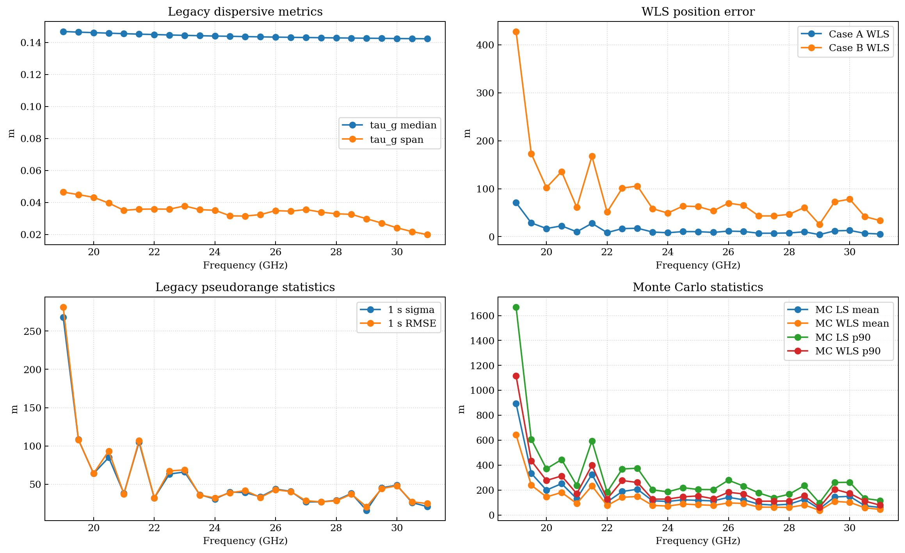

从图上看，色散指标本身的变化并不夸张，但伪距统计、一秒平滑标准差、困难场景定位误差和九成分位值却都随着频率升高整体收缩，说明真正被放大的不是某个传播量，而是传播扰动经过观测构造和权重分配之后的结果。尤其在困难场景中，普通最小二乘与加权最小二乘之间的差异在低频端更明显，而在高频端整体下压，这意味着低仰角和弱观测会最先暴露上游质量差异；一旦单通道统计改善，权重矩阵就能更有效地限制差观测的影响，单历元解才会更早进入收敛区。

这一层在数学上对应的是带权线性化最小二乘问题。若把单历元观测残差写成 `Δρ`，设计矩阵写成 `H`，未知增量写成 `Δx`，则可以把求解写成

```text
Δx = arg min || W^(1/2) (Δρ - HΔx) ||_2^2
Δx = (H^T W H)^(-1) H^T W Δρ
```

这里的 `W` 不是任意指定的权重矩阵，而是由单通道观测误差统计映射而来，因此它直接承接了上游传播与接收层的质量信息。也正因为如此，当单通道伪距统计较差时，即便已经采用加权求解，也很难把误差完全压住，因为进入求解器之前观测本身的质量已经显著退化；而当单通道统计改善以后，加权求解就能更有效地抑制低质量观测带来的误差放大。因此，单历元加权定位的改善并不是单靠求解器本身完成的，它一方面依赖传播恢复层能否把观测质量抬起来，另一方面也依赖权重映射是否足够准确，能够把较差观测真正压到较低影响力。

### 6.3 多历元动态滤波层

这一层的主结论更集中：高频端真正拉开差距的地方，不在单历元求解器，而在多历元递推能否持续利用更稳定的伪距和距离变化率观测。图中需要优先看的不是绝对最小值，而是三类解是否形成了稳定分层，以及这种分层从哪个频段开始明显出现。

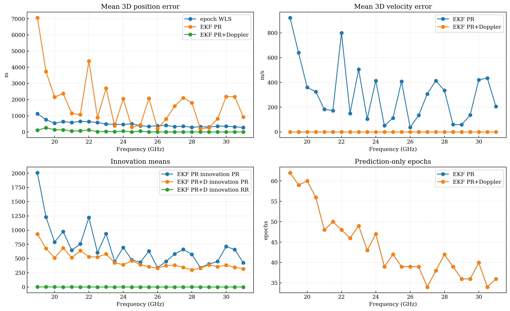

图中的四个子图共同说明，只有把距离变化率观测一并纳入以后，动态层才真正开始稳定兑现高频收益。位置误差图显示，仅伪距解在全频上都明显高于“伪距加距离变化率”解，并且低频端峰值极高；速度误差图进一步说明，没有距离变化率时速度约束几乎立不住；新息均值和仅预测历元数则表明，高频端不仅误差更小，而且观测更新本身更一致、被迫只做预测的时刻更少。因此，这一层的重点不是证明滤波器形式本身，而是说明当观测质量和距离变化率信息同时改善后，递推结构才真正进入稳定工作区。

这一层在模型上使用的是八状态常速度滤波器。状态向量写成

```text
x_k = [r_x, r_y, r_z, v_x, v_y, v_z, c_b, c_d]^T
```

其中前三维是位置，中间三维是速度，最后两维分别是钟差和钟漂。对应的状态转移关系可写成

```text
r_{k+1}   = r_k + v_k Δt
v_{k+1}   = v_k + w_v
c_{b,k+1} = c_{b,k} + c_{d,k} Δt
c_{d,k+1} = c_{d,k} + w_c
```

当前实现里，过程噪声并不是简单常数，而是按白加速度和钟漂随机游走离散化。若写成二阶积分白噪声块，则可以表示为

```text
Q_block = σ^2 · [ Δt^4/4   Δt^3/2 ]
                [ Δt^3/2    Δt^2  ]
```

预测与更新则遵循标准递推形式：

```text
x_{k|k-1} = F x_{k-1|k-1}
P_{k|k-1} = F P_{k-1|k-1} F^T + Q
K_k = P_{k|k-1} H_k^T (H_k P_{k|k-1} H_k^T + R_k)^(-1)
x_{k|k} = x_{k|k-1} + K_k (z_k - h(x_{k|k-1}))
P_{k|k} = (I - K_k H_k) P_{k|k-1}
```

这背后的逻辑并不复杂，但必须沿着层间关系来看。当单通道恢复更稳定时，距离变化率观测更容易形成有效约束，观测协方差 `R_k` 也更容易保持在较合理的量级；而动态滤波本身又能够把相邻历元的信息串联起来，因此比单历元求解更能消化局部噪声扰动。也正因为如此，当传播恢复层和距离变化率观测都处在较稳定的状态时，位置误差就会在动态滤波层被快速压缩到很低水平。高频段之所以在这一层表现尤其突出，并不是因为滤波器“自动变强”了，而是因为它终于拿到了更适合被递推利用的观测条件。

## 7. 频段分区结论

### 7.1 分区依据

本报告不采用任意切段的方式，而是固定把全频结果分为三个部分来讨论，即 19.0 GHz 至 22.0 GHz 的低频段、22.5 GHz 至 25.5 GHz 的过渡段，以及 26.0 GHz 至 31.0 GHz 的高频段。这样分区并不是为了让结构看起来整齐，而是因为现有全频结果已经显示，这三个频段在单通道恢复、单历元定位和动态滤波三层上都呈现出可区分的统计行为，既有明显的总体差异，也各自保留了不同的局部波动特征。

### 7.2 分区统计总表

| 频段 | 频率范围 | 频点数 | 单通道误差均值（纳秒） | 困难场景定位均值（米） | 动态滤波位置误差均值（米） | 动态滤波位置误差中位数（米） |
| --- | --- | --- | --- | --- | --- | --- |
| 低频段 | 19.0 至 22.0 GHz | 7 | 764.461 | 159.855 | 126.632 | 125.657 |
| 过渡段 | 22.5 至 25.5 GHz | 7 | 573.727 | 70.666 | 26.519 | 18.988 |
| 高频段 | 26.0 至 31.0 GHz | 11 | 534.584 | 52.785 | 2.166 | 1.813 |

### 7.3 分区讨论

### 低频段

该频段覆盖 19.0 至 22.0 GHz，共 7 个频点。

这一段最突出的问题是单通道码时延恢复误差大，而且不同频点之间起伏明显。传播层的时延和衰减虽然并不呈现灾难性恶化，但接收机恢复过程对这些变化更敏感，最终把误差放大到定位层与动态滤波层。就统计量而言，这一段的单通道码时延均方根误差均值达到 `764.461` 纳秒，困难场景加权定位三维误差均值为 `159.855` 米，动态滤波三维位置误差均值为 `126.632` 米，整体处于三个频段中最不稳定的位置。若把它放回公式框架里理解，可以说低频段中 `τ_g` 虽然不是唯一主因，但它进入 `τ_total` 之后更容易在接收机环路中放大为较大的 `ε_ρ`，随后再通过较不理想的 `W` 与 `R_k` 向下扩散。即便在这一段内部，不同频点之间的差异也很大，例如动态滤波表现最好的 `21 GHz` 位置误差仍有 `56.657` 米，而表现最差的 `19.5 GHz` 则达到 `256.882` 米，这说明低频段的问题并不是单一频点失常，而是整个频段都更容易把传播层的不利变化持续放大。


### 过渡段

该频段覆盖 22.5 至 25.5 GHz，共 7 个频点。

这一段体现的是从“可用”向“稳定好用”的过渡。单通道误差继续下降，困难场景定位误差明显收缩，但仍保留若干局部起伏，说明传播层改善尚未完全转化为稳定的导航层收益。这里的单通道码时延均方根误差均值已经降到 `573.727` 纳秒，困难场景加权定位三维误差均值收缩到 `70.666` 米，动态滤波三维位置误差均值也进一步压低到 `26.519` 米，整体显著优于低频段。从模型上看，这意味着 `ε_ρ` 和 `ε_ρdot` 的量级已经明显下降，使得加权矩阵 `W` 和动态层观测协方差 `R_k` 开始稳定地发挥作用。然而，这一段仍然不能被简单描述为“已经稳定”，因为动态滤波最好时在 `25.5 GHz` 可以做到 `1.850` 米，而 `25.0 GHz` 仍然会回升到 `56.189` 米，说明过渡段的本质并不是已经完全进入稳定区，而是传播改善开始持续显现，但系统仍会受到局部几何和门控条件的明显扰动。


### 高频段

该频段覆盖 26.0 至 31.0 GHz，共 11 个频点。

这一段已经进入明显稳定区。单通道误差总体维持在较低水平，单历元定位误差显著收缩，动态滤波的三维位置误差降到数米甚至一米左右，说明距离变化率观测在这一段能被更充分地利用。从统计结果看，这一段的单通道码时延均方根误差均值为 `534.584` 纳秒，困难场景加权定位三维误差均值为 `52.785` 米，动态滤波三维位置误差均值进一步压缩到 `2.166` 米，已经和前两个频段拉开明显差距。若回到状态空间模型来看，这说明高频段更容易同时给出较稳定的 `ε_ρ` 与 `ε_ρdot`，从而让预测项 `F x_{k-1|k-1}` 与观测更新项 `K_k(z_k-h(x))` 之间形成更有效的互补。更重要的是，这一段内部虽然仍然存在局部起伏，但波动尺度已经明显收敛，例如动态滤波最好的 `30 GHz` 位置误差为 `0.855` 米，最差的 `28.5 GHz` 也只有 `4.954` 米。这样的结果说明，高频段的优势并不是某个单点偶然特别好，而是整个频段都更容易把传播层改善转化为稳定的动态定位收益。


## 8. 代表频点对比

代表频点固定为 19.0 GHz、22.5 GHz 和 31.0 GHz，分别对应低频段、过渡段和高频段的典型行为。这样选择并不是为了形式上的首中末对照，而是为了让三个频段各自最有代表性的状态都能被放在同一套叙述框架中比较：低频端用来展示传播扰动如何被一路放大，过渡段用来展示旧参考频点在全频背景中究竟处在什么位置，高频端则用来展示传播改善如何最终沉淀为稳定的动态定位收益。代表频点的完整详细表已经移到附录 `11.5`，正文这里只保留综合位置表和最能支撑判断的图像证据。

这一章的读法也尽量简单：先用三张横向摘要图确认三个代表频点在三层中的相对位置，再分别看每个频点如何把这种位置关系落实到具体图像证据上。这里不再逐图逐项解释，而是把每个频点压缩成“单通道与单历元的联合证据”和“动态滤波证据与层间闭环”两部分。

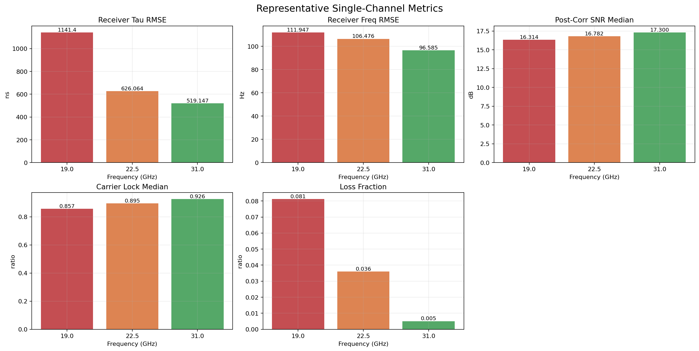

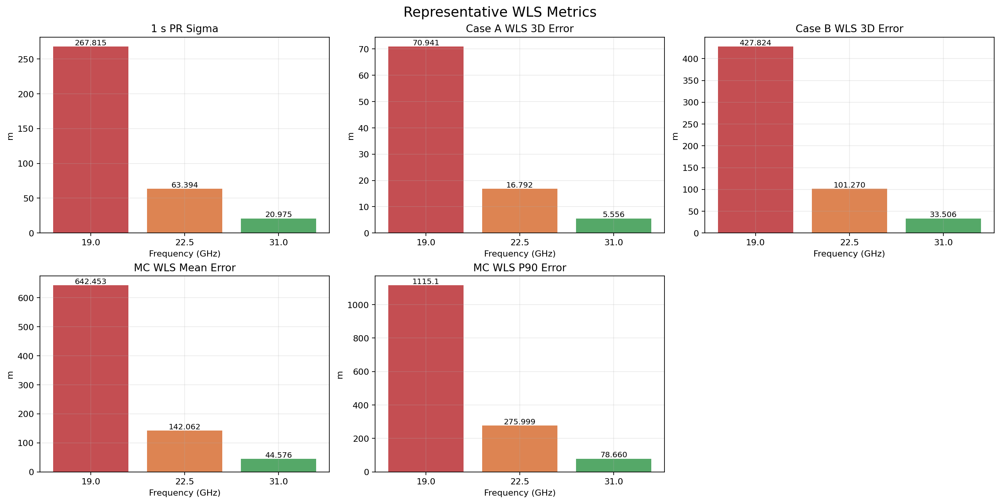

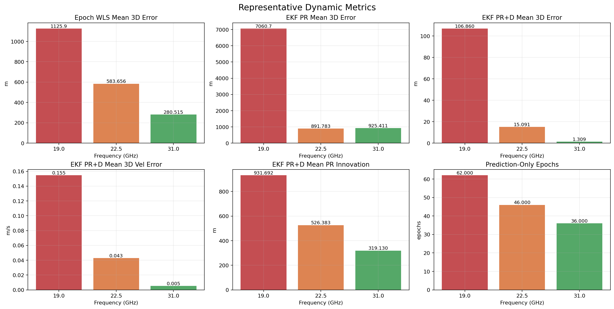

三张摘要图合起来已经足够说明主线：从 `19.0 GHz` 到 `31.0 GHz`，单通道恢复逐步变稳，困难场景单历元误差持续收缩，而动态层的改善最为剧烈。以最关键的三个量为例，码时延均方根误差由 `1141.415` 纳秒降到 `519.147` 纳秒，场景乙加权定位三维误差由 `427.824` 米降到 `33.506` 米，伪距加距离变化率动态滤波三维位置误差则由 `106.860` 米压到 `1.309` 米。唯一没有同步改善的是仅伪距动态滤波，这反过来说明高频收益并不是“频率越高滤波器自动越强”，而是更好的观测条件只有在与距离变化率约束结合时，才会稳定转化为动态优势。

### 8.1 代表频点 19.0 GHz 的层间证据

这一频点代表低频段。它的意义不在于给出最坏值本身，而在于揭示低频端如何把传播层的不利影响放大到接收机恢复与动态估计层。

#### 8.1.1 该频点的综合位置

| 指标 | 数值 |
| --- | --- |
| 单通道码时延均方根误差（纳秒） | 1141.415 |
| 单通道后相关信噪比中位数（分贝） | 16.314 |
| 困难场景加权定位三维误差（米） | 427.824 |
| 动态滤波三维位置误差（米） | 106.860 |
| 动态滤波三维速度误差（米每秒） | 0.155 |

#### 8.1.2 单通道与单历元的联合证据


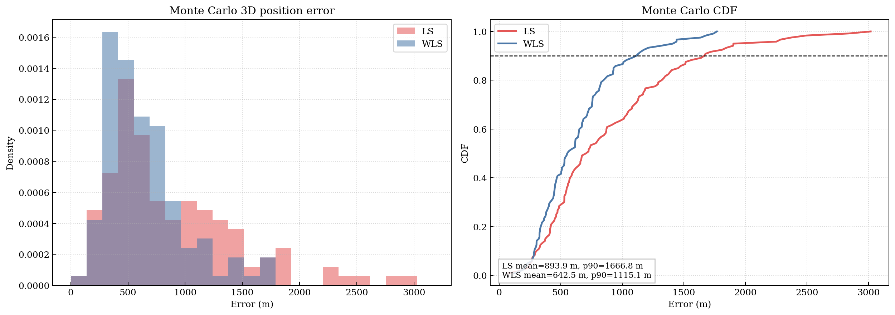

这一组图共同说明，`19.0 GHz` 的问题从单通道层就已经开始累积，而且会在单历元层被进一步放大。频谱图里主峰不够干净，噪声底抬高且带有明显深陷，说明接收机始终在较差的可跟踪条件下工作；这与综合表中的 `16.314` 分贝后相关信噪比和 `1141.415` 纳秒码时延均方根误差是一致的。进入单历元层以后，背景图在十六秒附近同时出现振幅下探、后相关信噪比下降和伪距误差放大的共振区，残差图显示困难场景中的低仰角观测被明显放大，统计图则表明即便加权解整体左移，右尾仍然很长，九成分位仍停留在 `1115.106` 米。换句话说，这个频点的问题不是“求解器没起作用”，而是进入求解器之前，观测集合本身就已经被上游退化抬高了误差底座。

#### 8.1.3 动态滤波证据与层间闭环


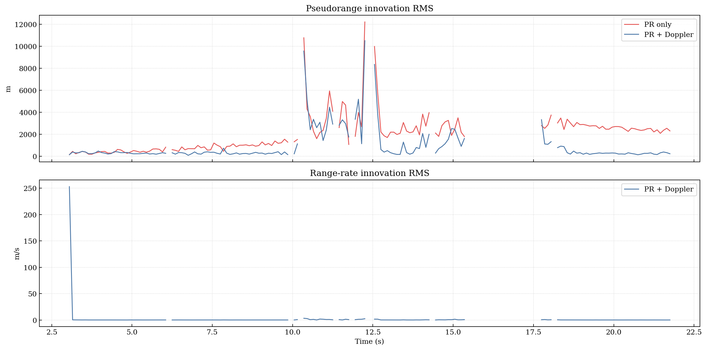


动态图把上一段的判断闭合起来了。`19.0 GHz` 下，单历元基线平均三维误差已经达到 `1125.948` 米，仅伪距动态滤波更是发散到 `7060.729` 米，而加入距离变化率后才把平均三维位置误差压到 `106.860` 米。轨迹误差图显示，仅伪距解在三个方向上长期漂移，加入距离变化率后的解虽然仍有偏差，但至少维持在可控范围；新息图中频繁出现的高位突刺，说明观测与预测长期不一致；与单历元基线对比图则进一步证明，只有蓝色方案真正把误差压下来了。因此，这个频点最能说明低频端的层间逻辑：传播和接收层的退化会先把单历元观测底座抬高，再把动态层逼到必须依靠额外约束才能勉强稳定的状态。


### 8.2 代表频点 22.5 GHz 的层间证据

这一频点代表过渡段，也是此前工作最常用的参考频点。它适合用来比较“旧单频工作流”与“新全频工作流”之间的解释差异。

#### 8.2.1 该频点的综合位置

| 指标 | 数值 |
| --- | --- |
| 单通道码时延均方根误差（纳秒） | 626.064 |
| 单通道后相关信噪比中位数（分贝） | 16.782 |
| 困难场景加权定位三维误差（米） | 101.270 |
| 动态滤波三维位置误差（米） | 15.091 |
| 动态滤波三维速度误差（米每秒） | 0.043 |

#### 8.2.2 单通道与单历元的联合证据

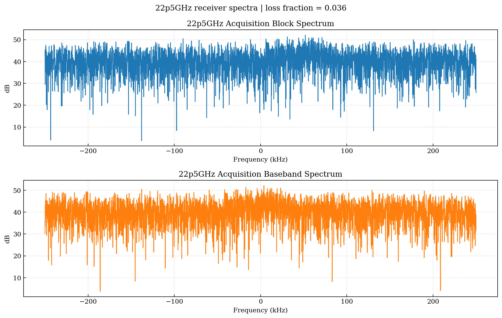


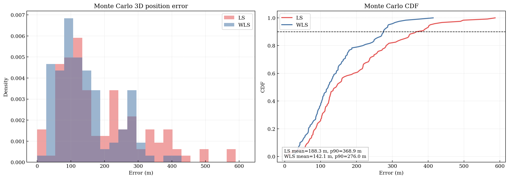

`22.5 GHz` 的图像证据体现的是典型过渡态。频谱图已经明显比低频端平顺，极深陷波减少，主峰可跟踪性改善，因此码时延均方根误差相对 `19.0 GHz` 已经下降到 `626.064` 纳秒；但局部波动仍然存在，说明它还没有进入高频端那种几乎全程舒适的环路状态。进入单历元层以后，这种“整体变稳、局部仍抖”的特征依然保留：背景图中的共振区明显减弱，残差图中困难场景的条形已从数百米级收缩，统计图也显示加权解整体左移，但右尾仍未完全收短，因此场景乙加权定位误差虽然已经降到 `101.270` 米，仍明显高于 `31.0 GHz`。这正是过渡段的含义：它已经足以支撑一套可靠的单频流程，但还不能代表全频中的稳定上限。

#### 8.2.3 动态滤波证据与层间闭环

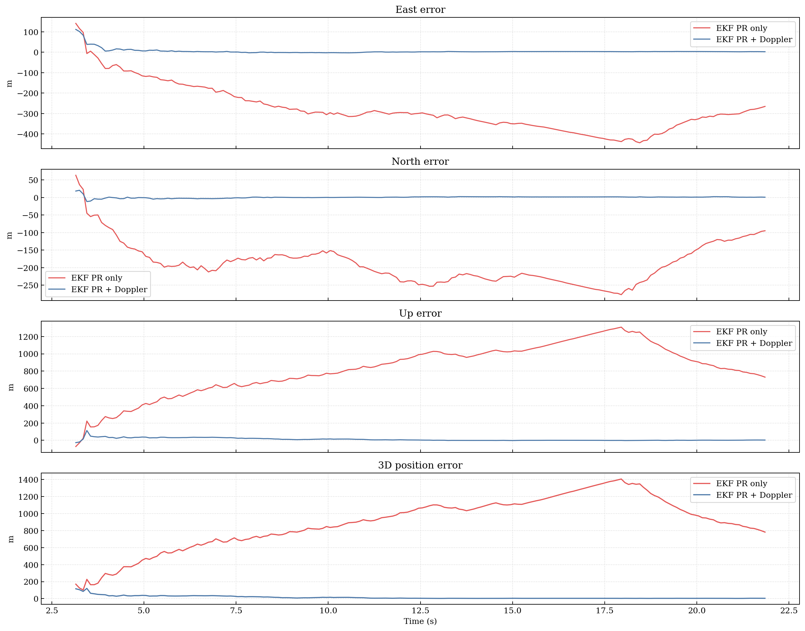

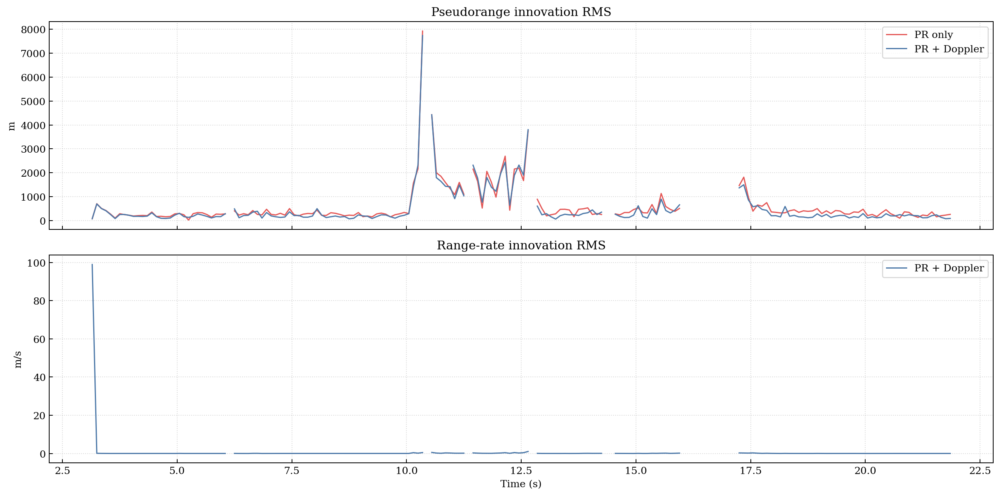

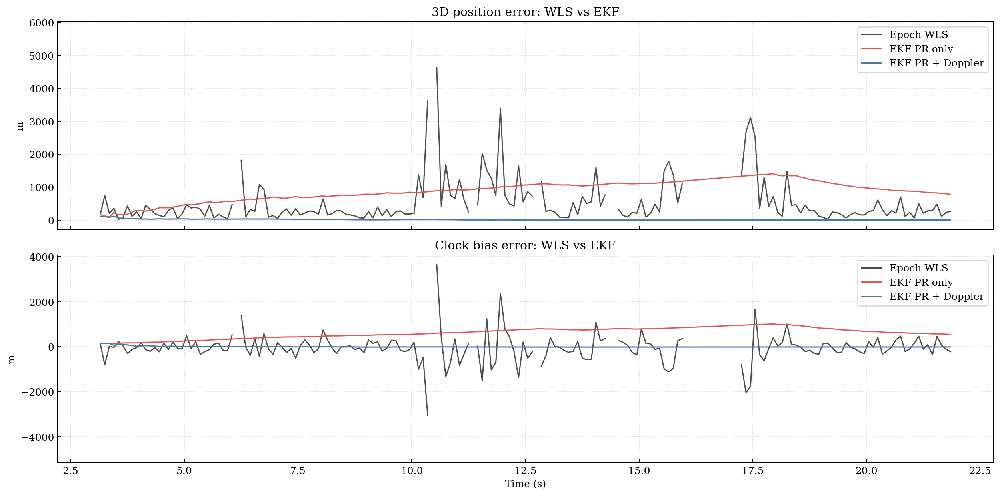

动态层则把过渡态进一步坐实。`22.5 GHz` 下，伪距加距离变化率动态滤波平均三维位置误差已经降到 `15.091` 米，比 `19.0 GHz` 大幅改善，但离 `31.0 GHz` 的 `1.309` 米仍有明显差距。轨迹误差图中，蓝线已经能较快贴近零附近，说明递推开始稳定受益；但仅伪距解仍然漂移，新息图在中间若干时段仍有尖峰，对比图中的黑线也还带着明显脉冲。这说明 `22.5 GHz` 的价值在于它足以证明“伪距加距离变化率”方案是有效的，却还不能说明系统已经进入最稳定的工作区，因此它适合作为方法验证点，却不再适合作为唯一频点来代表全频规律。


### 8.3 代表频点 31.0 GHz 的层间证据

这一频点代表高频段。它最能体现高频端在单通道恢复、困难场景定位和动态滤波三层上的联合改善。

#### 8.3.1 该频点的综合位置

| 指标 | 数值 |
| --- | --- |
| 单通道码时延均方根误差（纳秒） | 519.147 |
| 单通道后相关信噪比中位数（分贝） | 17.300 |
| 困难场景加权定位三维误差（米） | 33.506 |
| 动态滤波三维位置误差（米） | 1.309 |
| 动态滤波三维速度误差（米每秒） | 0.005 |

#### 8.3.2 单通道与单历元的联合证据

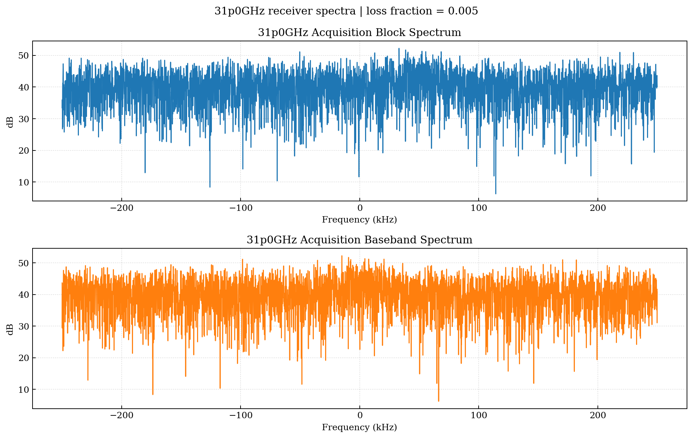


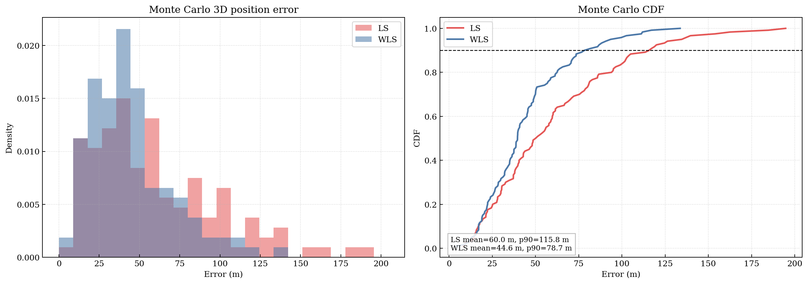

`31.0 GHz` 的联合证据最清楚地说明什么叫“高频端已经进入稳定区”。频谱图中噪声底更均匀、深陷波更少，因此失锁占比已经压到 `0.005`，码时延均方根误差收缩到 `519.147` 纳秒；这意味着接收机面对的是一幅更平顺、更可预测的频谱。进入单历元层以后，这种稳定性被完整保留下来：背景图中的传播起伏明显变浅，残差图里无论场景甲还是场景乙都已压缩到较小范围，统计图则显示加权解不仅整体左移，而且右尾很短，因此场景乙加权定位误差已经降到 `33.506` 米。这里最关键的变化不是“加权再修一点”，而是观测集合本身已经足够干净，使单历元求解进入窄分布、低尾部的工作区。

#### 8.3.3 动态滤波证据与层间闭环

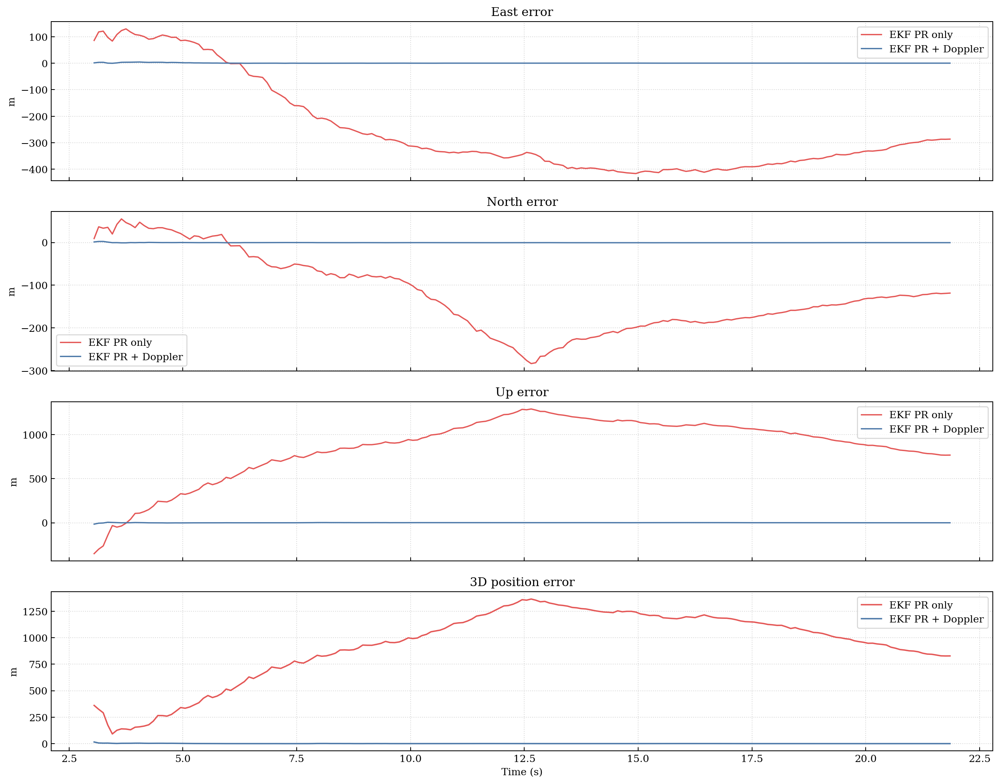

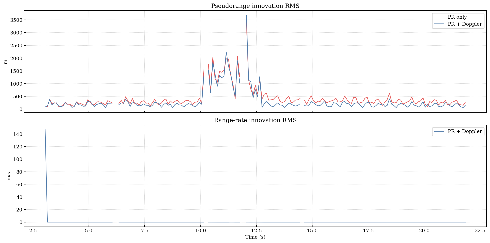

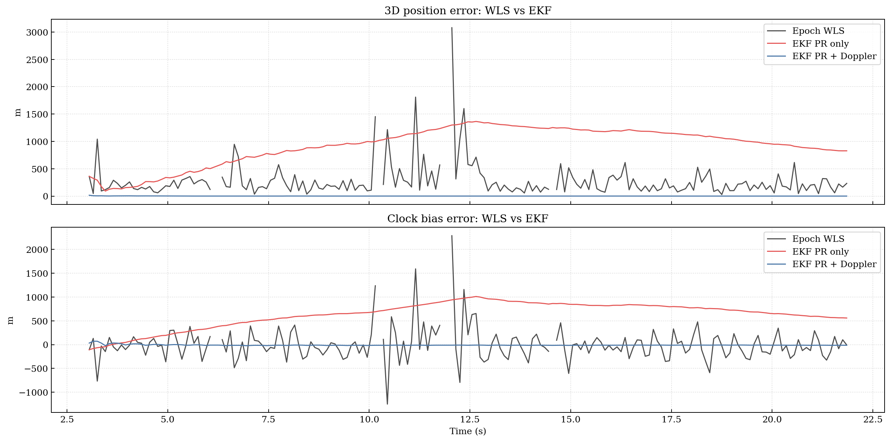

动态层把这种高频稳定性最终落实成持续优势。相对于 `22.5 GHz`，`31.0 GHz` 的伪距加距离变化率动态滤波平均三维位置误差从 `15.091` 米进一步降到 `1.309` 米，平均三维速度误差也压到 `0.005` 米每秒。轨迹误差图里，蓝线几乎贴着零线运行；新息图中，大部分时段都维持在较低水平，只剩局部尖峰；与单历元基线对比图则显示蓝线几乎全程压在黑线和红线下方。对这个频点来说，真正重要的不是某一个最小误差值，而是图中已经看不到低频端那种长期漂移和大范围震荡，这说明预测项与更新项终于进入了稳定配合，也说明高频端确实把传播和接收层的改善沉淀成了可持续的动态收益。


## 9. 讨论与局限

### 9.1 为什么高频段总体更优

从现有结果看，高频段总体更优并不只是因为某一个传播量单独变好了，而是因为三个层面的因素同时朝着有利方向变化。首先，接收机恢复层的码时延误差整体收缩，使得进入导航层的伪距统计质量明显提高；其次，单历元定位层在困难场景中的误差放大幅度下降，加权求解不再需要在极差观测和不理想几何之间艰难平衡；最后，动态滤波层能够更稳定地利用距离变化率信息，使连续历元处理真正发挥出递推约束的优势。正是这三层因素同时改善，才构成了高频段稳定优于前两个频段的根本原因。

### 9.2 为什么仍会出现局部波动

局部波动并不意味着总体趋势失效，恰恰相反，它说明这个系统从传播到导航是多因素耦合的。传播层变化本身就不是严格线性单调的，进入单历元求解以后又会受到几何条件和权重映射的影响，而到了动态滤波层，还会继续受到观测门控和仅预测历元的影响。因此，本报告采用的是“总体趋势叠加局部波动”的解释框架，而不是把所有曲线强行描述为简单单调。只有保留这种波动视角，后续基于全频结果开展实验时，才不会在局部反弹出现时误判整个趋势。

### 9.3 本报告不能替代什么

本报告不能替代真实多星端到端系统定标，因为这里的多星几何不是广播星历，各卫星也没有独立的真实传播路径，动态轨迹同样不是实飞轨迹。也就是说，这份报告的目标从来不是宣布某个系统最终能达到什么工程指标，而是回答“频率变化会怎样影响跨层链路”这个问题。不过，虽然它不能替代最终定标，这份报告已经足够支撑两类关键工作：一类是把后续笔记本和实验从单频点扩展为全频分析，另一类是为更进一步接入真实星历、真实轨迹和独立传播路径提供频率侧依据。它的价值不在于终局，而在于为下一阶段提供一套已经被全频数据支持的解释基线。

## 10. 结论

本次全频研究最重要的结论，是频率不能再被视为一个固定常数，而必须被视为后续所有实验和笔记本的主实验维度。只围绕单一频点构建工作流，已经不足以解释传播层变化如何进入接收机恢复，更不足以说明这些变化在单历元定位和多历元动态估计中究竟会如何继续放大或收敛。

沿着本报告使用的跨层链路来看，单通道传播恢复误差是传播层影响导航层的关键中间环节。传播层的振幅、相位和群时延变化并不会原封不动地等于导航误差，而是先经过接收机恢复环节，被重新表现为码时延恢复误差、频率恢复误差和锁定稳定性差异，再继续下传到伪距统计质量之中。也正因为如此，困难场景单历元定位才会成为跨频比较中最敏感的一层，它最能把观测质量和几何条件共同作用后的误差放大机制显露出来。

最终的动态滤波结果则说明，高频段最有价值的地方，不只是数值更小，而是它更容易把传播层改善稳定地转化为连续历元定位收益。低频段更多体现为误差放大和波动积累，过渡段体现为明显改善但仍伴随局部起伏，而高频段则表现为误差底座的系统性下移和动态约束利用效率的显著提升。这也是为什么后续工作不应再以 `22.5 GHz` 作为唯一中心，而应当真正面向整个泛卡频段组织分析与实验。

## 11. 附录

### 11.1 全频核心指标总表

| 频率 (GHz) | 群时延中位数（纳秒） | 单通道码时延均方根误差（纳秒） | 后相关信噪比中位数（分贝） | 困难场景加权定位三维误差（米） | 困难场景统计定位均值（米） | 动态滤波三维位置误差（米） | 动态滤波三维速度误差（米每秒） |
| --- | --- | --- | --- | --- | --- | --- | --- |
| 19 | 0.490 | 1141.415 | 16.314 | 427.824 | 642.453 | 106.860 | 0.155 |
| 19.500 | 0.488 | 636.439 | 16.387 | 173.090 | 239.233 | 256.882 | 0.486 |
| 20 | 0.487 | 897.467 | 16.464 | 102.257 | 144.531 | 139.503 | 0.190 |
| 20.500 | 0.486 | 700.259 | 16.537 | 135.800 | 180.945 | 130.429 | 0.270 |
| 21 | 0.485 | 620.970 | 16.589 | 60.994 | 91.815 | 56.657 | 0.088 |
| 21.500 | 0.484 | 605.642 | 16.634 | 167.681 | 233.652 | 70.438 | 0.123 |
| 22 | 0.483 | 749.033 | 16.696 | 51.342 | 75.543 | 125.657 | 0.182 |
| 22.500 | 0.482 | 626.064 | 16.782 | 101.270 | 142.062 | 15.091 | 0.043 |
| 23 | 0.482 | 574.163 | 16.784 | 105.608 | 147.983 | 34.792 | 0.068 |
| 23.500 | 0.481 | 590.589 | 16.854 | 58.245 | 76.467 | 18.988 | 0.040 |
| 24 | 0.480 | 584.715 | 16.907 | 49.241 | 71.419 | 54.613 | 0.091 |
| 24.500 | 0.480 | 533.662 | 16.947 | 63.733 | 87.790 | 4.107 | 0.014 |
| 25 | 0.479 | 566.501 | 16.948 | 62.743 | 81.623 | 56.189 | 0.091 |
| 25.500 | 0.478 | 540.393 | 17.020 | 53.821 | 77.158 | 1.850 | 0.009 |
| 26 | 0.478 | 535.323 | 17.032 | 69.876 | 96.236 | 3.609 | 0.011 |
| 26.500 | 0.478 | 544.490 | 17.051 | 65.297 | 92.803 | 2.416 | 0.009 |
| 27 | 0.477 | 526.783 | 17.106 | 43.251 | 62.913 | 1.396 | 0.007 |
| 27.500 | 0.477 | 532.286 | 17.138 | 43.256 | 62.272 | 1.659 | 0.009 |
| 28 | 0.476 | 534.356 | 17.145 | 46.517 | 60.226 | 2.517 | 0.007 |
| 28.500 | 0.476 | 538.774 | 17.158 | 60.792 | 80.340 | 4.954 | 0.012 |
| 29 | 0.476 | 535.468 | 17.205 | 25.606 | 37.019 | 2.105 | 0.008 |
| 29.500 | 0.475 | 537.601 | 17.239 | 72.683 | 108.989 | 1.193 | 0.007 |
| 30 | 0.475 | 533.470 | 17.233 | 78.101 | 101.136 | 0.855 | 0.005 |
| 30.500 | 0.475 | 542.725 | 17.274 | 41.748 | 57.504 | 1.813 | 0.006 |
| 31 | 0.474 | 519.147 | 17.300 | 33.506 | 44.576 | 1.309 | 0.005 |

## 11.2 低频段附录

该频段覆盖 19.0 至 22.0 GHz，共 7 个频点。附录仅保留该频段的核心数值和对应文件索引，正文不再逐频点展开长段解释。

| 频率 (GHz) | 单通道误差（纳秒） | 困难场景定位误差（米） | 动态滤波位置误差（米） | 单通道文件 | 单历元文件 | 动态文件 |
| --- | --- | --- | --- | --- | --- | --- |
| 19 | 1141.415 | 427.824 | 106.860 | [单通道明细](single_channel/frequency_details/19p0GHz.json) | [单历元摘要](wls/19p0GHz/summary.json) | [动态摘要](ekf/19p0GHz/summary.json) |
| 19.500 | 636.439 | 173.090 | 256.882 | [单通道明细](single_channel/frequency_details/19p5GHz.json) | [单历元摘要](wls/19p5GHz/summary.json) | [动态摘要](ekf/19p5GHz/summary.json) |
| 20 | 897.467 | 102.257 | 139.503 | [单通道明细](single_channel/frequency_details/20p0GHz.json) | [单历元摘要](wls/20p0GHz/summary.json) | [动态摘要](ekf/20p0GHz/summary.json) |
| 20.500 | 700.259 | 135.800 | 130.429 | [单通道明细](single_channel/frequency_details/20p5GHz.json) | [单历元摘要](wls/20p5GHz/summary.json) | [动态摘要](ekf/20p5GHz/summary.json) |
| 21 | 620.970 | 60.994 | 56.657 | [单通道明细](single_channel/frequency_details/21p0GHz.json) | [单历元摘要](wls/21p0GHz/summary.json) | [动态摘要](ekf/21p0GHz/summary.json) |
| 21.500 | 605.642 | 167.681 | 70.438 | [单通道明细](single_channel/frequency_details/21p5GHz.json) | [单历元摘要](wls/21p5GHz/summary.json) | [动态摘要](ekf/21p5GHz/summary.json) |
| 22 | 749.033 | 51.342 | 125.657 | [单通道明细](single_channel/frequency_details/22p0GHz.json) | [单历元摘要](wls/22p0GHz/summary.json) | [动态摘要](ekf/22p0GHz/summary.json) |

## 11.3 过渡段附录

该频段覆盖 22.5 至 25.5 GHz，共 7 个频点。附录仅保留该频段的核心数值和对应文件索引，正文不再逐频点展开长段解释。

| 频率 (GHz) | 单通道误差（纳秒） | 困难场景定位误差（米） | 动态滤波位置误差（米） | 单通道文件 | 单历元文件 | 动态文件 |
| --- | --- | --- | --- | --- | --- | --- |
| 22.500 | 626.064 | 101.270 | 15.091 | [单通道明细](single_channel/frequency_details/22p5GHz.json) | [单历元摘要](wls/22p5GHz/summary.json) | [动态摘要](ekf/22p5GHz/summary.json) |
| 23 | 574.163 | 105.608 | 34.792 | [单通道明细](single_channel/frequency_details/23p0GHz.json) | [单历元摘要](wls/23p0GHz/summary.json) | [动态摘要](ekf/23p0GHz/summary.json) |
| 23.500 | 590.589 | 58.245 | 18.988 | [单通道明细](single_channel/frequency_details/23p5GHz.json) | [单历元摘要](wls/23p5GHz/summary.json) | [动态摘要](ekf/23p5GHz/summary.json) |
| 24 | 584.715 | 49.241 | 54.613 | [单通道明细](single_channel/frequency_details/24p0GHz.json) | [单历元摘要](wls/24p0GHz/summary.json) | [动态摘要](ekf/24p0GHz/summary.json) |
| 24.500 | 533.662 | 63.733 | 4.107 | [单通道明细](single_channel/frequency_details/24p5GHz.json) | [单历元摘要](wls/24p5GHz/summary.json) | [动态摘要](ekf/24p5GHz/summary.json) |
| 25 | 566.501 | 62.743 | 56.189 | [单通道明细](single_channel/frequency_details/25p0GHz.json) | [单历元摘要](wls/25p0GHz/summary.json) | [动态摘要](ekf/25p0GHz/summary.json) |
| 25.500 | 540.393 | 53.821 | 1.850 | [单通道明细](single_channel/frequency_details/25p5GHz.json) | [单历元摘要](wls/25p5GHz/summary.json) | [动态摘要](ekf/25p5GHz/summary.json) |

## 11.4 高频段附录

该频段覆盖 26.0 至 31.0 GHz，共 11 个频点。附录仅保留该频段的核心数值和对应文件索引，正文不再逐频点展开长段解释。

| 频率 (GHz) | 单通道误差（纳秒） | 困难场景定位误差（米） | 动态滤波位置误差（米） | 单通道文件 | 单历元文件 | 动态文件 |
| --- | --- | --- | --- | --- | --- | --- |
| 26 | 535.323 | 69.876 | 3.609 | [单通道明细](single_channel/frequency_details/26p0GHz.json) | [单历元摘要](wls/26p0GHz/summary.json) | [动态摘要](ekf/26p0GHz/summary.json) |
| 26.500 | 544.490 | 65.297 | 2.416 | [单通道明细](single_channel/frequency_details/26p5GHz.json) | [单历元摘要](wls/26p5GHz/summary.json) | [动态摘要](ekf/26p5GHz/summary.json) |
| 27 | 526.783 | 43.251 | 1.396 | [单通道明细](single_channel/frequency_details/27p0GHz.json) | [单历元摘要](wls/27p0GHz/summary.json) | [动态摘要](ekf/27p0GHz/summary.json) |
| 27.500 | 532.286 | 43.256 | 1.659 | [单通道明细](single_channel/frequency_details/27p5GHz.json) | [单历元摘要](wls/27p5GHz/summary.json) | [动态摘要](ekf/27p5GHz/summary.json) |
| 28 | 534.356 | 46.517 | 2.517 | [单通道明细](single_channel/frequency_details/28p0GHz.json) | [单历元摘要](wls/28p0GHz/summary.json) | [动态摘要](ekf/28p0GHz/summary.json) |
| 28.500 | 538.774 | 60.792 | 4.954 | [单通道明细](single_channel/frequency_details/28p5GHz.json) | [单历元摘要](wls/28p5GHz/summary.json) | [动态摘要](ekf/28p5GHz/summary.json) |
| 29 | 535.468 | 25.606 | 2.105 | [单通道明细](single_channel/frequency_details/29p0GHz.json) | [单历元摘要](wls/29p0GHz/summary.json) | [动态摘要](ekf/29p0GHz/summary.json) |
| 29.500 | 537.601 | 72.683 | 1.193 | [单通道明细](single_channel/frequency_details/29p5GHz.json) | [单历元摘要](wls/29p5GHz/summary.json) | [动态摘要](ekf/29p5GHz/summary.json) |
| 30 | 533.470 | 78.101 | 0.855 | [单通道明细](single_channel/frequency_details/30p0GHz.json) | [单历元摘要](wls/30p0GHz/summary.json) | [动态摘要](ekf/30p0GHz/summary.json) |
| 30.500 | 542.725 | 41.748 | 1.813 | [单通道明细](single_channel/frequency_details/30p5GHz.json) | [单历元摘要](wls/30p5GHz/summary.json) | [动态摘要](ekf/30p5GHz/summary.json) |
| 31 | 519.147 | 33.506 | 1.309 | [单通道明细](single_channel/frequency_details/31p0GHz.json) | [单历元摘要](wls/31p0GHz/summary.json) | [动态摘要](ekf/31p0GHz/summary.json) |

## 11.5 代表频点详细指标表

这一节集中放回正文中移出的代表频点详细指标表，便于追溯数值来源，同时避免这些长表继续打断正文的主叙事。

### 11.5.1 19.0 GHz

#### 单通道详细指标

| 单通道指标 | 数值 |
| --- | --- |
| 传播振幅中位数 | 0.872 |
| 传播衰减中位数（分贝） | -1.195 |
| 传播相位中位数（弧度） | -53.358 |
| 群时延中位数（纳秒） | 0.490 |
| 码时延均方根误差（纳秒） | 1141.415 |
| 频率恢复均方根误差（赫兹） | 111.947 |
| 主峰与次峰差值（分贝） | 0.188 |
| 后相关信噪比中位数（分贝） | 16.314 |
| 载波锁定指标中位数 | 0.857 |
| 失锁占比 | 0.081 |

#### 单历元定位详细指标

| 单历元定位指标 | 数值 |
| --- | --- |
| 群时延中位数（米） | 0.147 |
| 单通道伪距一秒平滑标准差（米） | 267.815 |
| 场景甲普通最小二乘三维误差（米） | 81.453 |
| 场景甲加权最小二乘三维误差（米） | 70.941 |
| 场景乙普通最小二乘三维误差（米） | 1534.425 |
| 场景乙加权最小二乘三维误差（米） | 427.824 |
| 场景甲位置精度因子 | 3.556 |
| 场景乙位置精度因子 | 2.104 |
| 困难场景统计定位均值（米） | 642.453 |
| 困难场景统计定位九成分位值（米） | 1115.106 |

#### 动态滤波详细指标

| 动态滤波指标 | 数值 |
| --- | --- |
| 单历元基线平均三维误差（米） | 1125.948 |
| 仅伪距动态滤波平均三维误差（米） | 7060.729 |
| 伪距加距离变化率动态滤波平均三维误差（米） | 106.860 |
| 伪距加距离变化率动态滤波平均三维速度误差（米每秒） | 0.155 |
| 伪距加距离变化率动态滤波平均伪距新息（米） | 931.692 |
| 伪距加距离变化率动态滤波平均距离变化率新息（米每秒） | 1.909 |
| 仅预测历元数 | 62 |
| 动态距离变化率一百毫秒标准差（米每秒） | 0.138 |

### 11.5.2 22.5 GHz

#### 单通道详细指标

| 单通道指标 | 数值 |
| --- | --- |
| 传播振幅中位数 | 0.912 |
| 传播衰减中位数（分贝） | -0.799 |
| 传播相位中位数（弧度） | -64.038 |
| 群时延中位数（纳秒） | 0.482 |
| 码时延均方根误差（纳秒） | 626.064 |
| 频率恢复均方根误差（赫兹） | 106.476 |
| 主峰与次峰差值（分贝） | 0.082 |
| 后相关信噪比中位数（分贝） | 16.782 |
| 载波锁定指标中位数 | 0.895 |
| 失锁占比 | 0.036 |

#### 单历元定位详细指标

| 单历元定位指标 | 数值 |
| --- | --- |
| 群时延中位数（米） | 0.145 |
| 单通道伪距一秒平滑标准差（米） | 63.394 |
| 场景甲普通最小二乘三维误差（米） | 19.281 |
| 场景甲加权最小二乘三维误差（米） | 16.792 |
| 场景乙普通最小二乘三维误差（米） | 363.227 |
| 场景乙加权最小二乘三维误差（米） | 101.270 |
| 场景甲位置精度因子 | 3.556 |
| 场景乙位置精度因子 | 2.104 |
| 困难场景统计定位均值（米） | 142.062 |
| 困难场景统计定位九成分位值（米） | 275.999 |

#### 动态滤波详细指标

| 动态滤波指标 | 数值 |
| --- | --- |
| 单历元基线平均三维误差（米） | 583.656 |
| 仅伪距动态滤波平均三维误差（米） | 891.783 |
| 伪距加距离变化率动态滤波平均三维误差（米） | 15.091 |
| 伪距加距离变化率动态滤波平均三维速度误差（米每秒） | 0.043 |
| 伪距加距离变化率动态滤波平均伪距新息（米） | 526.383 |
| 伪距加距离变化率动态滤波平均距离变化率新息（米每秒） | 0.652 |
| 仅预测历元数 | 46 |
| 动态距离变化率一百毫秒标准差（米每秒） | 0.040 |

### 11.5.3 31.0 GHz

#### 单通道详细指标

| 单通道指标 | 数值 |
| --- | --- |
| 传播振幅中位数 | 0.955 |
| 传播衰减中位数（分贝） | -0.404 |
| 传播相位中位数（弧度） | -89.540 |
| 群时延中位数（纳秒） | 0.474 |
| 码时延均方根误差（纳秒） | 519.147 |
| 频率恢复均方根误差（赫兹） | 96.585 |
| 主峰与次峰差值（分贝） | 0.067 |
| 后相关信噪比中位数（分贝） | 17.300 |
| 载波锁定指标中位数 | 0.926 |
| 失锁占比 | 0.005 |

#### 单历元定位详细指标

| 单历元定位指标 | 数值 |
| --- | --- |
| 群时延中位数（米） | 0.142 |
| 单通道伪距一秒平滑标准差（米） | 20.975 |
| 场景甲普通最小二乘三维误差（米） | 6.379 |
| 场景甲加权最小二乘三维误差（米） | 5.556 |
| 场景乙普通最小二乘三维误差（米） | 120.178 |
| 场景乙加权最小二乘三维误差（米） | 33.506 |
| 场景甲位置精度因子 | 3.556 |
| 场景乙位置精度因子 | 2.104 |
| 困难场景统计定位均值（米） | 44.576 |
| 困难场景统计定位九成分位值（米） | 78.660 |

#### 动态滤波详细指标

| 动态滤波指标 | 数值 |
| --- | --- |
| 单历元基线平均三维误差（米） | 280.515 |
| 仅伪距动态滤波平均三维误差（米） | 925.411 |
| 伪距加距离变化率动态滤波平均三维误差（米） | 1.309 |
| 伪距加距离变化率动态滤波平均三维速度误差（米每秒） | 0.005 |
| 伪距加距离变化率动态滤波平均伪距新息（米） | 319.130 |
| 伪距加距离变化率动态滤波平均距离变化率新息（米每秒） | 0.810 |
| 仅预测历元数 | 36 |
| 动态距离变化率一百毫秒标准差（米每秒） | 0.004 |


## 12. 数据文件与图像索引

完整跨层综合指标位于 `cross_frequency/combined_metrics.csv` 和 `cross_frequency/combined_metrics.json`。分层统计文件位于 `wls/cross_frequency/wls_metrics.csv` 与 `ekf/cross_frequency/ekf_metrics.csv`。本报告中最关键的全频图像分别位于 `single_channel/wkb_multifreq_overview.png`、`single_channel/wkb_multifreq_frequency_summary.png`、`wls/cross_frequency/wls_metrics_vs_frequency.png`、`ekf/cross_frequency/ekf_metrics_vs_frequency.png`、`report_visuals/overview_key_metrics.png`、`report_visuals/band_summary_metrics.png`、`report_visuals/representative_single_channel_metrics.png`、`report_visuals/representative_wls_metrics.png` 和 `report_visuals/representative_dynamic_metrics.png`。附录各频点引用的单通道明细、单历元摘要和动态摘要文件，则已经在对应频段表格中逐项列出，可直接按频点回溯到原始结果。
