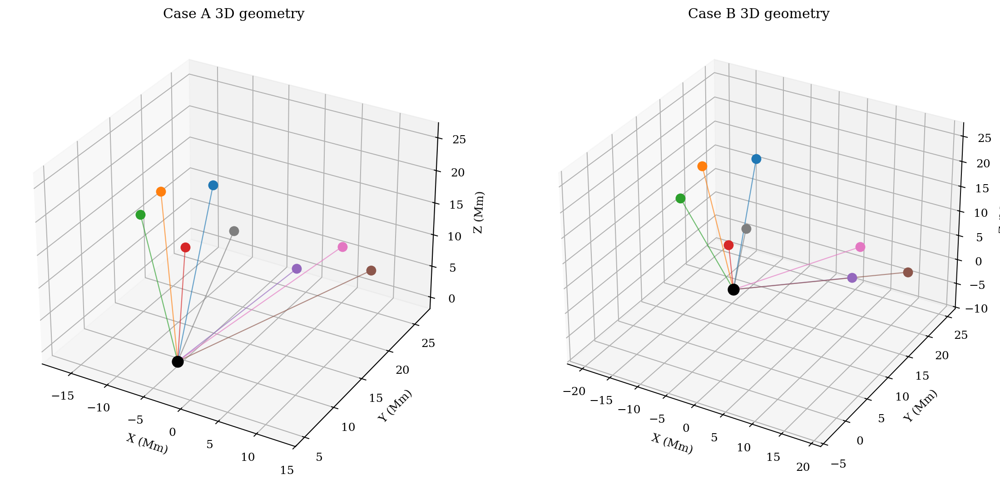
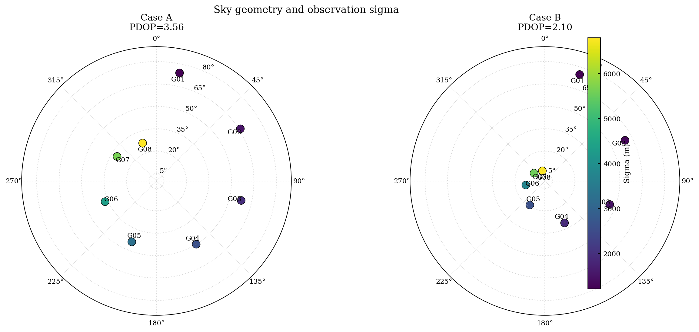
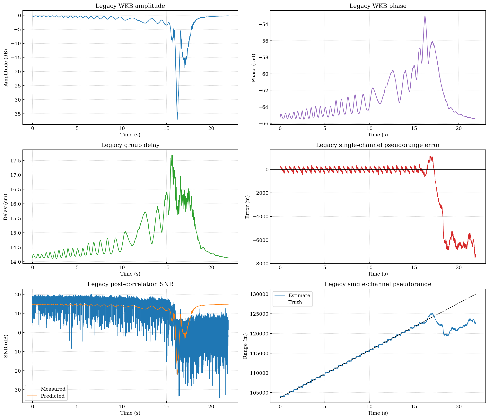
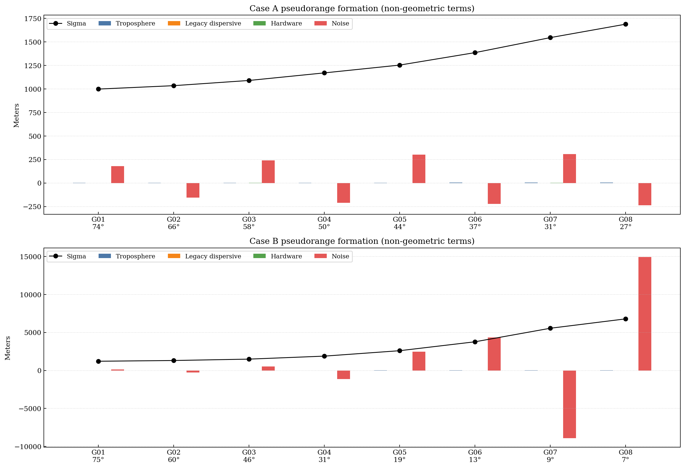
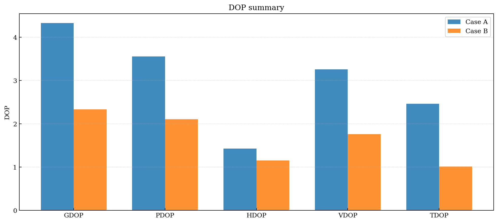
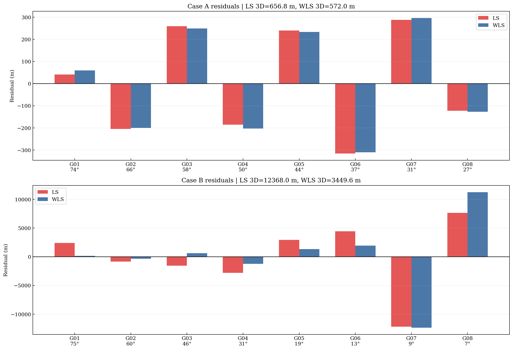
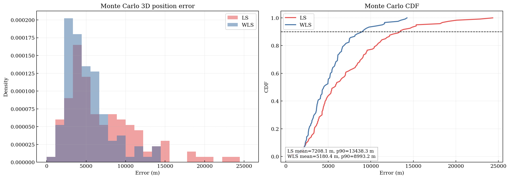

# Ka 22.5 GHz 真实 WKB 单通道背景下的多星标准伪距与单历元 WLS PVT 实验报告

## 1. 摘要

[../notebooks/nb_ka225_rx_from_real_wkb_debug.py](../notebooks/nb_ka225_rx_from_real_wkb_debug.py) 已经完成了单通道链路实验：真实电子密度场、真实 WKB、Ka 22.5 GHz PN/BPSK 信号、捕获、DLL / PLL 跟踪，以及单通道 `pseudorange / carrier phase / Doppler` 输出。  
[../notebooks/exp_multisat_wls_pvt_report.py](../notebooks/exp_multisat_wls_pvt_report.py) 在旧脚本基础上增加了多星几何、标准伪距方程、单历元 LS/WLS PVT 和 Monte Carlo。

报告中的多星结果不代表“真实多星端到端 Ka 导航系统”的性能结论。旧脚本中的真实单通道传播和接收机链路已经接入；多星几何、卫星钟差、对流层项、硬件偏差和观测方差映射仍由新脚本补充。

主要数字如下：

| 项目 | 数值 |
|---|---:|
| `tau_g` 中位数 | 0.1446 m |
| 单通道伪距误差 `1 s` 平滑 sigma | 63.394 m |
| 实验 A LS 3D 误差 | 19.281 m |
| 实验 A WLS 3D 误差 | 16.792 m |
| 实验 B LS 3D 误差 | 363.227 m |
| 实验 B WLS 3D 误差 | 101.270 m |
| Monte Carlo LS 均值 / p90 | 183.398 m / 356.426 m |
| Monte Carlo WLS 均值 / p90 | 125.992 m / 223.767 m |

## 2. 旧脚本已有内容

旧脚本 [../notebooks/nb_ka225_rx_from_real_wkb_debug.py](../notebooks/nb_ka225_rx_from_real_wkb_debug.py) 的主链路如下：

1. 从 CSV 构造电子密度场。
2. 计算真实 WKB，得到 `A(t)`、`phi(t)`、`tau_g(t)`。
3. 用真实传播量生成 Ka 22.5 GHz PN/BPSK 信号。
4. 完成捕获。
5. 完成 DLL / PLL 跟踪。
6. 输出单通道 `pseudorange / carrier phase / Doppler`。

旧脚本已经覆盖了传播和单通道接收机。缺少的部分是多星几何、标准伪距方程、位置与钟差联合求解、DOP 和 WLS。

## 3. 新脚本增加的步骤

新脚本 [../notebooks/exp_multisat_wls_pvt_report.py](../notebooks/exp_multisat_wls_pvt_report.py) 增加的是导航解算部分：

```text
电子密度场 CSV
  -> 旧脚本 build_fields_from_csv
  -> 旧脚本 compute_real_wkb_series
  -> 旧脚本 build_signal_config_from_wkb_time
  -> 旧脚本 resample_wkb_to_receiver_time
  -> 旧脚本 KaBpskReceiver.run
  -> 单通道背景: A(t), phi(t), tau_g(t), pseudorange, SNR, tracking error
  -> 多星几何场景
  -> 标准伪距形成
  -> LS / WLS 单历元 PVT
  -> Monte Carlo
  -> 图片、CSV、JSON、Markdown
```

流程中有三类量：

1. 单通道链路量：`A(t)`、`phi(t)`、`tau_g(t)`、单通道 `pseudorange`、单通道 tracking error。
2. 标准伪距观测：进入统一观测方程的多星 `pseudorange_m`。
3. 导航解算结果：位置、钟差、残差、DOP、ENU 误差、3D 误差、Monte Carlo 统计。

## 4. 复用的旧脚本函数

新脚本直接复用了以下旧函数：

1. `build_fields_from_csv`
2. `compute_real_wkb_series`
3. `build_signal_config_from_wkb_time`
4. `resample_wkb_to_receiver_time`
5. `KaBpskReceiver.run`

代码如下：

```python
# notebooks/exp_multisat_wls_pvt_report.py
field_result = LEGACY_DEBUG.build_fields_from_csv(...)
wkb_result = LEGACY_DEBUG.compute_real_wkb_series(...)
cfg_sig = LEGACY_DEBUG.build_signal_config_from_wkb_time(...)
plasma_rx = LEGACY_DEBUG.resample_wkb_to_receiver_time(...)
receiver_context = LEGACY_DEBUG.ReceiverRuntimeContext(...)
receiver_outputs = LEGACY_DEBUG.KaBpskReceiver(receiver_context).run()
trk_result = receiver_outputs.trk_result
```

代码从旧脚本提取真实传播和单通道接收机输出。多星几何和 PVT 不在旧脚本中，由新脚本新增。

## 5. 标准伪距方程

导航层使用的标准伪距方程如下：

```text
pseudorange_m =
    geometric_range_m
    + c * (receiver_clock_bias_s - satellite_clock_bias_s)
    + tropo_delay_m
    + dispersive_delay_m
    + hardware_bias_m
    + noise_m
```

各项含义如下：

- `geometric_range_m`：卫星到接收机的几何距离。
- `receiver_clock_bias_s`：接收机钟差。
- `satellite_clock_bias_s`：卫星钟差。
- `tropo_delay_m`：对流层延迟。
- `dispersive_delay_m`：色散传播项。
- `hardware_bias_m`：硬件偏差。
- `noise_m`：测量噪声。

单通道 DLL 输出的 `c * tau_est` 只是链路内部恢复的码时延量。标准伪距必须把几何、钟差和非几何项放在同一个方程里。

代码如下：

```python
# notebooks/exp_multisat_wls_pvt_report.py
pseudorange_m = (
    geometric_range_m
    + receiver_cfg.receiver_clock_bias_m
    - C_LIGHT * sat.sat_clock_bias_s
    + tropo_delay_m
    + dispersive_delay_m
    + hardware_bias_m
    + noise_m
)
```

## 6. 多星几何场景

接收机真值设置如下：

| 参数 | 数值 |
|---|---:|
| Latitude | 34.0 deg |
| Longitude | 108.0 deg |
| Height | 500 m |
| Receiver clock bias | 120 m |
| Carrier frequency | 22.5 GHz |

卫星场景使用 8 颗星。Case A 以中高仰角为主。Case B 有多个低仰角观测，专门用来放大普通 LS 的问题。

### 6.1 三维几何图



图 1 给出接收机和卫星在 ECEF 坐标系下的位置。黑点是接收机，其余点是卫星。连线表示视线方向。图中几何关系由接收机位置、方位角、仰角和轨道半径共同确定。

### 6.2 天空图



图 2 给出天空图。径向坐标是 `90° - elevation`，越靠中心表示仰角越高。颜色表示观测 sigma。Case B 中低仰角卫星的 sigma 明显更大。

### 6.3 逐星几何与 sigma

#### Case A

| Sat | Az (deg) | El (deg) | Sigma (m) |
|---|---:|---:|---:|
| G01 | 12.0 | 74.0 | 29.33 |
| G02 | 58.0 | 66.0 | 30.39 |
| G03 | 103.0 | 58.0 | 32.02 |
| G04 | 148.0 | 50.0 | 34.38 |
| G05 | 202.0 | 44.0 | 36.81 |
| G06 | 248.0 | 37.0 | 40.70 |
| G07 | 302.0 | 31.0 | 45.39 |
| G08 | 340.0 | 27.0 | 49.58 |

#### Case B

| Sat | Az (deg) | El (deg) | Sigma (m) |
|---|---:|---:|---:|
| G01 | 18.0 | 75.0 | 35.72 |
| G02 | 63.0 | 60.0 | 38.56 |
| G03 | 110.0 | 46.0 | 43.91 |
| G04 | 155.0 | 31.0 | 55.48 |
| G05 | 212.0 | 19.0 | 76.48 |
| G06 | 258.0 | 13.0 | 110.91 |
| G07 | 306.0 | 9.0 | 163.26 |
| G08 | 346.0 | 7.0 | 199.49 |

Case B 的 sigma 随仰角下降而快速上升。WLS 的权阵按这组 sigma 构造。

## 7. 旧脚本生成的单通道背景



图 3 包含六个子图：

1. 真实 WKB 幅度衰减。
2. 真实 WKB 相位。
3. 真实群时延 `tau_g(t)`。
4. 单通道伪距误差。
5. 后相关 SNR。
6. 单通道伪距估计与 truth。

图 3 里能直接看到三件事：

- `tau_g` 存在，但量级不大。
- 单通道码伪距误差不小。
- 观测质量随时间变化，SNR 也不是常数。

旧链路给出的量级如下：

| 指标 | 数值 |
|---|---:|
| `tau_g` 中位数 | 0.1446 m |
| `tau_g` 跨度 | 0.0358 m |
| 单通道伪距误差 `100 ms` 平滑 sigma | 165.353 m |
| 单通道伪距误差 `1 s` 平滑 sigma | 63.394 m |
| 单通道伪距误差 `1 s` 平滑 RMSE | 67.510 m |
| 单通道伪距误差平均偏置 | -25.391 m |

代码如下：

```python
# notebooks/exp_multisat_wls_pvt_report.py
wkb_result = LEGACY_DEBUG.compute_real_wkb_series(...)
cfg_sig = LEGACY_DEBUG.build_signal_config_from_wkb_time(...)
plasma_rx = LEGACY_DEBUG.resample_wkb_to_receiver_time(...)
receiver_outputs = LEGACY_DEBUG.KaBpskReceiver(receiver_context).run()
trk_result = receiver_outputs.trk_result

pseudorange_error_m = trk_result["pseudorange_m"] - C_LIGHT * trk_result["tau_true_s"]
effective_sigma_100ms_m = block_average_sigma(pseudorange_error_m, 100)
effective_sigma_1s_m = block_average_sigma(pseudorange_error_m, 1000)
```

代码从旧脚本提取 WKB 和单通道跟踪输出，再把伪距误差统计量写进多星观测定标。

## 8. 从单通道背景到多星标准伪距

多星标准伪距不是直接拿单通道 `c * tau_est` 复制 8 份。新脚本做了四件事：

1. 用方位角和仰角生成多星几何。
2. 用旧链路 `tau_g` 中位数构造色散项，并按仰角放大。
3. 用旧链路 `1 s` 平滑伪距 sigma 构造多星观测方差。
4. 在低仰角卫星上继续放大误差项。

代码如下：

```python
# notebooks/exp_multisat_wls_pvt_report.py
sigma_m = legacy_bg.effective_pseudorange_sigma_1s_m * config.sigma_scale_factor / (sin_el ** 0.70)
dispersive_delay_m = legacy_bg.tau_g_median_m * config.dispersive_scale_factor / (sin_el ** 1.25)

pseudorange_m = (
    geometric_range_m
    + receiver_cfg.receiver_clock_bias_m
    - C_LIGHT * sat.sat_clock_bias_s
    + tropo_delay_m
    + dispersive_delay_m
    + hardware_bias_m
    + noise_m
)
```

### 8.1 伪距组成图



图 4 给出每颗星非几何项的组成，包括对流层项、色散项、硬件偏差、噪声和 sigma。Case A 的变化较平缓。Case B 中 G06、G07、G08 的 sigma 和噪声幅度明显更大。

### 8.2 逐星观测摘要

#### Case A

| Sat | El (deg) | Tropo (m) | Dispersive (m) | Hardware (m) | Noise (m) | Sigma (m) |
|---|---:|---:|---:|---:|---:|---:|
| G01 | 74 | 2.392 | 0.152 | 0.800 | 5.279 | 29.327 |
| G02 | 66 | 2.517 | 0.162 | -0.600 | -4.559 | 30.391 |
| G03 | 58 | 2.711 | 0.178 | 1.100 | 7.044 | 32.016 |
| G04 | 50 | 3.000 | 0.202 | -0.900 | -6.188 | 34.378 |
| G05 | 44 | 3.307 | 0.228 | 0.400 | 8.836 | 36.815 |
| G06 | 37 | 3.815 | 0.273 | -0.700 | -6.513 | 40.704 |
| G07 | 31 | 4.453 | 0.331 | 1.600 | 9.078 | 45.391 |
| G08 | 27 | 5.047 | 0.388 | -1.300 | -6.942 | 49.583 |

#### Case B

| Sat | El (deg) | Tropo (m) | Dispersive (m) | Hardware (m) | Noise (m) | Sigma (m) |
|---|---:|---:|---:|---:|---:|---:|
| G01 | 75 | 2.692 | 0.211 | 1.040 | 4.287 | 35.723 |
| G02 | 60 | 3.001 | 0.242 | -0.780 | -7.712 | 38.560 |
| G03 | 46 | 3.611 | 0.306 | 1.430 | 15.368 | 43.909 |
| G04 | 31 | 5.034 | 0.464 | -1.170 | -33.287 | 55.478 |
| G05 | 19 | 7.920 | 0.823 | 0.520 | 72.658 | 76.483 |
| G06 | 13 | 11.347 | 1.307 | -0.910 | 127.541 | 110.905 |
| G07 | 9 | 15.996 | 2.058 | 2.080 | -261.210 | 163.256 |
| G08 | 7 | 20.048 | 2.812 | -1.690 | 438.876 | 199.489 |

## 9. LS 与 WLS 单历元解算

状态量定义如下：

```text
[x_m, y_m, z_m, receiver_clock_bias_m]
```

设计矩阵 `H` 的每一行来自卫星 LOS 单位向量。代码如下：

```python
# notebooks/exp_multisat_wls_pvt_report.py
line_of_sight_m = obs.sat_pos_ecef_m - state_m[:3]
geometric_range_m = float(np.linalg.norm(line_of_sight_m))
los_unit = line_of_sight_m / geometric_range_m

h_rows.append([-los_unit[0], -los_unit[1], -los_unit[2], 1.0])
residual_vector_m.append(obs.pseudorange_m - predicted_pseudorange_m)
```

WLS 和 LS 的差别在权阵：

```python
if weighted:
    weight_matrix = np.diag(1.0 / np.maximum(sigma_m, 1e-6) ** 2)
    normal_matrix = h_matrix.T @ weight_matrix @ h_matrix
    rhs_vector = h_matrix.T @ weight_matrix @ residual_vector_m
else:
    normal_matrix = h_matrix.T @ h_matrix
    rhs_vector = h_matrix.T @ residual_vector_m
```

LS 对所有观测权重相同。WLS 用 `sigma_m` 做权重，低质量观测的影响更小。

## 10. 实验设计

### 10.1 实验 A

- 场景：几何较好，噪声中等。
- 目标：检查 LS 和 WLS 是否都能正常工作。

### 10.2 实验 B

- 场景：加入多个低仰角观测。
- 目标：放大低质量观测对 LS 的影响，比较 WLS。

### 10.3 实验 C

- 场景：基于 Case B 做 120 次 Monte Carlo。
- 输出：LS/WLS 的 3D 误差分布、均值、标准差和 90% 分位数。

## 11. 实验结果

### 11.1 DOP



图 5 给出 DOP。Case B 的 PDOP 不算高，但 Case B 的观测质量更差。几何和观测质量需要分开看。

### 11.2 单次结果总表

| Case | Metric | LS | WLS |
|---|---|---:|---:|
| A | 3D position error (m) | 19.281 | 16.792 |
| A | Clock bias (m) | 107.029 | 108.826 |
| A | Residual RMS / weighted RMS | 6.574 | 0.177 |
| B | 3D position error (m) | 363.227 | 101.270 |
| B | Clock bias (m) | 340.639 | 203.528 |
| B | Residual RMS / weighted RMS | 164.850 | 1.053 |

Case A 中 LS 和 WLS 都能工作。Case B 中 LS 为 363.227 m，WLS 为 101.270 m。差别主要出现在低仰角观测。

### 11.3 ENU 误差

| Case | Method | East (m) | North (m) | Up (m) | 3D (m) |
|---|---|---:|---:|---:|---:|
| A | LS | 6.153 | 0.633 | -18.262 | 19.281 |
| A | WLS | 5.270 | 1.034 | -15.910 | 16.792 |
| B | LS | -141.996 | -70.250 | 326.858 | 363.227 |
| B | WLS | 15.692 | -34.039 | 94.079 | 101.270 |

Case B 中垂向误差最大。低仰角观测多时，Up 分量更脆弱。

### 11.4 残差图



图 6 给出逐星残差。Case B 里低仰角星的 LS 残差更大。WLS 对低仰角观测做了降权。

### 11.5 Monte Carlo 图



图 7 给出 Monte Carlo 的误差分布和 CDF。WLS 曲线整体更靠左。

### 11.6 Monte Carlo 表

| Method | Mean (m) | Std (m) | P90 (m) |
|---|---:|---:|---:|
| LS | 183.398 | 120.032 | 356.426 |
| WLS | 125.992 | 70.084 | 223.767 |

Monte Carlo 里，WLS 的均值、标准差和 90% 分位数都低于 LS。

## 12. 代码片段

### 12.1 旧链路背景构造

```python
def build_legacy_channel_background() -> LegacyChannelBackground:
    field_result = LEGACY_DEBUG.build_fields_from_csv(...)
    wkb_result = LEGACY_DEBUG.compute_real_wkb_series(...)
    cfg_sig = LEGACY_DEBUG.build_signal_config_from_wkb_time(...)
    plasma_rx = LEGACY_DEBUG.resample_wkb_to_receiver_time(...)
    receiver_outputs = LEGACY_DEBUG.KaBpskReceiver(receiver_context).run()
    trk_result = receiver_outputs.trk_result
```

代码从旧脚本生成真实传播和单通道接收机输出。

### 12.2 标准伪距形成

```python
sigma_m = legacy_bg.effective_pseudorange_sigma_1s_m * config.sigma_scale_factor / (sin_el ** 0.70)
dispersive_delay_m = legacy_bg.tau_g_median_m * config.dispersive_scale_factor / (sin_el ** 1.25)

pseudorange_m = (
    geometric_range_m
    + receiver_cfg.receiver_clock_bias_m
    - C_LIGHT * sat.sat_clock_bias_s
    + tropo_delay_m
    + dispersive_delay_m
    + hardware_bias_m
    + noise_m
)
```

代码把几何、钟差和非几何项写进标准伪距。

### 12.3 LS / WLS

```python
h_rows.append([-los_unit[0], -los_unit[1], -los_unit[2], 1.0])

if weighted:
    weight_matrix = np.diag(1.0 / np.maximum(sigma_m, 1e-6) ** 2)
    normal_matrix = h_matrix.T @ weight_matrix @ h_matrix
    rhs_vector = h_matrix.T @ weight_matrix @ residual_vector_m
else:
    normal_matrix = h_matrix.T @ h_matrix
    rhs_vector = h_matrix.T @ residual_vector_m
```

代码里只有权阵不同。LS 不区分观测质量，WLS 使用 `sigma_m`。

### 12.4 主流程

```python
legacy_bg = build_legacy_channel_background()
case_a_result = run_experiment_case(receiver_cfg, legacy_bg, experiment_a_cfg, rng_case_a)
case_b_result = run_experiment_case(receiver_cfg, legacy_bg, experiment_b_cfg, rng_case_b)
monte_carlo_result = run_monte_carlo(receiver_cfg, legacy_bg, experiment_b_cfg, ...)

plot_geometry_3d(...)
plot_legacy_channel_overview(...)
plot_pseudorange_formation(...)
plot_ls_vs_wls_residuals(...)
plot_monte_carlo_position_error(...)
plot_dop_summary(...)
```

主流程先生成旧链路背景，再做多星几何、伪距形成、PVT 和出图。

## 13. 简化项与适用范围

### 13.1 简化项

1. 多星几何采用静态自洽场景，未使用广播星历。
2. 各颗卫星没有独立真实鞘套路径，使用同一真实单通道背景再做仰角映射。
3. 对流层、硬件偏差、卫星钟差是参数化项。
4. 多星观测方差来自旧脚本单通道伪距误差统计，不是多星同步跟踪直接输出。

### 13.2 结果适用范围

结果适用于“真实单通道 Ka/WKB 背景 + 多星几何映射 + 标准伪距 + 单历元 PVT”的组合。  
结果不代表真实多星端到端 Ka 导航系统性能。

## 14. 新增步骤解决的问题

旧脚本已经覆盖了真实传播和单通道接收机。新脚本补上了多星标准观测和单历元位置解算。  
后续如果要接入真实星历、独立多星传播路径、速度与钟漂、双频或 EKF，现有脚本已经给出直接的落点。

## 15. 运行方式与输出物

运行命令：

```bash
.venv/bin/python notebooks/exp_multisat_wls_pvt_report.py
```

输出目录：

```text
results_multisat_wls/
```

主报告使用的文件如下：

- `geometry_3d.png`
- `sky_geometry.png`
- `legacy_channel_overview.png`
- `pseudorange_formation.png`
- `ls_vs_wls_residuals.png`
- `monte_carlo_position_error.png`
- `dop_summary.png`
- `satellite_observations.csv`
- `summary.json`
- `report_summary.md`

## 16. 附录

`pseudorange_error_budget.png` 来自前一版输出。当前主线汇报使用 `pseudorange_formation.png`。  
`summary.json` 是数值主来源。`satellite_observations.csv` 保存逐星标准伪距组成和残差。

---

旧脚本完成了单通道传播和单通道接收机。新脚本增加了多星标准伪距和单历元 LS/WLS PVT。报告中的所有结果都建立在这个分工上。  
