# 泛 Ka 全频真实 WKB / 频谱 / WLS / EKF 综合实验报告

## 1. 摘要

本报告面向已经完成的泛 Ka 全频实验结果目录 `tmp_fullstack_3f`，统一整理以下三层结果：

1. 真实单通道 WKB 传播与接收机频谱
2. 多星单历元标准伪距与 WLS
3. 多历元动态 EKF

相比旧阶段仅围绕 `22.5 GHz` 展开，本次报告将频率维显式提升为主轴，把实验结论从单点观察推进到跨频趋势分析。

本报告中的多层导航结果仍应理解为：

**真实单通道 Ka/WKB 背景耦合下的 hybrid 全频导航实验**

而不是：

**真实多星端到端 Ka 导航系统性能最终定标**

主要数字如下：

| 项目 | 数值 |
| --- | --- |
| 频点数 | 3 |
| 频率范围 (GHz) | 19.0 ~ 31.0 |
| 综合指标列数 | 144 |
| 最佳单通道 tau RMSE 频点 (GHz) | 31 |
| 最佳单通道 tau RMSE (ns) | 534.180 |
| 最差单通道 tau RMSE 频点 (GHz) | 19 |
| 最差单通道 tau RMSE (ns) | 1141.415 |
| 最佳 WLS Case B 频点 (GHz) | 31 |
| 最佳 WLS Case B 3D 误差 (m) | 33.506 |
| 最差 WLS Case B 频点 (GHz) | 19 |
| 最差 WLS Case B 3D 误差 (m) | 427.824 |
| 最佳 EKF PR+D 频点 (GHz) | 31 |
| 最佳 EKF PR+D 位置误差 (m) | 0.923 |
| 最差 EKF PR+D 频点 (GHz) | 19 |
| 最差 EKF PR+D 位置误差 (m) | 106.860 |

## 2. 数据基线与结果目录

频点网格如下：

| 参数 | 数值 |
| --- | --- |
| 频率范围 (GHz) | 19.0 ~ 31.0 |
| 频点数 | 3 |
| 接收机采样率 (Hz) | 5.000e+05 |
| 码率 (Hz) | 5.000e+04 |
| 相干积分时间 (s) | 0.001 |
| 码长 | 127 |
| 名义 C/N0 (dB-Hz) | 45 |
| 综合指标列数 | 144 |

正式全频结果根目录下的关键文件为：

- `single_channel/summary.json`
- `wls/cross_frequency/wls_metrics.csv`
- `ekf/cross_frequency/ekf_metrics.csv`
- `cross_frequency/combined_metrics.csv`

## 3. 复用关系与方法链路

本次工作不是重新手写一套简化导航层，而是把已有模块按层级组合：

1. `ka_multifreq_receiver_common.py` 负责真实单通道共享链路
2. `nb_ka_multifreq_wkb_spectrum.py` 负责全频 WKB 与接收机频谱批处理
3. `exp_multisat_wls_pvt_report.py` 负责单频 WLS 与跨频 WLS 汇总
4. `exp_dynamic_multisat_ekf_report.py` 负责单频 EKF 与跨频 EKF 汇总
5. `run_ka_multifreq_full_stack.py` 负责三层联调与综合指标拼接

主链路如下：

```text
电子密度场 CSV
  -> 真实 WKB 传播
  -> 单通道接收机捕获/跟踪
  -> 全频单通道指标
  -> 多星标准伪距形成
  -> 单历元 WLS
  -> 动态 EKF
  -> 跨层综合指标
  -> Markdown 总报告
```

## 4. 全频单通道 WKB 与接收机分析

### 4.1 全频传播热图

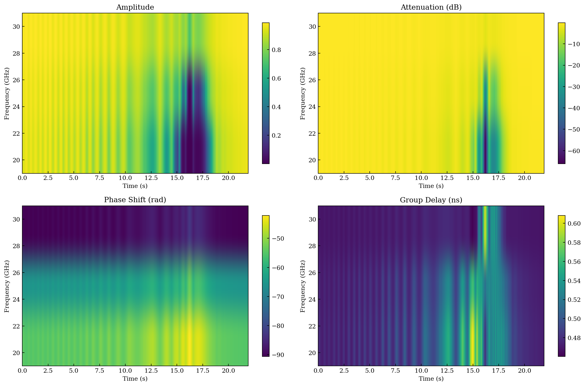

该图直接给出频率与时间二维平面上的：

1. 幅度
2. 衰减
3. 相位
4. 群时延

因此可以同时观察传播随时间变化和随频率变化的耦合。

### 4.2 单通道频率趋势

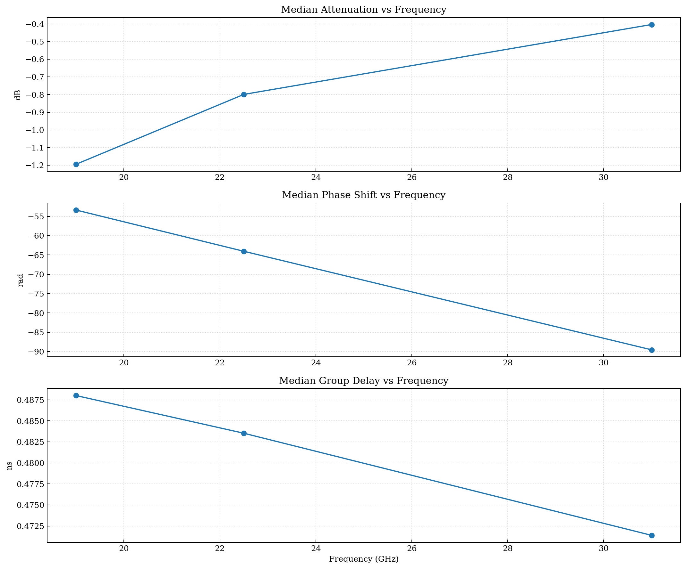

这一组图把全频传播趋势压缩到频率轴上，适合直接回答：

1. 哪些频率段的群时延更大
2. 哪些频率段衰减更重
3. 相位响应是否单调

### 4.3 单通道核心指标总表

| Freq (GHz) | Group delay (ns) | Tau RMSE (ns) | Post-corr SNR (dB) | WLS Case B 3D (m) | WLS MC mean (m) | EKF PR+D pos (m) | EKF PR+D vel (m/s) |
| --- | --- | --- | --- | --- | --- | --- | --- |
| 19 | 0.490 | 1141.415 | 16.314 | 427.824 | 642.453 | 106.860 | 0.155 |
| 22.500 | 0.482 | 570.738 | 16.764 | 101.270 | 139.969 | 51.358 | 0.079 |
| 31 | 0.474 | 534.180 | 17.306 | 33.506 | 47.358 | 0.923 | 0.006 |

从单通道表中应重点关注：

1. `group_delay_ns_median` 反映传播色散的中心量级
2. `receiver_tau_rmse_ns` 反映最终码跟踪恢复精度
3. `post_corr_snr_median_db`、`carrier_lock_metric_median`、`loss_fraction` 反映接收机可跟踪性

## 5. WLS 全频分析

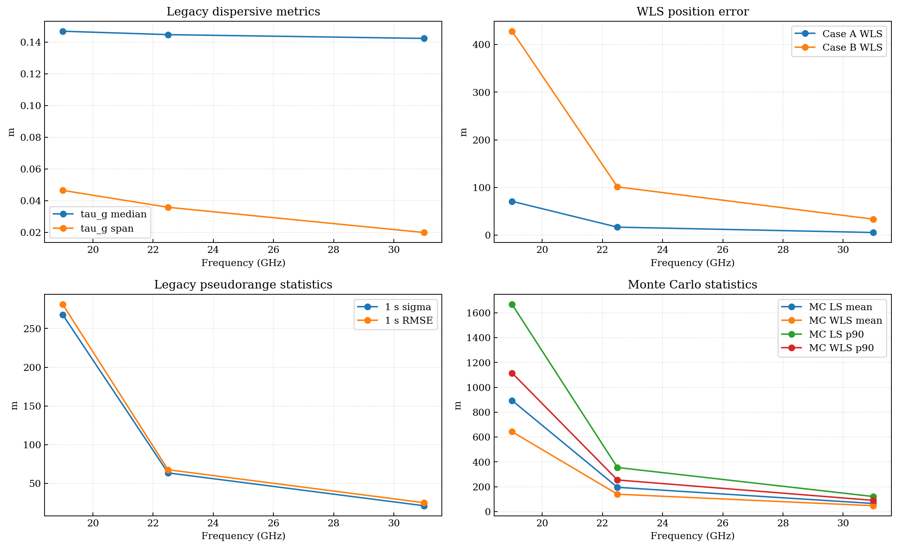

WLS 层的频率趋势图重点展示：

1. 传播层的 `tau_g` 与伪距 sigma 如何映射到导航层
2. 几何良好场景与低仰角困难场景在频率轴上的差异
3. Monte Carlo 下 LS 与 WLS 的均值与尾部分位数随频率如何演化

对于导航层解释，最关键的不是单一 `tau_g` 大小，而是：

1. `legacy` 单通道伪距统计
2. 低仰角观测的权重映射
3. Case B 困难场景下 WLS 对 LS 的改善

## 6. EKF 全频分析

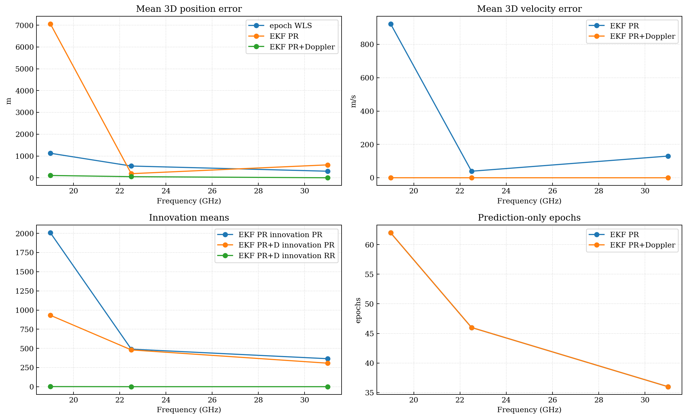

EKF 层的频率趋势图回答三个问题：

1. `epoch-wise WLS` 基线是否随频率系统性改善
2. `EKF PR only` 是否足以稳定吸收观测退化
3. `EKF PR + Doppler` 在哪些频段显著优于 `PR only`

从动态图层的意义看，`PR + Doppler` 把单通道 Doppler 观测真正转化成了速度与钟漂约束，因此其跨频趋势比单纯看位置误差更有解释力。

## 7. 跨层综合分析

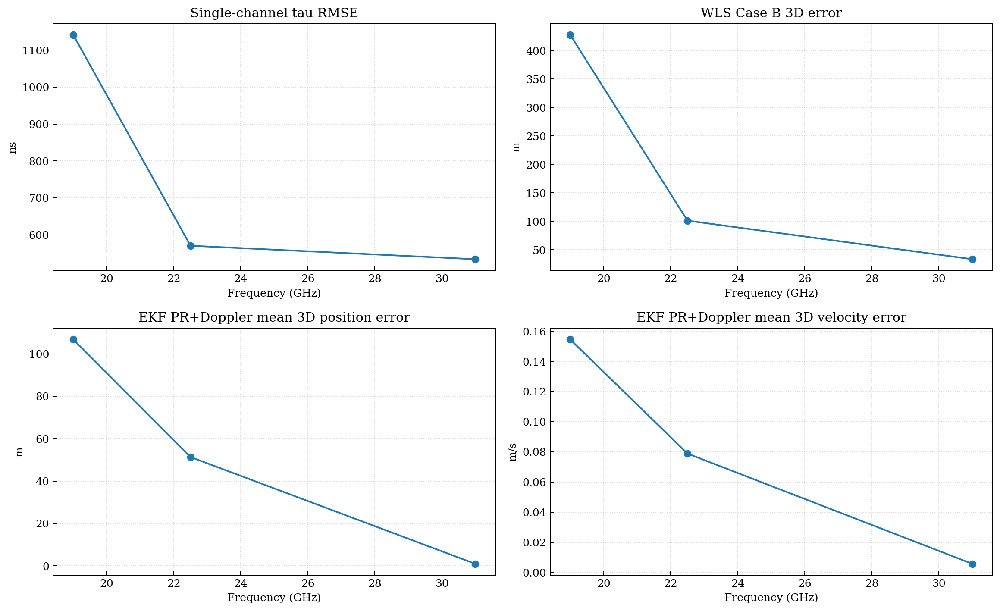

综合图把三层结果放到一张频率轴上，可用于观察：

1. 单通道 `tau RMSE` 是否与 WLS / EKF 的改善同步
2. WLS 困难场景误差是否随着频率升高而下降
3. EKF PR+Doppler 是否在高频端呈现更明显优势

全频趋势总表如下：

| Freq (GHz) | Tau RMSE (ns) | WLS Case B (m) | EKF PR+D pos (m) | EKF PR+D vel (m/s) |
| --- | --- | --- | --- | --- |
| 19 | 1141.415 | 427.824 | 106.860 | 0.155 |
| 22.500 | 570.738 | 101.270 | 51.358 | 0.079 |
| 31 | 534.180 | 33.506 | 0.923 | 0.006 |

从当前全频数据的总体趋势可以直接读到：

1. 单通道 `tau RMSE` 从低频端到高频端总体下降
2. WLS Case B 在高频端明显优于低频端
3. EKF PR+Doppler 在高频端的 3D 位置误差明显压低

## 8. 代表频点深挖

正文代表频点固定使用：

- 最低频 `19.0 GHz`
- 参考频点 `22.5 GHz`
- 最高频 `31.0 GHz`

这样做的目的是在不破坏主报告可读性的前提下，同时保留低频端、中间参考点和高频端三种典型行为。

### 8.1 代表频点 19p0GHz 案例

#### 8.1.1 该频点的综合结论

该频点在综合表中的关键量为：

| 指标 | 数值 |
| --- | --- |
| 单通道 tau RMSE (ns) | 1141.415 |
| 单通道后相关 SNR 中位数 (dB) | 16.314 |
| WLS Case B 3D 误差 (m) | 427.824 |
| EKF PR+D 3D 位置误差 (m) | 106.860 |
| EKF PR+D 3D 速度误差 (m/s) | 0.155 |

#### 8.1.2 单通道 WKB 与接收机

| 单通道指标 | 数值 |
| --- | --- |
| 幅度中位数 | 0.872 |
| 衰减中位数 (dB) | -1.195 |
| 相位中位数 (rad) | -53.358 |
| 群时延中位数 (ns) | 0.490 |
| tau RMSE (ns) | 1141.415 |
| fd RMSE (Hz) | 111.947 |
| 峰次峰比 (dB) | 0.188 |
| 后相关 SNR 中位数 (dB) | 16.314 |
| 载波锁定指标中位数 | 0.857 |
| 失锁占比 | 0.081 |

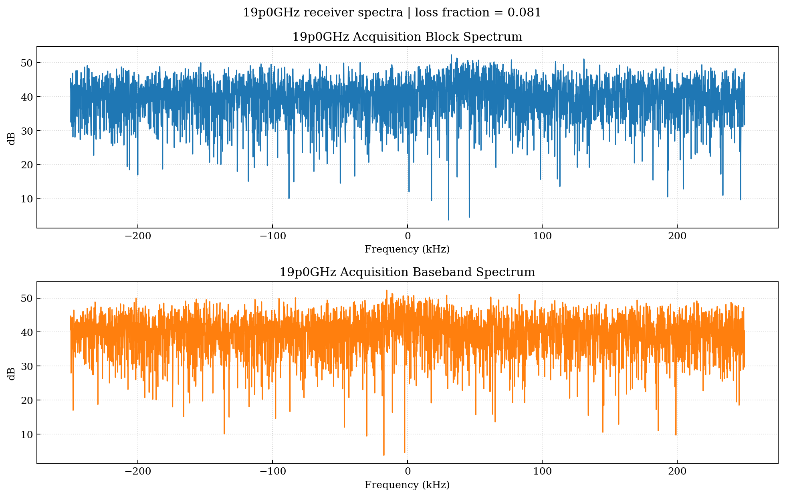

#### 8.1.3 WLS 单历元导航层

| WLS 指标 | 数值 |
| --- | --- |
| tau_g 中位数 (m) | 0.147 |
| PR 1 s sigma (m) | 267.815 |
| Case A LS 3D (m) | 81.453 |
| Case A WLS 3D (m) | 70.941 |
| Case B LS 3D (m) | 1534.425 |
| Case B WLS 3D (m) | 427.824 |
| Case A PDOP | 3.556 |
| Case B PDOP | 2.104 |
| MC WLS mean (m) | 642.453 |
| MC WLS p90 (m) | 1115.106 |

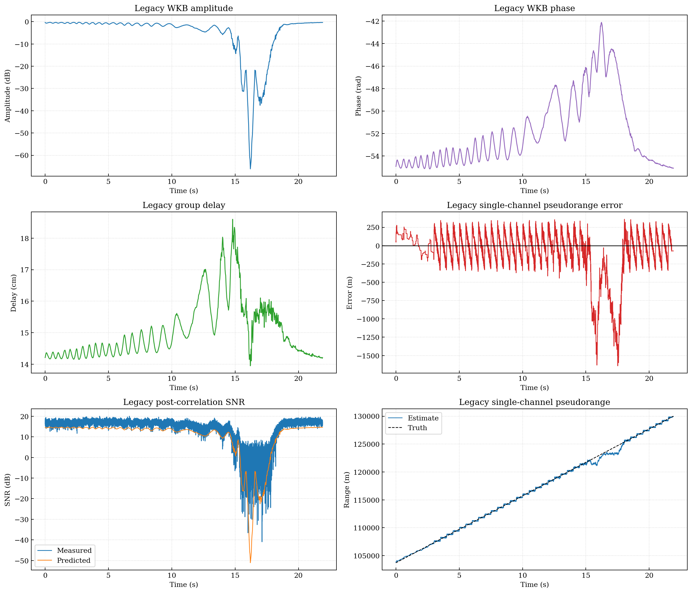

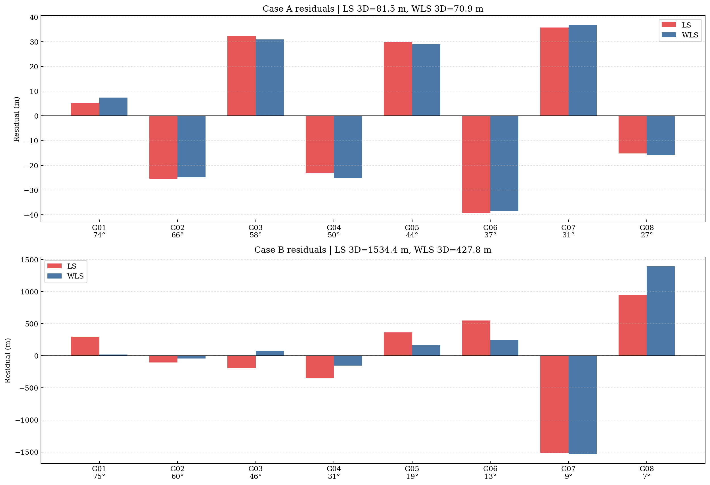


#### 8.1.4 动态 EKF 层

| EKF 指标 | 数值 |
| --- | --- |
| Epoch WLS mean 3D (m) | 1125.948 |
| EKF PR only mean 3D (m) | 7060.729 |
| EKF PR+D mean 3D (m) | 106.860 |
| EKF PR+D mean vel (m/s) | 0.155 |
| EKF PR+D mean PR innov (m) | 931.692 |
| EKF PR+D mean RR innov (m/s) | 1.909 |
| Prediction-only epochs | 62 |
| 动态 RR sigma 100 ms (m/s) | 0.138 |

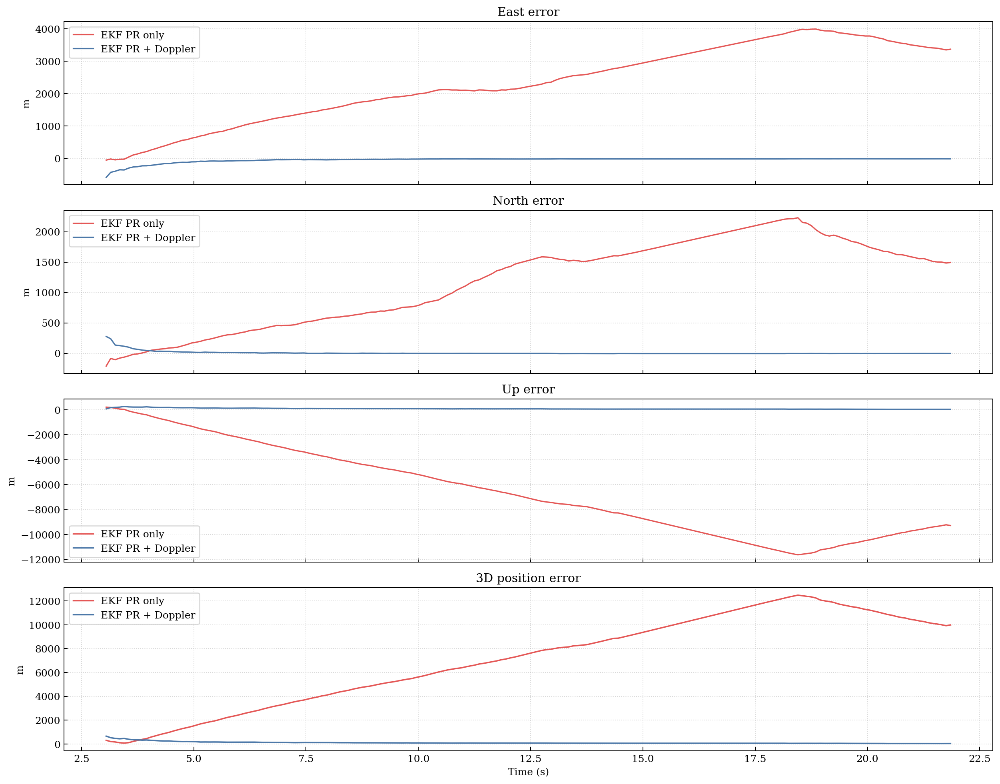


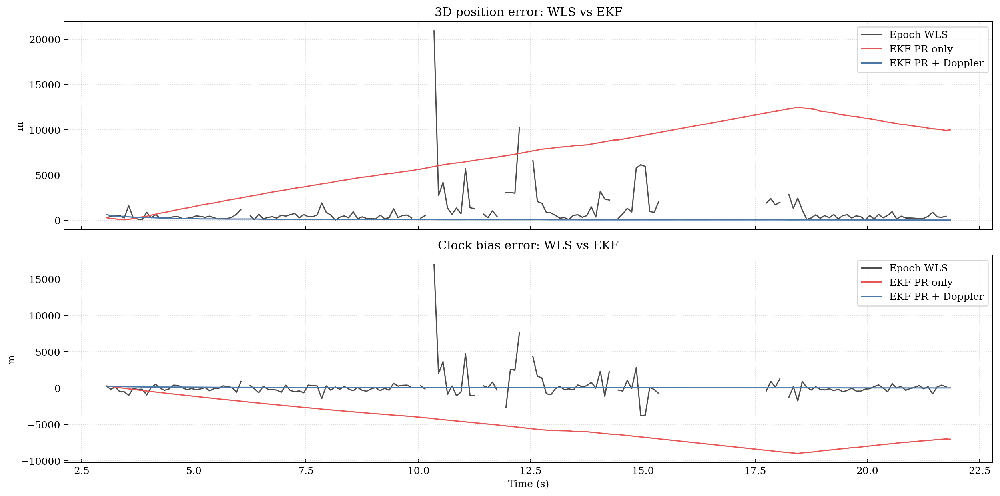


### 8.2 代表频点 22p5GHz 案例

#### 8.2.1 该频点的综合结论

该频点在综合表中的关键量为：

| 指标 | 数值 |
| --- | --- |
| 单通道 tau RMSE (ns) | 570.738 |
| 单通道后相关 SNR 中位数 (dB) | 16.764 |
| WLS Case B 3D 误差 (m) | 101.270 |
| EKF PR+D 3D 位置误差 (m) | 51.358 |
| EKF PR+D 3D 速度误差 (m/s) | 0.079 |

#### 8.2.2 单通道 WKB 与接收机

| 单通道指标 | 数值 |
| --- | --- |
| 幅度中位数 | 0.912 |
| 衰减中位数 (dB) | -0.799 |
| 相位中位数 (rad) | -64.038 |
| 群时延中位数 (ns) | 0.482 |
| tau RMSE (ns) | 570.738 |
| fd RMSE (Hz) | 103.805 |
| 峰次峰比 (dB) | 0.026 |
| 后相关 SNR 中位数 (dB) | 16.764 |
| 载波锁定指标中位数 | 0.905 |
| 失锁占比 | 0.034 |

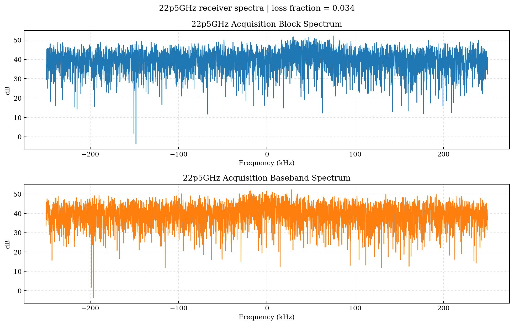

#### 8.2.3 WLS 单历元导航层

| WLS 指标 | 数值 |
| --- | --- |
| tau_g 中位数 (m) | 0.145 |
| PR 1 s sigma (m) | 63.394 |
| Case A LS 3D (m) | 19.281 |
| Case A WLS 3D (m) | 16.792 |
| Case B LS 3D (m) | 363.227 |
| Case B WLS 3D (m) | 101.270 |
| Case A PDOP | 3.556 |
| Case B PDOP | 2.104 |
| MC WLS mean (m) | 139.969 |
| MC WLS p90 (m) | 254.584 |

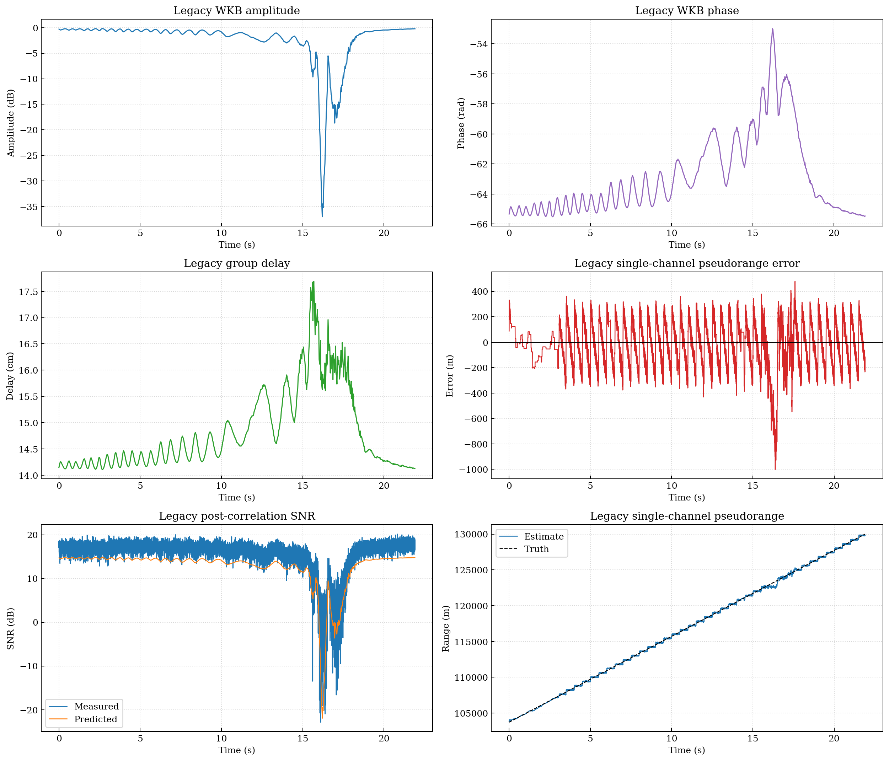


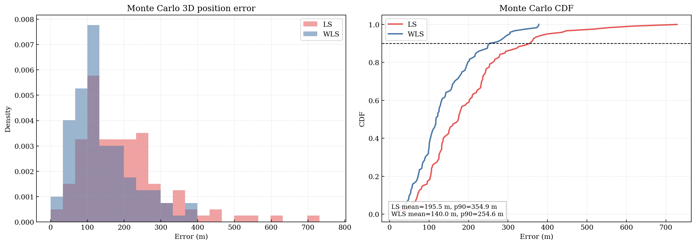

#### 8.2.4 动态 EKF 层

| EKF 指标 | 数值 |
| --- | --- |
| Epoch WLS mean 3D (m) | 539.467 |
| EKF PR only mean 3D (m) | 189.401 |
| EKF PR+D mean 3D (m) | 51.358 |
| EKF PR+D mean vel (m/s) | 0.079 |
| EKF PR+D mean PR innov (m) | 480.398 |
| EKF PR+D mean RR innov (m/s) | 0.726 |
| Prediction-only epochs | 46 |
| 动态 RR sigma 100 ms (m/s) | 0.040 |

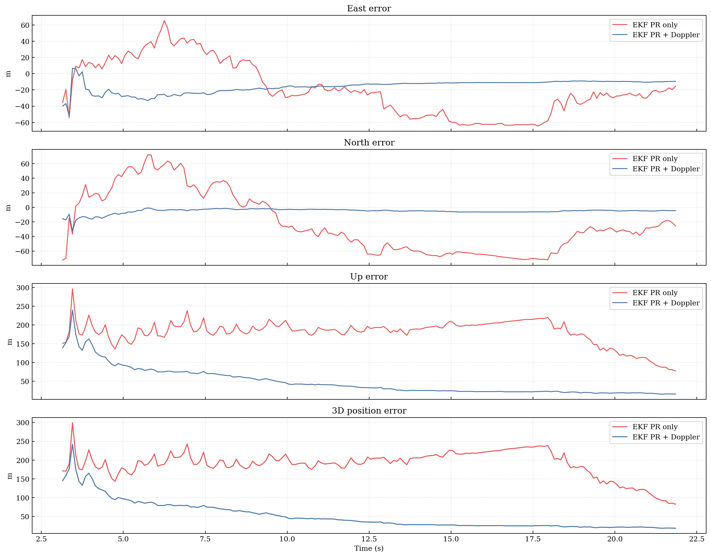

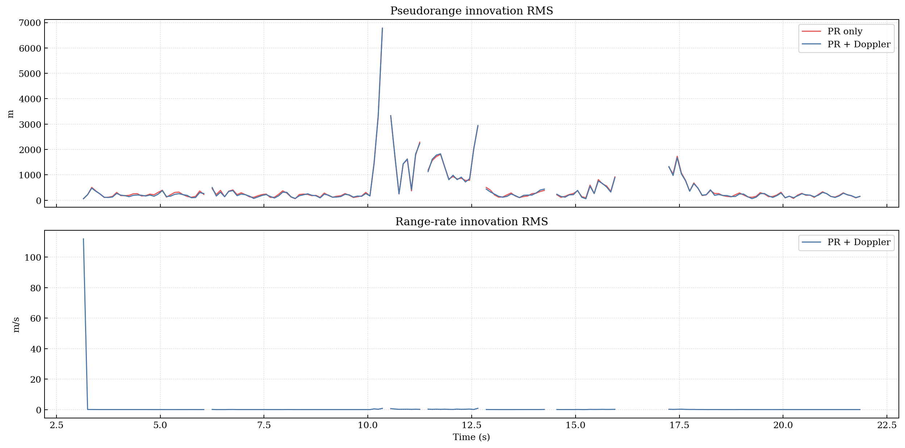

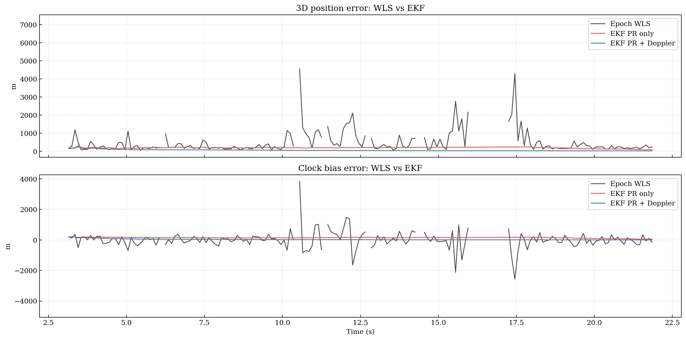


### 8.3 代表频点 31p0GHz 案例

#### 8.3.1 该频点的综合结论

该频点在综合表中的关键量为：

| 指标 | 数值 |
| --- | --- |
| 单通道 tau RMSE (ns) | 534.180 |
| 单通道后相关 SNR 中位数 (dB) | 17.306 |
| WLS Case B 3D 误差 (m) | 33.506 |
| EKF PR+D 3D 位置误差 (m) | 0.923 |
| EKF PR+D 3D 速度误差 (m/s) | 0.006 |

#### 8.3.2 单通道 WKB 与接收机

| 单通道指标 | 数值 |
| --- | --- |
| 幅度中位数 | 0.955 |
| 衰减中位数 (dB) | -0.404 |
| 相位中位数 (rad) | -89.540 |
| 群时延中位数 (ns) | 0.474 |
| tau RMSE (ns) | 534.180 |
| fd RMSE (Hz) | 94.741 |
| 峰次峰比 (dB) | 0.131 |
| 后相关 SNR 中位数 (dB) | 17.306 |
| 载波锁定指标中位数 | 0.931 |
| 失锁占比 | 0.005 |

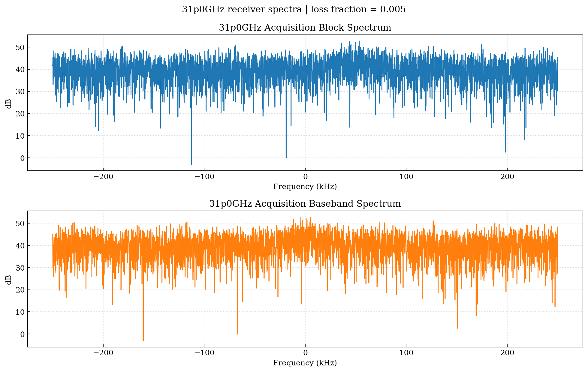

#### 8.3.3 WLS 单历元导航层

| WLS 指标 | 数值 |
| --- | --- |
| tau_g 中位数 (m) | 0.142 |
| PR 1 s sigma (m) | 20.975 |
| Case A LS 3D (m) | 6.379 |
| Case A WLS 3D (m) | 5.556 |
| Case B LS 3D (m) | 120.178 |
| Case B WLS 3D (m) | 33.506 |
| Case A PDOP | 3.556 |
| Case B PDOP | 2.104 |
| MC WLS mean (m) | 47.358 |
| MC WLS p90 (m) | 90.627 |

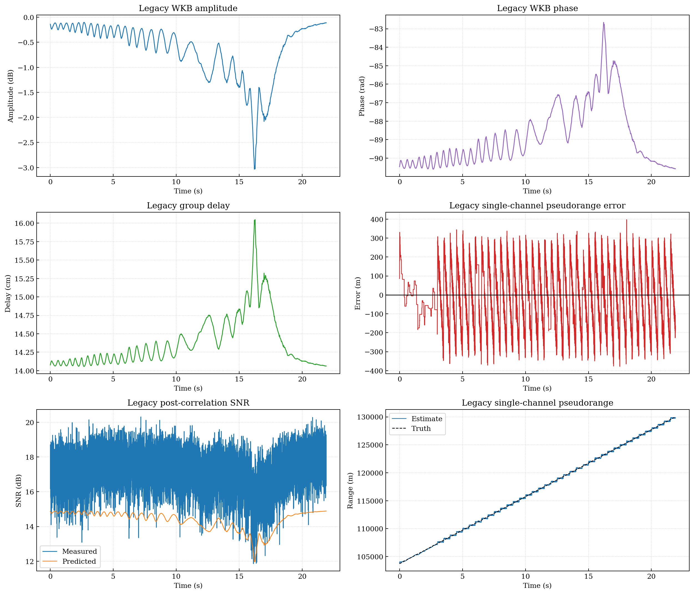

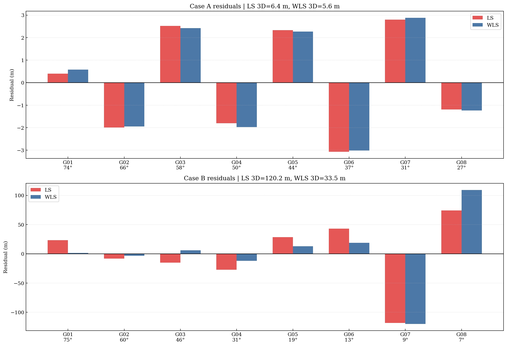

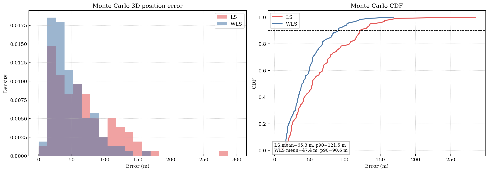

#### 8.3.4 动态 EKF 层

| EKF 指标 | 数值 |
| --- | --- |
| Epoch WLS mean 3D (m) | 301.373 |
| EKF PR only mean 3D (m) | 593.120 |
| EKF PR+D mean 3D (m) | 0.923 |
| EKF PR+D mean vel (m/s) | 0.006 |
| EKF PR+D mean PR innov (m) | 307.116 |
| EKF PR+D mean RR innov (m/s) | 0.739 |
| Prediction-only epochs | 36 |
| 动态 RR sigma 100 ms (m/s) | 0.004 |

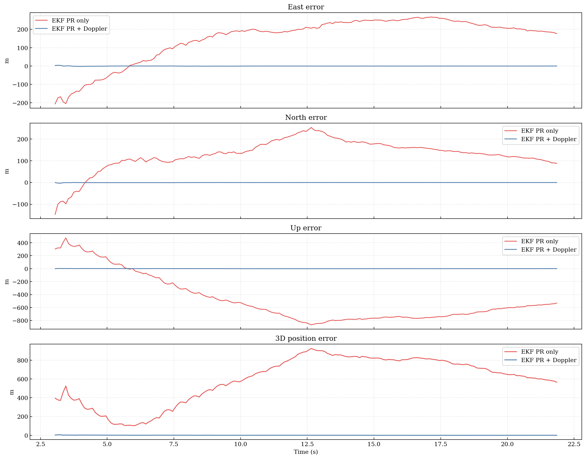

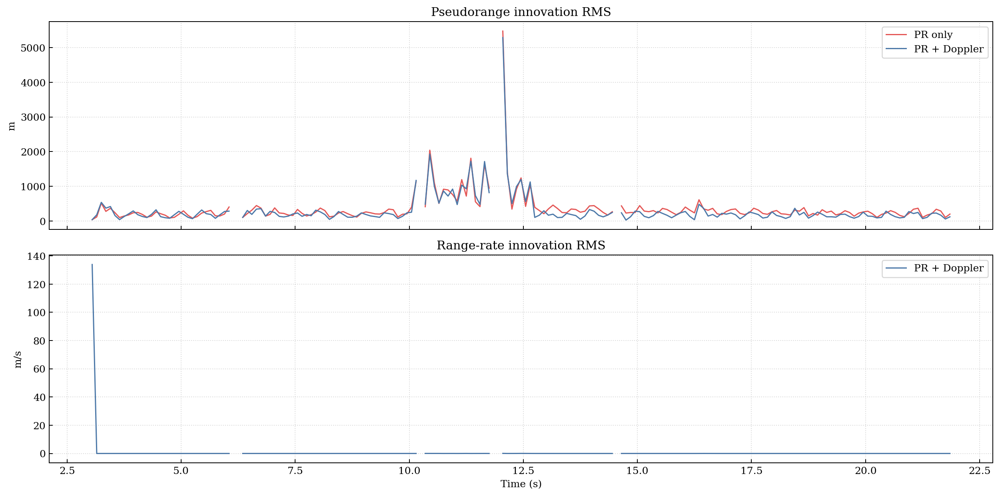

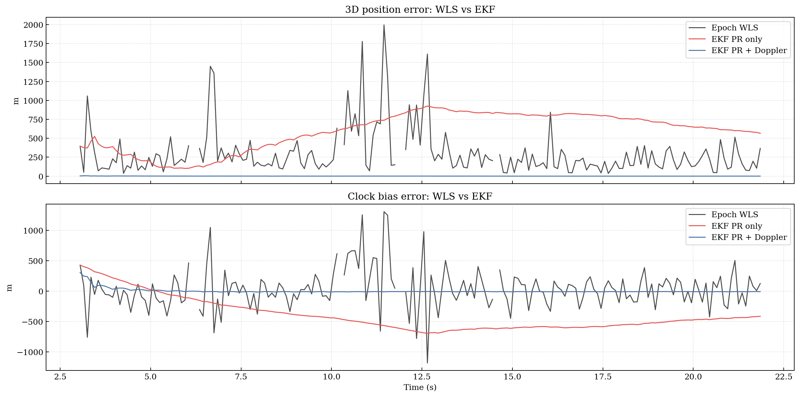


## 9. 结果边界与工程解释

需要始终保持以下边界：

1. 单通道传播与接收机链路是真实复用的
2. 多星几何和动态轨迹仍是自洽构造，不是真实星历与真实飞行轨迹
3. 多颗卫星并没有各自独立的真实鞘套传播路径
4. 因此导航层结果应解释为“在真实单通道背景之上的多层算法实验”，不是最终系统定标

从工程角度，本次工作的真正价值是：

1. 把频率从单点参数提升为主实验维度
2. 打通了传播层、接收层、导航层、动态滤波层的一体化批处理
3. 把所有核心数值指标汇总到统一跨频 CSV / JSON
4. 让后续任何 notebook 都可以从“只看 22.5 GHz”切换为“看整个泛 Ka 频段”

## 10. 附录 A：全频核心指标总表

| Freq (GHz) | Group delay (ns) | Tau RMSE (ns) | Post-corr SNR (dB) | WLS Case B 3D (m) | WLS MC mean (m) | EKF PR+D pos (m) | EKF PR+D vel (m/s) |
| --- | --- | --- | --- | --- | --- | --- | --- |
| 19 | 0.490 | 1141.415 | 16.314 | 427.824 | 642.453 | 106.860 | 0.155 |
| 22.500 | 0.482 | 570.738 | 16.764 | 101.270 | 139.969 | 51.358 | 0.079 |
| 31 | 0.474 | 534.180 | 17.306 | 33.506 | 47.358 | 0.923 | 0.006 |

## 11. 附录 B：逐频点产物索引

| Freq (GHz) | Single detail | Single spectrum | WLS summary | EKF summary |
| --- | --- | --- | --- | --- |
| 19 | [single detail](single_channel/frequency_details/19p0GHz.json) | [single spectrum](single_channel/receiver_spectra/19p0GHz_receiver_spectrum.png) | [wls summary](wls/19p0GHz/summary.json) | [ekf summary](ekf/19p0GHz/summary.json) |
| 22.500 | [single detail](single_channel/frequency_details/22p5GHz.json) | [single spectrum](single_channel/receiver_spectra/22p5GHz_receiver_spectrum.png) | [wls summary](wls/22p5GHz/summary.json) | [ekf summary](ekf/22p5GHz/summary.json) |
| 31 | [single detail](single_channel/frequency_details/31p0GHz.json) | [single spectrum](single_channel/receiver_spectra/31p0GHz_receiver_spectrum.png) | [wls summary](wls/31p0GHz/summary.json) | [ekf summary](ekf/31p0GHz/summary.json) |

## 12. 附录 C：完整数据文件说明

完整跨层数值指标位于：

- `cross_frequency/combined_metrics.csv`
- `cross_frequency/combined_metrics.json`

其中综合文件包含所有可量化的 `single / wls / ekf` 指标列，可作为后续 notebook、论文表格和二次统计的统一输入源。

WLS 与 EKF 分层统计文件位于：

- `wls/cross_frequency/wls_metrics.csv`
- `ekf/cross_frequency/ekf_metrics.csv`

这些文件保留了各自模块更细粒度的跨频统计，适合只关注单一层级时直接读取。
